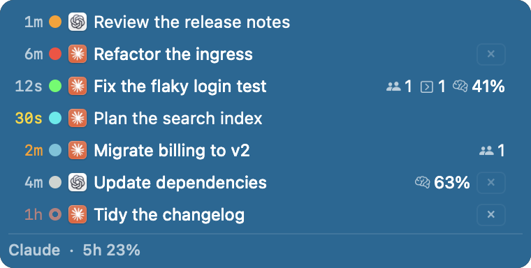
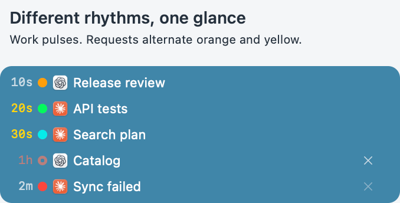
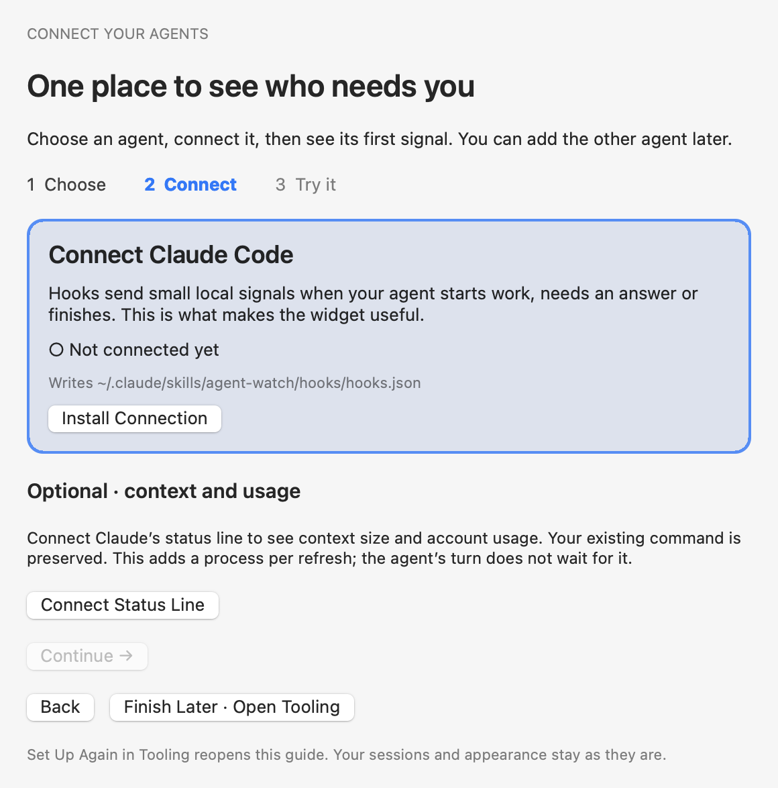

# Agent Watch

[](https://github.com/glockbender/agentwatcher/actions/workflows/verify.yml)
[](https://github.com/glockbender/agentwatcher/releases)

**See which Claude Code or Codex session needs you — without switching between terminals.**

Agent Watch is a small menu bar app for **Apple Silicon Macs running macOS 14+**. Its floating
widget shows your sessions together; on macOS 26 the widget can use Liquid Glass, Apple's
see-through material. Click a row to return to the session; hover for details. `⌥⌘W` shows or
hides the widget; **Settings… → General** changes the shortcut.



## How it works

Start a request in your agent. Watch its row change as it works, asks for input, and finishes.
The other sessions keep their own states, so you can see where to turn next.



Watch **Catalog** move up from inactive to active, ask for an answer, finish, and return below
active work. Green pulses slowly; orange alternates with yellow quickly when you need to answer.
These are real widget views and lamp timings with fictional sessions, ordered **By blocks**.
The 20-second loop demonstrates behavior; it is not a recording of agent work.
Clicking a row activates its host; exact tab selection is available in Ghostty and in JetBrains IDEs
with the optional plugin below.

**Alpha:** used daily, still being refined.

## Install and connect

1. Download `AgentWatch-<version>.dmg` from [Releases](https://github.com/glockbender/agentwatcher/releases),
   open it and drag Agent Watch to the Applications folder beside it.
2. Alpha builds have an ad-hoc signature. After downloading from this project's release,
   remove the quarantine flag so macOS can open the app:

   ```sh
   xattr -dr com.apple.quarantine /Applications/AgentWatch.app
   ```

3. Open Agent Watch. The empty widget offers **Connect Agent →**, which opens the setup guide.
   Choose Claude Code or Codex and press **Install Connection**.
4. **Claude Code:** run `/reload-plugins` in an existing session, or start a new session.
   **Codex:** accept its trust prompts for the hooks. Then send a short request.
5. The guide sees the agent's first signal, and the session appears in the widget.

Nothing is written to an agent's configuration until you press an installation button.
Claude's optional status line (**Connect Status Line** in the guide) adds context and account
usage; your existing status-line command is kept. You can connect just one agent, and add the
other later: **Settings… → Tooling → Open Tooling…**, then **Set Up Again…**, repeats the guide
without deleting sessions, changing appearance or removing integrations.

Tooling also shows whether each agent's program was found, separately from whether it is
connected. “Not found” only means that the executable is not in the usual locations; you can
still connect an agent installed elsewhere.

<details>
<summary>See the connection guide</summary>



</details>

## Settings

The menu bar menu lists your sessions and shows the widget when it is hidden. Everything else is
in one window: **Settings…** in the menu, or ⌘, while the menu is open.

- **Widget** — what a row shows and how rows are ordered (**Arrival**, **Recent activity**,
  **By state** or **By blocks**).
- **Appearance** — the theme, its mode (light, dark or following the system) and the widget's
  size. A theme holds every colour
  and animation: the widget's background, material and opacity, the lamp for each state, the
  menu bar icon and the marks in the menu. **Edit Theme** changes it with live examples beside
  each setting, and its **Timing** page sets how long things take and how far they fade; the
  built-in theme is copied on the first change. **Your Themes** lists your own
  themes to edit, export or delete, and **Import…** adds one somebody shared.
- **Menu Bar** — a sphere coloured by the states it shows or a count for each state, which
  states the menu lists, and a dot in a corner of a full-screen display, where the menu bar is
  hidden. The dot steps aside while the menu bar slides down.
- **General** — showing the widget (the next launch keeps it as it was left), its locks and
  resets, its shortcut, how long closed sessions stay, reading transcripts, and updates.
- **Tooling** and **Diagnostics** — the agents' integrations, and the event log.

## JetBrains IDE plugin

The optional plugin takes a widget click to the **exact terminal tab** in your IDE.
It supports classic and reworked terminals; the declared minimum is JetBrains platform 2025.1.
It needs the Agent Watch macOS app and does nothing on its own.

1. Download `agent-watch-ide-<version>.zip` from the same [release page](https://github.com/glockbender/agentwatcher/releases).
   The plugin has its own version number.
2. In the IDE: **Settings → Plugins → gear → Install Plugin from Disk**. Select the ZIP.
   Restart if the IDE asks you to.
3. With the IDE running, open **Settings… → Tooling → Open Tooling…** and press **Check** beside it.
4. Start an agent in that IDE's terminal and click its widget row to check the jump.

Marketplace publication is still part of the [release plan](docs/release-plan.md).
The app does not download the plugin for you yet, so install the ZIP from disk as above.

## If something looks wrong

If a session does not appear or has no name, see [Troubleshooting](TROUBLESHOOTING.md).
Use **Remove** or **Disconnect** in Tooling to undo an integration.

## Local by default

Session monitoring stays on your Mac. Hooks send local events and fail open when Agent Watch
is not running. Settings and remembered sessions live in
`~/Library/Application Support/AgentWatch/`. The app goes online only to check GitHub for
updates and to download a release you asked to install.
See [agent integration](docs/agent-integration.md) for the files it writes and
[architecture](docs/architecture.md) for the privacy boundaries.

## Build from source

Requires Xcode 16 or newer (it includes Swift 6) and [Task](https://taskfile.dev/). Liquid Glass
needs Xcode 26 and its macOS 26 SDK; with an older Xcode the app still builds, and the widget is
frosted instead of glass.

```sh
task verify   # formatting, tests, debug/release builds and app bundle
task run      # run the app
```

`task plugin` builds the IDE plugin and places it where Tooling's **Open Plugins** finds it.
Development details are in [AGENTS.md](AGENTS.md).

## Documentation

Project documents are in Russian:

- [Release plan](docs/release-plan.md) — remaining blockers, plugin publication and acceptance checks.
- [Architecture](docs/architecture.md) · [Implementation plan](docs/implementation-plan.md)
- [Agent integration](docs/agent-integration.md) · [Distribution](docs/distribution.md)

MIT — see [LICENSE](LICENSE).
