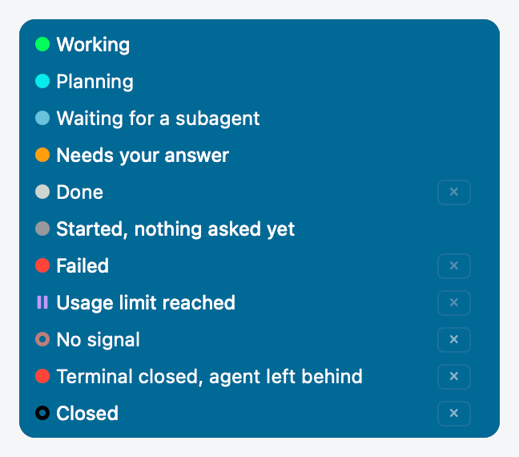
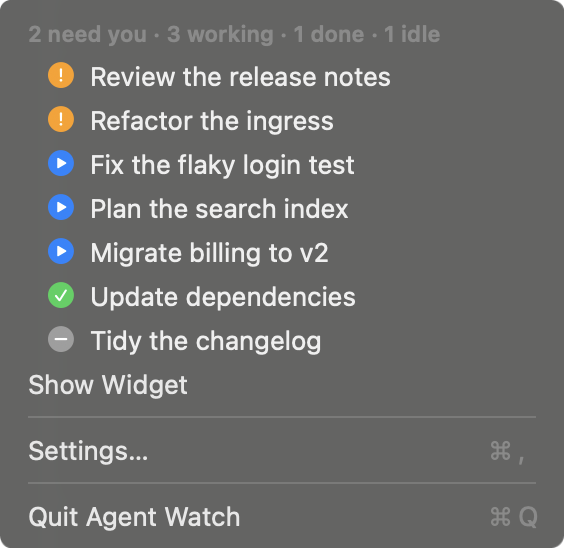
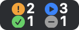
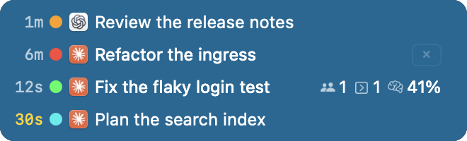
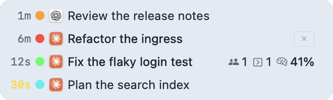
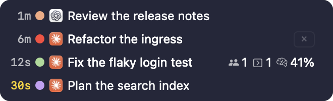

# Agent Watch

[](https://github.com/glockbender/agentwatcher/actions/workflows/verify.yml)
[](https://github.com/glockbender/agentwatcher/releases)

**See which Claude Code or Codex session needs you, without switching between terminals.**

A menu bar app for Apple Silicon Macs with macOS 14 or newer. Alpha: used every day, still changing.
[Download](https://github.com/glockbender/agentwatcher/releases) · [Install](#install) ·
[What it works with](#what-it-works-with) · [Troubleshooting](TROUBLESHOOTING.md)


Every agent session gets a lamp that says what it is doing: working, waiting for you, done. A small
floating widget lists the sessions with their lamps, the menu bar icon sums them up, and its menu
lists the sessions too, so one look tells you where you are needed, and one click takes you there.

## Two ways to watch your sessions

### The widget


Every session is one row in a small floating window that stays above your other windows. Click a
row to go back to that session's terminal tab; hover it for details. `⌥⌘W` shows or hides the
widget.

#### What the lamps mean



The lamps fall into the four groups the menu bar counts:

| Group | Lamps |
|---|---|
| **Needs you** | Orange and yellow, alternating fast: a permission, a choice or a question. Red: failed, or the terminal was closed and the agent stayed behind |
| **Working** | Green pulse: working. Cyan: planning. Light blue: the turn is over, a subagent still works |
| **Done** | Steady light grey: the last turn finished |
| **Idle** | Grey: started, nothing asked yet. Ring: no signal for a while. Pause sign: usage limit reached |

A black ring means the session closed; it leaves the list after the time set in **Settings… →
General**. Colour is never the only sign: the ring, the pause sign and the menu's marks differ by
shape.

### The menu



If you would rather not have a window on screen, hide the widget: the menu bar icon's menu lists the
sessions in the widget's order — by default only those that need you and the finished ones — and
choosing one is the same as clicking its row. **Show Widget** or **Hide Widget** stays at the same
place in the menu. The picture lists all four groups, as chosen in **Settings… → Menu Bar**.


## The menu bar icon

The icon changes colour as soon as a session starts waiting for you, so you notice it even with
the widget hidden.


It comes in two styles, chosen in **Settings… → Menu Bar**:

| Sphere (default) | Counts |
|---|---|
|  |  |


On a full-screen display, where the menu bar is hidden, a small dot in a top corner shows while a
session needs you or works.


## What it works with

Claude Code and Codex, in a terminal or in their desktop apps. Every session gets its lamp wherever
it runs; what differs is where a click on its row takes you.

| Where the session runs | A click on its row |
|---|---|
| **Claude Code or Codex in Ghostty** | Brings forward the exact tab. macOS asks once for Automation permission. A Codex tab is found once Codex has named the thread, after its first answer |
| **Claude Code or Codex in a JetBrains IDE terminal**, with the [plugin](#jetbrains-ide-plugin) | Brings forward the exact terminal tab |
| **Claude desktop app** | Opens that session in the app |
| **Codex in the ChatGPT desktop app** | Opens that thread in the app |
| **Claude Code sent to the background** (`/bg`) | Opens `claude attach` for it in a new Ghostty tab |
| **Claude Code or Codex in any other terminal or IDE**: Terminal, iTerm2, VS Code, a JetBrains IDE without the plugin | Brings that app forward with all its windows, not the exact tab |

If a terminal was closed and its agent kept running, the click asks whether to end that agent.

Runs without a window — `claude -p`, Agent SDK runs and `codex exec` — are hidden by default,
because the program that started one usually shows it already. **Settings… → General → Show
headless runs** lists them; a click on one offers to end it.

## Install

> [!NOTE]
> Alpha builds are signed ad hoc, not with an Apple Developer ID, so macOS blocks them until
> step 2 below.

1. Download `AgentWatch-<version>.dmg` from [Releases](https://github.com/glockbender/agentwatcher/releases),
   open it and drag Agent Watch to Applications.
2. Remove the quarantine flag, so macOS lets the app open:

   ```sh
   xattr -dr com.apple.quarantine /Applications/AgentWatch.app
   ```

   **System Settings → Privacy & Security → Open Anyway** also exists, but does not work on every
   Mac for such apps; the command above always does.

3. Open Agent Watch. The empty widget offers **Connect Agent →**, which opens a short guide in
   **Settings… → Tooling**. Choose Claude Code or Codex and press **Install Connection**.
4. **Claude Code:** run `/reload-plugins` in a running session, or start a new one.
   **Codex:** accept its trust prompt for the hooks. Then send a short request; the session
   appears in the widget.


Nothing is written into an agent's configuration until you press an install button. Connect the
other agent later in **Settings… → Tooling**. For Claude, **Connect Status Line** adds the
context size and account usage to the widget; your own status-line command keeps running.

## Make it yours

Everything Agent Watch draws can be changed: every colour and every animation of the widget, the
menu bar icon and the menu, separately for light and dark mode — and what a row shows, the order
of the rows and the size. It is all in one window: **Settings…** in the menu, or `⌘,` while the
menu is open. Every change shows at once, on the widget itself.

### Themes

A theme holds every colour and animation. The built-in one is called Default; the first change
you make copies it into a theme of your own, so Default stays as it was.


The theme editor changes:

- **The widget's panel:** background colour, material — glass or clear glass on macOS 26, frosted
  or solid — and opacity.
- **Each of the eleven lamps:** its colour, its motion (none, dim, or a fade into a second colour)
  and how long one cycle takes.
- **The menu bar icon and the menu's marks:** their own colours and motion, or matched to the
  lamps; for the sphere, its halo, sway and swell.
- **Other colours:** the timers, the highlight outline, secondary text and warnings.
- **Timing:** how long the highlight lasts, how soon a row's card opens, how far lamps dim, and
  where the full-screen dot sits and how big it is.

A change goes into light mode, dark mode, or both. A theme is a JSON file: **Export…** one to
share it, **Import…** one somebody shared, or edit the file by hand. Glass chosen on an older macOS
is drawn frosted.

| Default, dark mode | Default, light mode | A theme of your own |
|---|---|---|
|  |  |  |


### Rows

Choose and reorder what a row shows: elapsed time, lamp, agent, a problem mark, name, project,
branch, model, where it runs, which Codex subagent it is, running work and context size. In **Settings… → Widget →
Rows**, tick a part and drag it into place. Drag an edge of the widget to make it wider or
narrower; a name too long for its row is shortened in the middle.


### Order

Three orders are ready to use: arrival (rows never move by themselves), by state, and by recent
activity. **By blocks** is the one you arrange: drag the Active, Inactive, Broken and Closed blocks
into the order you want.


### Size

From 50% to 200%, in **Settings… → Appearance**.


## JetBrains IDE plugin

Optional. It takes a click to the **exact terminal tab** in a JetBrains IDE (platform 2025.1 or
newer, classic and reworked terminals), and needs the Agent Watch app.

1. Download `agent-watch-ide-<version>.zip` from the same
   [Releases](https://github.com/glockbender/agentwatcher/releases) page.
2. In the IDE: **Settings → Plugins → ⚙ → Install Plugin from Disk**, select the ZIP, restart if asked.
3. In Agent Watch: **Settings… → Tooling**, press **Check** beside the IDE.

## Privacy

- Session state stays on your Mac. Hooks send events over a local socket only your user can open.
  When Agent Watch is not running they fail open, and the agent goes on as usual.
- For names, branch and context size the app reads the agent's own files on disk, such as the
  Claude transcript and the Codex thread index. **Settings… → General** sets how often.
- It writes `~/.claude/skills/agent-watch/` for Claude, its own entries in `~/.codex/hooks.json`
  for Codex, the `statusLine` key in `~/.claude/settings.json` only if you connect the status
  line, and its state in `~/Library/Application Support/AgentWatch/`.
- It goes online only to check GitHub for updates and to download a release you chose to install.

Details: [installing into the agents](docs/agent-install.md), [architecture](docs/architecture.md).

## Uninstall

1. **Settings… → Tooling**: press **Remove** for each agent and **Disconnect** for
   the status line. This takes out everything the app wrote into the agents.
2. Quit Agent Watch and move it to the Trash. To forget settings and sessions too, move
   `~/Library/Application Support/AgentWatch/` to the Trash.
3. If you installed the IDE plugin, uninstall it in the IDE: **Settings → Plugins**.

## If something looks wrong

A session does not appear, has no name, or a lamp looks stuck: see [Troubleshooting](TROUBLESHOOTING.md).

## Build from source

Requires Xcode 16 or newer and [Task](https://taskfile.dev/). Liquid Glass needs Xcode 26 and its
macOS 26 SDK; with an older Xcode the widget is frosted instead.

```sh
task verify   # formatting, tests, debug and release builds, app bundle
task run      # run the app
```

Development notes are in [AGENTS.md](AGENTS.md); project documents, in Russian, are in
[docs](docs/).

MIT — see [LICENSE](LICENSE).
