# Agent Watch

[](https://github.com/glockbender/agentwatcher/actions/workflows/verify.yml)
[](https://github.com/glockbender/agentwatcher/releases)

**See which Claude Code or Codex session needs you, without switching between terminals.**

A menu bar app for Apple Silicon Macs with macOS 14 or newer. Alpha: used every day, still changing.
[Download](https://github.com/glockbender/agentwatcher/releases) · [Install](#install) ·
[Troubleshooting](TROUBLESHOOTING.md)


Every agent session is one row in a small floating widget. The lamp at the start of a row says
what the session is doing, so one look tells you where you are needed. Click a row to go back
to that session's terminal tab; hover it for details. `⌥⌘W` shows or hides the widget. Without
the widget, the menu bar lists the same sessions and does the same.

## What the lamps mean


The lamps fall into the four groups the menu bar counts:

| Group | Lamps |
|---|---|
| **Needs you** | Orange and yellow, alternating fast: a permission, a choice or a question. Red: failed, or the terminal was closed and the agent stayed behind |
| **Working** | Green pulse: working. Cyan: planning. Light blue: the turn is over, a subagent still works |
| **Done** | Steady light grey: the last turn finished |
| **Idle** | Grey: started, nothing asked yet. Ring: no signal for a while. Pause sign: usage limit reached |

A black ring means the session closed; it leaves the list after the time set in **Settings… →
General**. Colour is never the only sign: the ring, the pause sign and the menu's marks differ by
shape.

<details>
<summary>Hover a row for its details</summary>

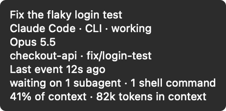

</details>

## Install

> [!NOTE]
> Alpha builds are signed ad hoc, not with an Apple Developer ID, so macOS blocks them until
> step 2 below.

1. Download `AgentWatch-<version>.dmg` from [Releases](https://github.com/glockbender/agentwatcher/releases),
   open it and drag Agent Watch to Applications.
2. Remove the quarantine flag, so macOS lets the app open:

   ```sh
   xattr -dr com.apple.quarantine /Applications/AgentWatch.app
   ```

   **System Settings → Privacy & Security → Open Anyway** also exists, but does not work on every
   Mac for such apps; the command above always does.

3. Open Agent Watch. The empty widget offers **Connect Agent →**. Choose Claude Code or Codex
   and press **Install Connection**.
4. **Claude Code:** run `/reload-plugins` in a running session, or start a new one.
   **Codex:** accept its trust prompt for the hooks. Then send a short request; the session
   appears in the widget.

Nothing is written into an agent's configuration until you press an install button. Connect the
other agent later in **Settings… → Tooling → Open Tooling…**. For Claude, **Connect Status Line** adds the
context size and account usage to the widget; your own status-line command keeps running.

<details>
<summary>The connection guide</summary>


</details>

## Where a click takes you

| Where the agent runs | A click on its row |
|---|---|
| Ghostty | Brings forward the exact tab. macOS asks once for Automation permission |
| A JetBrains IDE terminal, with the [plugin](#jetbrains-ide-plugin) | Brings forward the exact terminal tab |
| Claude desktop app; Codex in the ChatGPT desktop app | Opens that session in the app |
| A Claude Code session sent to the background (`/bg`) | Opens `claude attach` for it in a new Ghostty tab |
| Any other terminal or IDE | Brings the app forward with all its windows |

If a terminal was closed and its agent kept running, the click asks whether to end that agent.

## Without the widget


The menu lists your sessions in the widget's order, and choosing one is the same as clicking its
row. **Show Widget** or **Hide Widget** stays at the same place. By default it lists the sessions
that need you and the finished ones; the picture lists all four groups, as chosen in
**Settings… → Menu Bar**.


| Sphere (default) | Counts |
|---|---|
|  |  |


On a full-screen display, where the menu bar is hidden, a small dot in a top corner shows while a
session needs you or works.

## Make it yours

Every setting is in one window: **Settings…** in the menu, or `⌘,` while the menu is open.

**Themes.** A theme holds every colour and animation: the panel, each lamp, the menu bar icon and
the menu's marks, for light and dark mode. On macOS 26 the panel can be Liquid Glass. Edit a
theme with live examples, export it, or import one somebody shared.

| Default, dark mode | Default, light mode | A theme of your own |
|---|---|---|
|  |  |  |


**Rows.** Choose and reorder what a row shows: elapsed time, lamp, agent, name, project, branch,
model, running work, context size, where it runs.

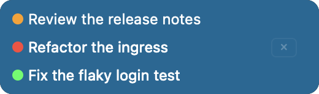
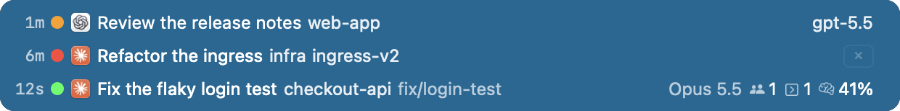


**Order.** Arrival (rows never move by themselves), by state, by blocks you arrange, or by recent
activity.

| Arrival | By state | By blocks |
|---|---|---|
| 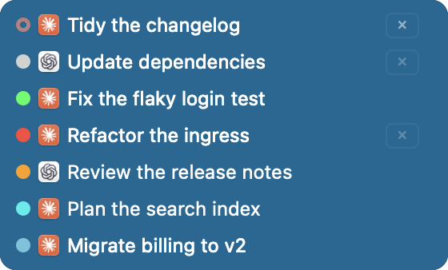 | 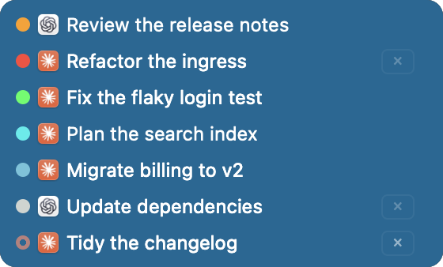 | 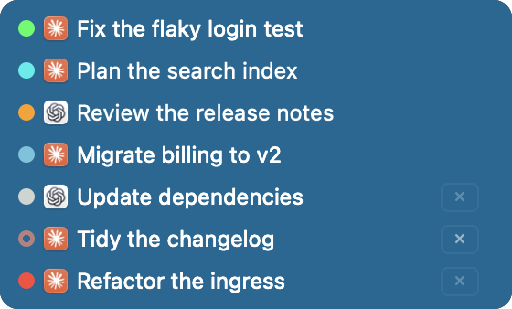 |


**Size** goes from 50% to 200%; here at 75% and 150%.

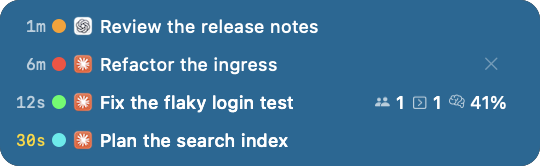
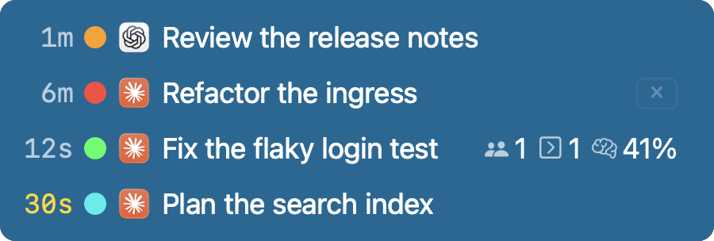

<details>
<summary>The settings pages</summary>

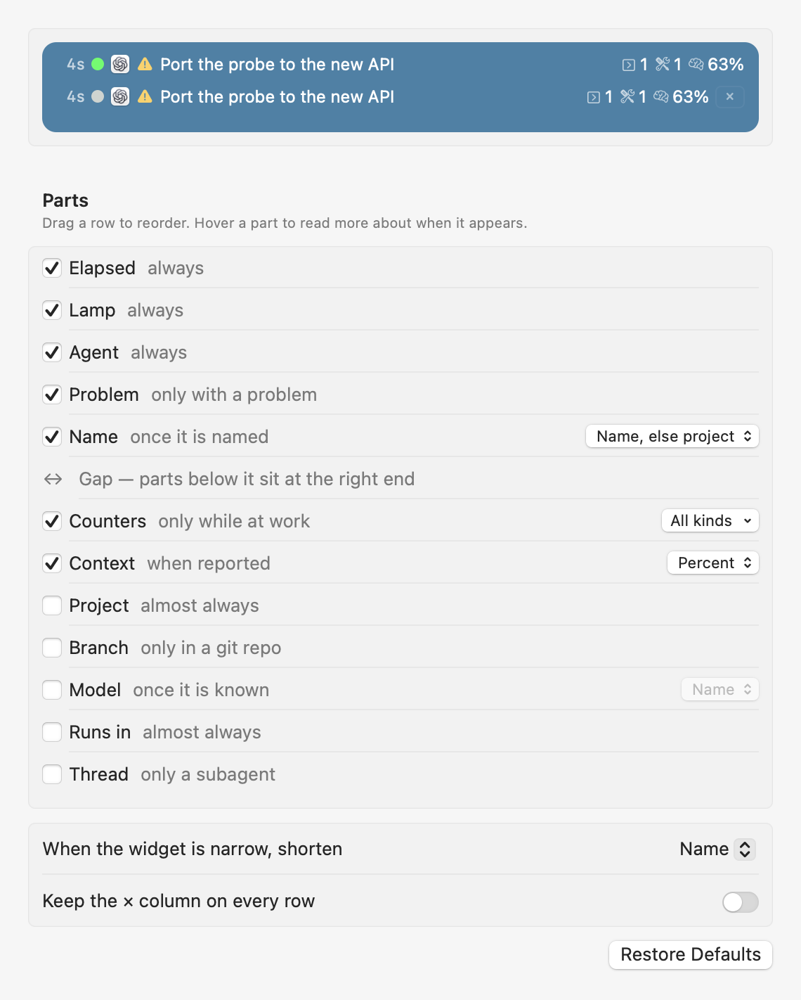
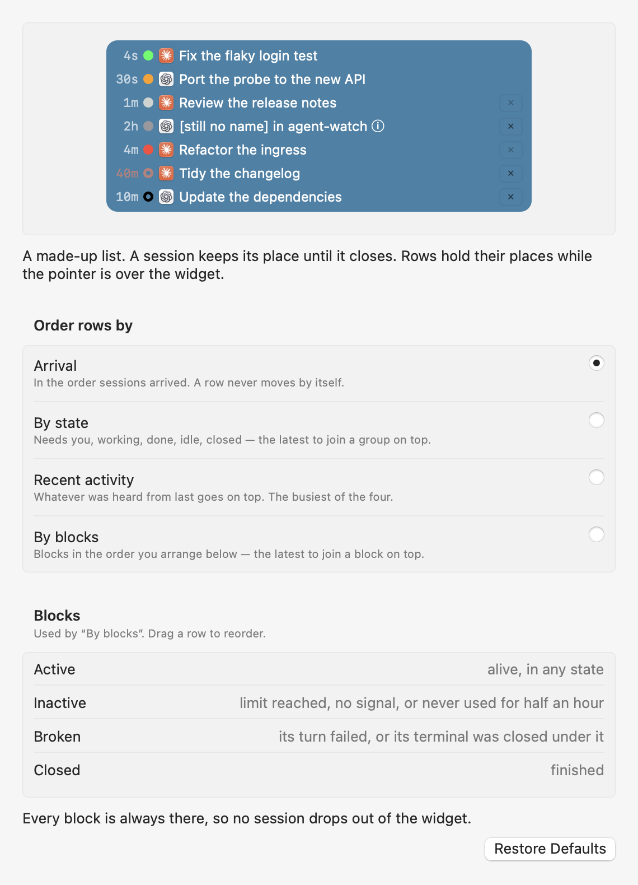
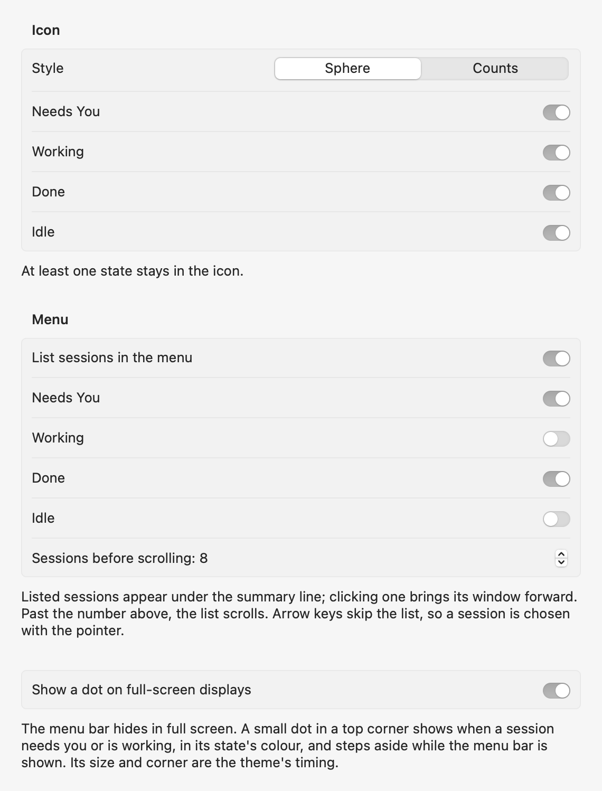
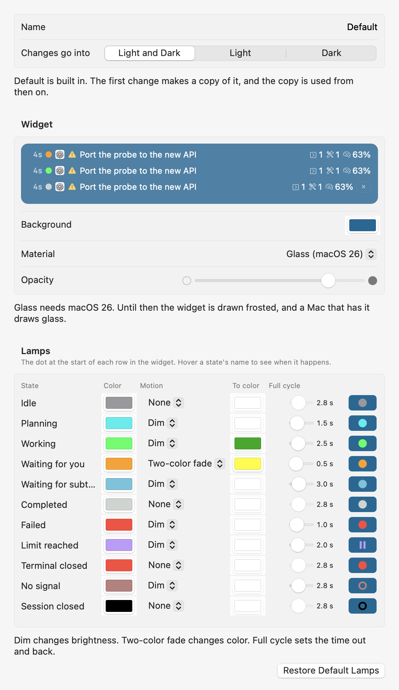

</details>

## JetBrains IDE plugin

Optional. It takes a click to the **exact terminal tab** in a JetBrains IDE (platform 2025.1 or
newer, classic and reworked terminals), and needs the Agent Watch app.

1. Download `agent-watch-ide-<version>.zip` from the same
   [Releases](https://github.com/glockbender/agentwatcher/releases) page.
2. In the IDE: **Settings → Plugins → ⚙ → Install Plugin from Disk**, select the ZIP, restart if asked.
3. In Agent Watch: **Settings… → Tooling → Open Tooling…**, press **Check** beside the IDE.

## Privacy

- Session state stays on your Mac. Hooks send events over a local socket only your user can open.
  When Agent Watch is not running they fail open, and the agent goes on as usual.
- For names, branch and context size the app reads the agent's own files on disk, such as the
  Claude transcript and the Codex thread index. **Settings… → General** sets how often.
- It writes `~/.claude/skills/agent-watch/` for Claude, its own entries in `~/.codex/hooks.json`
  for Codex, the `statusLine` key in `~/.claude/settings.json` only if you connect the status
  line, and its state in `~/Library/Application Support/AgentWatch/`.
- It goes online only to check GitHub for updates and to download a release you chose to install.

Details: [installing into the agents](docs/agent-install.md), [architecture](docs/architecture.md).

## Uninstall

1. **Settings… → Tooling → Open Tooling…**: press **Remove** for each agent and **Disconnect** for
   the status line. This takes out everything the app wrote into the agents.
2. Quit Agent Watch and move it to the Trash. To forget settings and sessions too, move
   `~/Library/Application Support/AgentWatch/` to the Trash.
3. If you installed the IDE plugin, uninstall it in the IDE: **Settings → Plugins**.

## If something looks wrong

A session does not appear, has no name, or a lamp looks stuck: see [Troubleshooting](TROUBLESHOOTING.md).

## Build from source

Requires Xcode 16 or newer and [Task](https://taskfile.dev/). Liquid Glass needs Xcode 26 and its
macOS 26 SDK; with an older Xcode the widget is frosted instead.

```sh
task verify   # formatting, tests, debug and release builds, app bundle
task run      # run the app
```

Development notes are in [AGENTS.md](AGENTS.md); project documents, in Russian, are in
[docs](docs/).

MIT — see [LICENSE](LICENSE).
