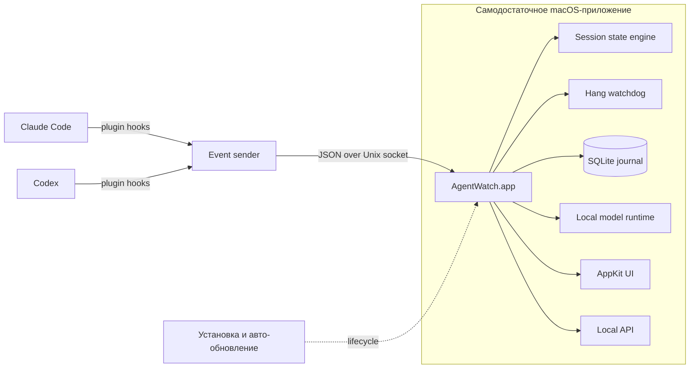
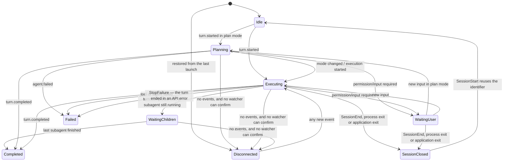

# Agent Watch: как следить за несколькими AI-агентами и замечать зависшие задачи

**Контекст:** Проектирование лёгкой macOS-утилиты для наблюдения за параллельными сессиями Claude
Code и Codex, включая локальную аналитику и обнаружение потенциально зависших shell-команд.
**Дата:** 2026-09-04

---

Когда одновременно работают несколько Claude Code и Codex-сессий, возникает парадокс: агенты
экономят время на программировании, но часть этой экономии съедается постоянным переключением между
окнами.

Нужно периодически проверять:

- закончил ли агент работу;
- не ждёт ли он подтверждения;
- выполняется ли тест или сборка;
- не зависла ли shell-команда;
- не завершилась ли сессия с ошибкой;
- где находится соответствующее окно.

Обычные уведомления решают только часть задачи. Они хорошо сообщают о завершении ответа, но почти
ничего не говорят о сессии, которая уже десять минут выглядит работающей, хотя запущенный процесс
ждёт ввод, сеть или бесконечно повторяет ошибочную операцию.

Agent Watch должен давать не ещё один поток уведомлений, а спокойную общую картину: какие сессии
активны, что они делают и где требуется внимание человека.

Главная идея решения:

> Claude Code и Codex сообщают приложению о lifecycle-событиях через hooks. Самодостаточное macOS-приложение хранит состояние, показывает виджет и позднее подключает дополнительные сигналы для диагностики зависаний.

Чтение текста из терминалов, OCR и анализ скриншотов для основной интеграции не нужны.

> **Состояние реализации на 2026-09-12.** Работает локальная alpha: AppKit HUD, меню, Unix-socket ingress, fail-open sender, нормализация Claude/Codex lifecycle events, чтение транскрипта, debug-window, базовый best-effort focus/закрытие CLI-сессии и самообновление из GitHub Releases. Встраивание в тулинг тоже работает и управляется из окна `Tooling…`: плагин хуков для Claude, слияние для Codex, обёртка статус-строки. Постоянная история, полноценный watchdog, статистика и локальные модели ещё не реализованы. Детальный порядок — в [плане реализации](implementation-plan.md).

---

## 1. Границы продукта

Agent Watch — локальное приложение, а не облачный сервис и не новая оболочка для запуска агентов.

Оно должно:

- видеть параллельные сессии Claude Code и Codex;
- обновлять состояние с допустимой задержкой в 5–10 секунд;
- показывать небольшой виджет поверх окон;
- отличать работу агента от ожидания пользователя;
- показывать фазу работы: планирование, исполнение, ожидание дочерних задач или завершение;
- отражать активные shell-команды, фоновые процессы и сабагентов, включая параллельную работу;
- давать достаточно контекста, чтобы смысл текущей активности был понятен без открытия сессии;
- позволять одним действием вернуться к окну или вкладке выбранной сессии;
- честно помечать потенциальные, а не доказанные зависания;
- хранить локальную историю для восстановления и аналитики;
- почти не использовать CPU и энергию в состоянии покоя.

Первая версия не должна:

- перехватывать терминальный ввод и вывод;
- автоматически завершать процессы;
- отправлять историю работы во внешние сервисы;
- требовать запуска агентов через специальную обёртку;
- использовать LLM для определения базового состояния сессии.

Полезный виджет можно получить уже на одних lifecycle hooks, а сложную диагностику добавлять после
того, как реальное использование покажет, какие случаи действительно мешают.

## 2. Факты и предположения

Наблюдаемую информацию нужно разделять на две категории.

### Факты

Их приложение получает непосредственно от агента:

- сессия началась или закончилась;
- пользователь отправил запрос;
- агент вызвал инструмент;
- shell-команда началась или завершилась;
- сессия находится в режиме планирования, если источник передаёт этот режим;
- запущен или завершён сабагент;
- активны несколько инструментов или фоновых задач;
- запрошено разрешение или ввод;
- ход завершён;
- инструмент вернул ошибку.

### Предположения

Они вычисляются по косвенным признакам:

- команда, возможно, зависла;
- процесс слишком долго не проявляет активности;
- тест зациклился;
- процесс ждёт сеть или интерактивный ввод;
- фоновая задача осталась работать после завершения хода.

Интерфейс не должен смешивать эти категории. Надпись «команда зависла» звучит как доказанный факт.
Корректнее показать:

> Возможно зависла: команда работает 14 минут, последние две минуты не было событий и процесс почти не использовал CPU.

## 3. Целевая архитектура

Система состоит из трёх независимо обновляемых частей.



### AgentWatch.app

Приложение является единственным владельцем runtime-состояния:

- принимает события;
- нормализует форматы Claude и Codex;
- вычисляет состояние сессий;
- хранит журнал;
- показывает menu bar и плавающий `NSPanel`;
- принимает хуковые события через `HookIngressController` и встраивается в агентов через
  `ToolingCoordinator` — обе части отделены от `AppDelegate`, который остаётся композицией и меню;
- управляет watchdog и локальными моделями;
- предоставляет локальный API для будущих клиентов.

Отдельный daemon не нужен. Когда окно настроек закрыто, приложение продолжает работать как menu
bar/accessory application. Таким образом долгоживущий процесс остаётся один — само приложение.

### Plugin

Плагин содержит declarative hooks и минимальный sender. Он передаёт событие непосредственно Agent
Watch и не зависит ни от какого промежуточного процесса.

### Установка

Отдельный инструмент установки не нужен. Приложение распространяется готовым пакетом, само проверяет
наличие новой версии при запуске и само ставит hook-интеграции для Claude и Codex.

Это позволяет приложению работать самостоятельно и не заставляет пользователя вручную собирать
несколько компонентов.

## 4. Почему приложение делается на AppKit

Основная причина — не бизнес-логика, а поведение системного интерфейса macOS.

Для виджета нужны:

- `NSStatusItem` в menu bar;
- плавающий `NSPanel` поверх обычных окон;
- `nonactivatingPanel`, чтобы не отнимать фокус у GoLand или терминала;
- поддержка разных Spaces;
- отображение рядом с fullscreen-приложениями;
- корректная обработка sleep/wake;
- сохранение положения и размера виджета.

Это естественно реализуется средствами AppKit. SwiftUI при желании можно использовать внутри сложных
экранов настроек, но системное поведение окна лучше оставить под явным контролем AppKit.

Приложение остаётся модульным, даже если собирается одним bundle:

```text
AgentWatch
├── EventIngress
├── SessionCore
├── Storage
├── HangWatchdog
├── LocalModels
├── LocalAPI
└── UI
    ├── Overlay
    ├── Sessions
    ├── History
    ├── Models
    └── Settings
```

UI подписывается на состояние `SessionCore`, а не содержит правила определения статусов.

## 5. Интеграция через hooks

Claude Code и Codex поддерживают lifecycle hooks, получающие JSON события через stdin. Полезны
события начала и окончания сессии, пользовательского хода, вызова инструмента, запроса
разрешения и завершения работы.
[Claude Code Hooks Reference](https://code.claude.com/docs/en/hooks),
[Codex Hooks](https://learn.chatgpt.com/docs/hooks)

Отсюда приложение получает всё, что знает о жизненном цикле. Как именно оно встраивается в
каждого агента, чем два агента отличаются, чего каждый требует и что про них выяснено опытом —
в отдельном документе: **[Встраивание в агентов](agent-integration.md)**. Там же контракт
отправителя и цена хука.

Первоначальный план — один версионируемый плагин из репозитория `instructions`, публикуемый в
оба менеджера расширений, — **отменён**. Менеджер расширений у Codex есть (`codex plugin add`,
`codex plugin marketplace`), но хуки через плагин он не исполняет: `plugin_hooks` стоит в
стадии `removed`. Одна упаковка на две экосистемы поэтому невозможна: Claude нужен свой
каталог, Codex остаётся слияние в общий файл. Проверка и её ловушки —
в [agent-integration.md](agent-integration.md), §7.

Ниже — то, что от агента уже не зависит: единая модель событий, в которую всё это
нормализуется.

## 6. Единая модель событий

Claude и Codex передают похожие, но не идентичные payload. Sender сохраняет исходное событие почти
без изменений, а нормализация выполняется внутри приложения.

Минимальный внутренний формат может выглядеть так:

```json
{
  "schema": 1,
  "source": "claude",
  "session_id": "abc123",
  "event": "tool.started",
  "observed_at": "2026-09-03T10:24:12Z",
  "mode": "default",
  "tool": {
    "id": "toolu_01ABC",
    "kind": "shell",
    "background": false,
    "parent_activity_id": null
  }
}
```

Пример намеренно не содержит prompt, stdout, путь к проекту или текст shell-команды. Идентификатора
хода в нём тоже нет: `turn_id` какое-то время передавался и никем не читался, а поле, пересекающее
границу процесса без единого читателя, — это поверхность без выгоды. Вернуть его, когда понадобится
группировка по ходу, стоит нескольких строк. Текущий transport принимает только allowlisted поля и
нормализует их до безопасных фактов; это не обещание о финальном публичном API.

Базовые нормализованные события:

```text
session.started
session.ended
turn.started
turn.completed
tool.started
tool.completed
tool.failed
user_input.required
subagent.started
subagent.completed
background.started
background.completed
agent.interrupted
agent.failed
```

### У вызова инструмента четыре конца, и хуком приходят не все

Это проверено по документации Claude Code и стоило реальной ошибки в редьюсере.

| Чем закончился вызов | Что приходит |
|---|---|
| успешно | ничего: `PostToolUse` не запрашивается намеренно, см. [agent-integration.md](agent-integration.md) |
| упал | `PostToolUseFailure` |
| отклонён автоматическим режимом | `PermissionDenied` |
| отклонён человеком в диалоге | не подтверждено; предполагаем, что ничего |
| прерван человеком | ничего |

Документация Claude Code описывает `PermissionDenied` как событие автоматического режима («when auto
mode denies a tool call») и про отказ человека в диалоге не говорит. Поэтому успешный конец и две
последние строки таблицы объединяет одно и то же следствие: такую активность закрывает либо чтение
транскрипта, либо правило ниже.

**Согласие человека не сообщает вообще ничто, и это отдельная беда.** Конец вызова закрывает
активность, но ожидание человека кончается раньше — в момент ответа, — а этот момент не приходит ни
хуком (в каталоге 2.1.272 тридцать три события, и ни одного про разрешённый вызов), ни записью в
транскрипте (между `tool_use` и `tool_result` одобренного `git push` за 89 с нет ни строки).
Поэтому строка держала «нужно действие» ровно столько, сколько работала одобренная команда. Отвечает
на это третий источник — собственная запись Claude Code о процессе, `~/.claude/sessions/<pid>.json`,
и только на этот один вопрос: ожидание кончилось.
[ADR-0010](adr/0010-the-answer-to-a-dialog-comes-from-the-session-record.md),
[agent-integration.md](agent-integration.md) §1б.

Успешный конец вызова тоже не всегда конец работы, и это замерено:

| Вызов | От вызова до ответа | Что происходит дальше |
|---|---|---|
| `Bash` с `run_in_background` | ~5 с | команда работает сколько угодно, и её конец сам открывает следующий ход |
| `Agent` | медиана 2.1 с, 151 из 152 быстрее 10 с | сабагент работает дальше, его конец — `SubagentStop` |
| обычный вызов | сколько работал | работа закончена |

Поэтому у активности два независимых признака, и оба нужны:

- `outlivesItsCall` — успешный ответ вызова её не закрывает. Стоит у фонового шелла;
- `outlivesTurn` — `Stop` её не закрывает. Стоит у сабагента, пришедшего из `SubagentStart`, и у
  фонового шелла. Закрывает их разное: сабагента — его собственный `SubagentStop`, фоновый шелл —
  начало следующего хода.

Границу фонового шелла даёт **начало следующего хода**, а не конец текущего, и это измерено. Claude
Code сообщает о завершении фоновой команды записью `task-notification` в транскрипте — с
идентификатором того самого вызова, — и эта запись сама открывает новый ход. В журнале событий
проекта три фоновые задачи закончились в 23:56:06, 00:03:40 и 00:12:17, и в каждом случае
`UserPromptSubmit` пришёл в ту же секунду.

Раньше границей считался `Stop`, и это было прямой ошибкой показа: в замеренном случае задача
стартовала в 00:08:52, `Stop` пришёл в 00:09:21, а скрипт работал до 00:12:16 — почти три минуты
сессия значилась завершённой, пока шла работа.

Граница по началу хода не доказательство: человек, написавший сообщение во время работы фоновой
задачи, тоже начинает ход и убирает строку раньше времени. Но ошибка при этом идёт в сторону
«показали меньше, чем есть», а не в сторону счётчика, который только растёт. Сам идентификатор из
`task-notification` на провод не идёт: это потребовало бы пустить содержимое транскрипта через
границу процесса — отдельное решение о приватности, см. §15.

Сжатие контекста (`PreCompact` → `PostCompact`) — тоже активность, хотя вызовом инструмента не
является. Это единственное объяснение того, почему строка вдруг замолчала, ничего при этом не
ожидая, и без него молчание читалось как зависание. Пара делит один идентификатор на сессию: сессия
сжимает один контекст за раз. Признака «переживает ход» у неё нет намеренно — сжатие может не
завершиться, и тогда её уберёт конец хода, тем же правилом, что и любой другой вызов без сообщённого
конца.

Вызов `Agent` остаётся короткой активностью, а не долгой: долгую даёт `SubagentStart`, и если бы оба
жили до конца хода, один сабагент считался бы дважды.

Очистка контекста (`/clear`) своего события не требует. Идентификатор сессии при ней
переиспользуется — на это движок уже опирается, чтобы вернуть закрытую сессию к жизни, — а
`SessionStart`, пришедший в работающую сессию, и есть всё сообщение: сброс, который начало
сессии выполняет всегда, гасит активности и ставит фазу `idle`. Поле `source` со значениями
`startup`/`resume`/`clear`/`compact` читать для этого не нужно; оно пригодилось бы, только если
бы на очистку понадобилось ответить иначе, чем на обычный старт. Открытый вопрос по доставке
этого события у Codex — в [agent-integration.md](agent-integration.md).

Прерывание хода нормализуется в `turnInterrupted`, и сессия садится в `idle`, а не в
`completed`: зелёная лампа «завершено» на ходе, который человек остановил, утверждала бы
противоположное тому, что произошло. Событие присылает только Codex; для Claude тот же факт
приходится доставать из транскрипта — почему так, в [agent-integration.md](agent-integration.md).

**Сабагент не заводит своей сессии.** Проверено на живом сабагенте 2026-09-04: `SubagentStart`,
`SubagentStop` и собственные `PreToolUse`/`PostToolUse` сабагента — все четыре события несут
`session_id` **родителя**, а сам сабагент различается полем `agent_id`. Документация об этом не
говорит, поэтому факт добыт наблюдением.

Из этого следует три вещи:

- лишних строк в списке сабагенты не создают: приложение не заведёт для них отдельную сессию;
- признак «переживает ход» у активности из `SubagentStart` работает — она попадает в строку
  родителя;
- **вызовы инструментов внутри сабагента доезжают до строки родителя**, и это не всегда было так.
  История тут важнее итога, потому что она объясняет, чего в этом месте нужно опасаться.

### Как вызовы сабагента то отбрасывались, то нет

Сначала они считались работой родителя. Замер 2026-09-04 показал, чего в этом не хватало: закрыть
такую активность нечем. За пять минут, в которые сама сессия не выполнила ни одной команды, на её
строке открылось 48 вызовов оболочки — и ни один не закрылся. `PostToolUse` для них не приходил, а
результат сабагент писал в свой файл `…/subagents/agent-….jsonl`, который приложение читать не имеет
права (§14). Строка набирала по сотне «работающих» команд за длинный ход, и вычищал их только конец
хода.

Тогда появился фильтр в отправителе — `SubagentToolCall`. Он отбрасывал `PreToolUse`, `PostToolUse`,
`PostToolUseFailure` и `PermissionDenied`, если `transcript_path` в payload похож на файл сабагента.
Отправитель был единственным местом, где вопрос вообще можно было задать: путь по проводу не ходит
(§15), а больше сабагента ничто не выдавало. `SubagentStart`/`SubagentStop` проходили — ими строка и
говорила, что сабагент работает. Проходил и `PermissionRequest`.

**На 2.1.272 обе половины этого рассуждения перестали быть верными**, и фильтр удалён. Замерено:

- у хука из сабагента `transcript_path` — путь *родительской* сессии, точно такой же, как у хуков
  основного потока. Собственный файл сабагента приходит отдельным полем `agent_transcript_path` и
  только у `SubagentStop`. Значит проверка по пути не узнавала уже никого: фильтр стоял и не
  срабатывал ни разу;
- вызовы сабагента **закрываются**: `PostToolUse` от него приходит, с тем же `agent_id`, что и его
  `PreToolUse`. Незакрываемых активностей, ради которых всё и затевалось, больше нет.

Фильтр убран, а не починен, и это выбор, а не недосмотр. Вызов, о котором спрашивают разрешение,
нужен приложению: без него у диалога не на что указать, и снять ожидание можно будет только концом
всего сабагента. Отправитель же отбрасывает событие насовсем — передумать потом нельзя.

Поэтому вопрос «считать ли вызовы сабагента работой строки» переехал туда, где на него можно
ответить обратимо: приложение теперь знает у каждого вызова его `agent_id` и может принять вызов, но
не показывать его в счётчике. Открытым этот вопрос и остаётся — один сабагент на пять команд даёт
сейчас шесть активностей, себя и свои вызовы.

Чего тут опасаться на будущее: у удалённого фильтра были зелёные тесты, и они кормили его выдуманным
путём вида `/tmp/whatever/agent-abc.jsonl`. Поэтому смена формата в Claude Code не сломала ни одного
теста: мёртвый код выглядел живым и работающим, и заметить это можно было только замером на живом
агенте. Когда именно формат сменился, не установлено — известно лишь, что 4 сентября фильтр ещё
узнавал сабагента, а 15-го уже нет. Проверка на этом месте теперь идёт через настоящий
отправитель, с payload той формы, какую агент действительно присылает
(`UnixSocketIngressTests.testExecutableDeliversASubagentsCallAndNamesTheSubagent`).

Поле `SessionActivity.parentID` несёт `agent_id` — того сабагента, внутри которого вызов сделан, и
пусто у основного потока. Не ради вложенности счётчиков, а ради одного вопроса: чей диалог висит.
Кто вправе его закрыть, разобрано в `agent-integration.md` §1в.

Поэтому вызов инструмента `Agent` больше не считается сабагентом: это обычный вызов инструмента,
который действительно выполняется те две секунды, что уходят на выдачу дескриптора. Сабагента
описывает ровно один источник — пара `SubagentStart`/`SubagentStop`. Пока оба назывались сабагентом,
один сабагент считался за два на протяжении этих двух секунд.

Выбор именно такой, а не «не заводить активность на вызов `Agent`»: подавлять событие значило бы
скрывать вызов, который в самом деле идёт, и делать сабагентов невидимыми там, где `SubagentStart`
не зарегистрирован. Так же и честнее, и устойчивее.

Когда приложение слушало только `PostToolUse`, отклонённый или упавший вызов оставался открытым
навсегда. К моменту `Stop` такая активность отправляла сессию в фазу «ждёт подзадач», из которой не
было выхода: событие, которое могло бы её закрыть, уже не придёт. В интерфейсе это выглядело как
сабагенты, которых в сессии никогда не было.

Отсюда правило: **`Stop` решает судьбу своего хода.** Ход закончен — значит всё, что он запустил,
закончено. Единственное исключение — сабагент: он может продолжать работать после конца хода
родителя и сообщает о своём конце отдельным `SubagentStop`. Поэтому активность несёт признак «может
пережить ход» (`SessionActivity.outlivesTurn`), выставляемый только при `SubagentStart`, и `Stop`
убирает все остальные. Признак объявляется в момент создания активности, а не выводится из её вида:
отклонённый вызов инструмента `Agent` — тоже сабагент по виду, но переживать ему нечего.

Прерванный вызов не сообщает о себе вообще ничего, поэтому только это правило его и убирает.

**И то же правило на `UserPromptSubmit`, потому что `Stop` приходит не всегда.** Замерено по
собственному журналу событий приложения: за 39 минут 8 начатых ходов против 4 завершённых, причём
одна сессия начала четыре хода подряд без единого `Stop` между ними — так выглядит прерывание. Хуки
к тому же fail-open по устройству, поэтому пропуск `Stop` — штатное событие, а не аномалия.

Пока подметал только `Stop`, вызов без сообщённого конца жил в счётчиках через все следующие ходы,
до какого-то более позднего `Stop`. Новый промпт означает, что предыдущий ход закончен, чем бы он ни
закончился, — поэтому `turnStarted` применяет ровно тот же предикат с тем же исключением: `removeAll
{ !$0.outlivesTurn }`. Именно с исключением, а не `removeAll()`: родитель, получивший новый промпт,
ничего не говорит о сабагенте, который всё ещё работает.

Размен назван честно. §14 обещает пережить события не по порядку, а `UserPromptSubmit`, пришедший
позже вызова, который он предваряет, уберёт живой вызов. Но такая потеря самовосстанавливается —
следующий `PreToolUse` снова откроет активность, — а прежний перерасчёт не восстанавливался ничем и
держался ходами.

Каждое событие должно иметь ключ дедупликации. Для сабагентов и инструментов желательно сохранять
`parent_activity_id`: он позволяет построить небольшое дерево текущей работы. Если источник не даёт
надёжной связи, приложение показывает плоский список активностей и не выдумывает иерархию.

State engine обязан корректно переживать повторную доставку, события, пришедшие не по порядку, и
несколько одновременно открытых активностей.

### Одна дверь в состояние

> [ADR-0004](adr/0004-one-door-into-session-state.md).

Событие попадает в состояние ровно одним способом: `SessionStateEngine.receive(_:)`. Внутри него
пять шагов в жёстком порядке — получит ли событие строку вообще; строка, построенная по живому
процессу, переходит к сессии, которая на нём работает; закрытая строка, чей процесс теперь занят
другой сессией, уходит; собственная строка копии складывается в строку, которую та продолжает; и
только потом применяется само событие. Три приватных поля переносят решения ранних шагов в
последний, так что порядок несущий.

Раньше этими пятью шагами управлял вызывающий: пять публичных методов, которые приложение
вызывало само, и седьмым действием читало поле `lastIngestNote`, действительное только до
следующего вызова. Порядок при этом не был закреплён ничем, кроме комментариев на месте вызова, а
тесты вызывали последний шаг в одиночку — то есть проверяли путь, которым приложение не ходит.

`receive` отвечает одним значением `RowChange`: строка, на которую событие легло (или причина,
по которой строки нет), строки, ушедшие вместе с этим событием, и что движок решил про копии.
Всё, что остаётся вызывающему, — то, чего движок знать не может: наблюдатель за процессом каждой
ушедшей строки и выбор, о чём сказать вслух.

## 7. Фаза сессии и граф активностей

> Решения из этого раздела, на которые ссылается код: [ADR-0002](adr/0002-a-closed-session-is-terminal.md)
> (закрытая сессия — конечное состояние), [ADR-0003](adr/0003-colour-is-never-the-only-carrier.md)
> (цвет никогда не единственный носитель) и
> [ADR-0008](adr/0008-background-work-does-not-claim-the-turn.md) (фоновая работа не претендует на
> ход).

Одного статуса для сессии недостаточно. Например, основной агент может ждать сразу двух сабагентов,
один из которых исследует код, а второй запускает тесты. Если показать только «работает», наиболее
полезная часть контекста потеряется.

Поэтому UI получает составной snapshot:

```text
SessionSnapshot
├── phase            planning | executing | waiting_user | waiting_children | completed | failed
├── mode             plan | default | unknown
├── fault            none | transcript unreadable | unexplained silence
├── activities
│   ├── shell
│   ├── subagent
│   ├── background task
│   └── other tool
└── background work  shell | subagent | monitor | workflow | other
```

`phase` описывает положение основной сессии, а `activities` — конкретную работу, которая сейчас
выполняется внутри неё. Активности могут образовывать дерево, но интерфейс обязан нормально работать
и с неполными связями.

`background work` — четвёртая ось, и она отвечает на свой вопрос: что осталось работать, когда ход
уже кончился. Это не активность: активность — вызов, которого ход ждёт, а здесь работа, от которой
ход ушёл. Список приходит целиком с каждым `Stop` (`agent-integration.md` §3), фазу не двигает
([ADR-0008](adr/0008-background-work-does-not-claim-the-turn.md)) и показывается счётчиком в строке
и отдельной строкой в карточке.

Третья ось — `fault` — отвечает не «что делает сессия», а «насколько это ещё известно», и это разные
вопросы: сессия может честно работать, а приложение — потерять её из виду. Здесь раньше стояло поле
`attention` со значениями `none | required | suspected_stuck | error`. Оно оказалось третьим именем
для того, что уже сказано фазой: `required` встречалось ровно там, где фаза `waiting_user`, `error`
— там, где `failed`, а `suspected_stuck` не порождался ничем и никогда. Лампа строится по фазе, поле
не читал никто, и оно уже расходилось с фазой — переход в `disconnected` менял фазу и его не трогал.
Модель приведена к тому, что есть на деле: догадка о «подозрительно застрявшей» сессии заменена
наблюдаемым признаком сбоя мониторинга.

Основная фаза вычисляется конечным автоматом:



Из `SessionClosed` есть ровно один выход — `SessionStart`. Идентификатор сессии действительно
переиспользуется, когда сессию очистили и начали заново, и это первое событие новой сессии, а не
запоздавшее событие старой. Любое другое событие, пришедшее после закрытия, теряет своё
lifecycle-значение: то, что оно рассказывает о сессии (имя, ветка, размер контекста), по-прежнему
сливается, а фаза не меняется, и время последнего события не уходит назад.

В `WaitingChildren` есть ровно один вход — конец хода, у которого остался работающий сабагент, — и
ровно один выход: этот сабагент завершился. Ход при этом уже закончен, поэтому выход ведёт в
`Completed`, а не назад в работу. Раньше выход вёл в `Executing`, и сессия объявляла себя работающей
после того, как её ход давно закрылся.

Выход `WaitingUser --> Executing` уточнён. Ожидание — это **список незакрытых диалогов**
(`awaitedDialogs`), по одному на спрошенного агента; у каждого есть хозяин (`agentID`, пустой у
основного потока), вызов, о котором спрашивают (`activityID`), и вид вопроса. Один диалог снимает
завершение или ошибка именно его вызова, начало нового вызова тем же агентом, конец самого этого
агента (`SubagentStop`), а для диалога основного потока — ещё и конец хода. Строка выходит из
ожидания, только когда список опустел: два сабагента могут быть спрошены одновременно (замерено,
`agent-integration.md` §1в), и ответ на один не отвечает за другой. Поздно прочитанное начало
advisor из транскрипта ожидание не снимает. Завершение параллельного вызова — не снимает. Если
идентификатора ожидаемого вызова нет, принимается только окончание не старше последнего
наблюдения; старая запись прошлого хода не может ответить на новый диалог.

Причина в двух словах: спрошенный агент остановлен, поэтому ничего нового он до ответа не
запускает, — а вот уже запущенные им вызовы продолжают завершаться, и раньше любое такое завершение
возвращало сессию в «работает», пока диалог висел на экране. *Спрошенный агент*, а не сессия: её
сабагенты работают дальше, и их события к чужому диалогу отношения не имеют
(`agent-integration.md` §1в).

Режим планирования можно показывать явно, когда он присутствует в hook payload. Codex передаёт
`permission_mode`, включая значение `plan`; Claude hooks также дают события сабагентов с их
идентификатором и типом. Доступность background-признаков и точной parent-child связи необходимо
подтвердить spike-тестами в конкретных клиентах. [Codex
Hooks](https://learn.chatgpt.com/docs/hooks), [Claude Code Hooks
Reference](https://code.claude.com/docs/en/hooks)

Первая версия показывает только подтверждённые или честно выведенные состояния. Фазу несёт
лампочка-индикатор — точка в начале строки, а не слово:

| Фаза | Цвет | Движение | Значение |
|---|---|---|---|
| Простой | `#98989D` серый | ровно горит | Сессия начата, ход ещё не начинался |
| Планирование | `#00EEEC` циан | медленно пульсирует | Сессия находится в plan mode |
| Исполнение | `#00FF5C` зелёный | медленно пульсирует | Основной агент выполняет ход |
| Ожидание дочерних задач | `#6AC4DC` голубой | медленно пульсирует | Ход закончен, а запущенный им сабагент ещё работает |
| Нужно разрешение или выбор | `#FF9F0A` оранжевый | часто мигает | Ход остановлен до ответа человека |
| Готово | `#CED4D0` почти белый | ровно горит | Последний ход завершён |
| Ошибка | `#FF453A` красный | часто мигает | Инструмент или агент завершились с ошибкой |
| Нет связи | `#BB7F7C` розовый | пульсирующее кольцо | Долго нет событий, и подтвердить состояние некому. Обратимо |
| Сессия закрыта | `#8E8E93` серый | ровное кольцо | Подтверждённое завершение |

**Это умолчания, а не единственный возможный вид.** Цвет и движение каждой фазы человек задаёт сам
в окне настроек (§8). Форма — кольцо вместо залитой точки — и название фазы словами в карточке
строки остаются за приложением и в настройки не выносятся: именно они не дают точке зависеть от
одного цвета, и колонка «Значение» этой таблицы — то, что окно показывает подсказкой у каждой
строки.

**Цвета записаны фиксированными значениями, а не системными** (`NSColor.systemBlue` и подобными), и
причина измерена: системный цвет подстраивается под тему машины — `systemBlue` это `#0A84FF` в
тёмной и `#007AFF` в светлой, — но лампа рисуется не на системной поверхности. Она рисуется на
собственном фоне виджета, одном из десяти фиксированных, половина из которых светлые. То есть
подстройка следила за поверхностью, которой точка не касается, и заодно делала поставляемое
умолчание зависимым от состояния машины, впервые записавшей файл настроек.

В умолчаниях цвет не единственный носитель, как того требует правило в §8: работа отличается от
покоя движением, требующее внимания — частотой мигания, а остановившаяся сессия — формой. Здесь это
проверяется правилом, а не перечнем случаев: у любых двух фаз, чей цвет совпал, обязаны различаться
движение или форма (`HUDStatusTextTests`). Раньше на этом месте стоял разбор «трёх серых» — простой,
«нет связи» и «сессия закрыта»; в текущих умолчаниях у каждой из них свой цвет, поэтому разбор
конкретного случая ушёл, а правило осталось.

Человек может это соотношение и разрушить: если выставить всем фазам «не мигать», «нет связи» и
«закрытая сессия» станут различаться только цветом. Приложение этого не запрещает, потому что
различить их всё равно есть чем: карточка называет фазу словами. Правило обязывает умолчания, а не
выбор человека.

Активности приписываются к фазе счётчиками по видам: сабагенты, shell, фоновые задачи, прочие
инструменты. Считается то, что агент **ждёт**: вызов отправлен, результат не получен. Команда,
отправленная в фон, отдаёт результат сразу и работает дальше — в счётчик она не попадает, и
подсказка говорит «waiting on», а не «running», иначе виджет выглядел бы неправым для того, кто
видит три фоновых команды и цифру один. Отличить фоновую команду от обычной на границе хуков нельзя:
признак лежит в аргументах инструмента, а они вычищаются до отправки. Каждый счётчик — системный
символ и число; emoji заменены, потому что в размере строки они читались хуже всего и не принимают
цвет строки. Источник словами в строку не пишется — его рисует иконка перед ней; клиента строка не
показывает вовсе, его называет карточка. Давность последнего события тоже не пишется словами: её
показывает таймер строки.

Строку объясняет одна карточка на всю строку, а не подсказка на каждой картинке. Она появляется
через полсекунды после наведения и исчезает, как только курсор уходит. Строка — это горсть мелких
мишеней, и охотиться за ними по одной, чтобы собрать картину одной сессии, дольше, чем один раз
прочитать шесть строк.

В карточке: полное имя сессии; источник, клиент и фаза словами; проект и ветка git; сколько прошло с
последнего события; активности словами («2 subagents running»); размер контекста. Строка, на которую
сессия не может ответить, не печатается пустой — её просто нет.

**Контекст в строке — доля, в карточке — оба числа.** Строка показывает только процент
заполнения окна: `87%`. Абсолютный счётчик был самым длинным, что в ней есть — Codex
сообщает миллионы, — и отвечал на вопрос, который без знания размера окна ни о чём не
говорит. В карточке места хватает обоим, и она называет и долю, и счётчик. Когда процента
нет — у Claude его не сообщает никто, см. ниже — строка показывает счётчик: пустая колонка
читалась бы как «контекст неизвестен» там, где он известен.

Имени у сессии может не быть, и тогда его строка отсутствует и в карточке, и в строке списка.
Запасное имя из названия продукта («Claude Code») отсюда убрано: строка уже несёт значок агента,
поэтому такое имя говорило то же самое второй раз и сдвигало вправо всё остальное, а карточка
читалась как `Claude Code` / `Claude Code · CLI · working`. Чем заменить отсутствующее имя — решение
виджета, и принять его нельзя, если модель уже решила за него.

Возраст в карточке идёт по тому же такту, что и таймер строки. Обновляемая только при пересборке
списка, карточка стояла над строкой, чей таймер шёл, и они расходились ровно на то время, пока
сессия молчит.

Карточка сделана отдельным окном, а не через `NSView.toolTip`. Штатные подсказки AppKit рассчитаны
на приложение, в котором уже работают: они ждут около секунды и привязаны к окну, которое
рассчитывает стать активным. Этот виджет наводят, пока впереди другое приложение. По той же причине
отслеживание курсора идёт областями с `.activeAlways`, а сама карточка не принимает события мыши:
иначе она перехватила бы курсор у строки, строка сочла бы, что курсор ушёл, и карточка замигала бы
без выхода из цикла.

Карточка привязана к идентификатору сессии, а не к вьюхе строки: строка пересобирается, когда
меняется её модель, и карточка, привязанная к вьюхе, исчезала бы прямо во время чтения — именно у той занятой сессии,
которую и хотели рассмотреть.

Статус «возможно зависла» появится только после отдельного этапа проектирования watchdog.

## 8. Интерфейс: HUD и окно управления

У продукта три поверхности с разными задачами: значок в строке меню, плавающий HUD и окно
управления.

### Значок в строке меню

Значок приложения — `circle.grid.2x2.fill`, четыре кружка в сетке 2×2. Каждый кружок несёт своё
состояние и своё число рядом, так что значок отвечает на единственный вопрос, ради которого стоит
открывать виджет: есть ли сейчас сессия, которой нужен человек.

| ячейка | что считает | фазы |
| --- | --- | --- |
| `exclamationmark.circle.fill`, оранжевый | ждут человека | `waitingForUser`, `failed` |
| `play.circle.fill`, синий | работают | `planning`, `executing`, `waitingForChildren` |
| `checkmark.circle.fill`, зелёный | доделали | `completed` |
| `minus.circle.fill`, серый | живы, но делать нечего | `idle`, `disconnected` |

Закрытая сессия не считается нигде ([ADR-0002](adr/0002-a-closed-session-is-terminal.md)).
Классификация одна на приложение — `SessionPhase.attention`, и `claimsWork` спрашивает её же.

Ноль показывается, а не прячется: четыре ячейки стоят на постоянных местах только пока ни одна не
исчезает. Ширина элемента меняется тремя ступенями — 51, 59 и 67 pt, — и только когда число в
колонке переходит через 9. На этом переходе содержимое смещается влево на 8 pt: элементы строки
меню закреплены правым краем и растут влево. Убрать смещение можно было бы, держа место под две
цифры всегда, но это 16 pt пустоты постоянно ради события, которое случается редко. Первым пунктом меню те же четыре числа сказаны словами; ими же
подписаны подсказка и описание для программ чтения с экрана.

Две ячейки, на которые человек может повлиять, «дышат» — плавно теряют и возвращают
непрозрачность за 1,4 с, столько же, сколько лампа в виджете. Дышит только непустая ячейка:
движение означает «здесь что-то есть». Сделано анимацией слоя, а не подменой картинки по таймеру,
и это замер, а не вкус: таймер стоит процессу 1,95 % ядра, слой — 0,02 %, то есть столько же,
сколько простой.

Расширенный вид выключается пунктом меню; выключенный значок — ровно тот, что был до этой работы.
Полный разбор с замерами — [`menu-bar-icon-design.md`](menu-bar-icon-design.md),
палитра — [ADR-0012](adr/0012-the-menu-bar-is-not-the-widgets-canvas.md).

### Плавающий HUD

Это компактный виджет, который остаётся видимым поверх рабочих окон:

```text
┌────────────────────────────────────────────────────────┐
│ 12s ● 🟠 ⌨ AGENTS.md в CLAUDE.md          👥1 ▷2 🧠333k │
│ 4m  ● 🟠 ⌨ Переписать ingress                          │
│ 45s ● ⚫ ⌘ Мониторинг AI-сессий                        │
│ 31m ○ 🟠 ⌨ Разбор падения тестов                     × │
└────────────────────────────────────────────────────────┘
```

Порядок слева направо один и тот же в каждой строке, поэтому колонки читаются сверху вниз. Таймер
идёт первым и занимает постоянную ширину в три знака, поэтому лампа и всё правее неё стоят в одной
колонке от строки к строке. Вся строка — цель для клика: клик по любому её месту, кроме `×`,
возвращает к сессии (см. «Возврат к сессии» ниже).

Правая часть строки отведена под изменчивое: чем сессия занята прямо сейчас и сколько у неё
контекста. Каждый вид работы — свой значок: сабагент, вызов оболочки, фоновая команда, сжатие
контекста. Число рядом со значком показывается только там, где оно может быть разным: у сжатия оно
всегда единица, и цифра в каждой строке отвечала бы на вопрос, которого никто не задавал.

Счётчики активностей, размер контекста и кнопка удаления прижаты к правому краю, а не следуют за
именем. Между именем и ними стоит распорка, забирающая всю свободную ширину, и каждая строка
получает ширину виджета — иначе одно и то же число оказывалось в разном месте в каждой строке,
потому что имена разной длины, и переезжало, как только имя сокращалось. Ширина строки считается в
коде из известной ширины виджета: ограничение против полосы обзора ставит ширину строки и ширину
окна в одно уравнение, и на замере оно разрешилось не в ту сторону — виджет шириной 190 точек
раздулся до 235, чтобы удовлетворить строку. Строка, которая не может сжаться до ширины окна,
сохраняет свою ширину, и до её правого края прокручивают вбок; остальные строки за ней не тянутся.

Строка перерисовывает свой таймер раз в секунду, но пишет в него, только если он читается иначе.
Замер: за пять смоделированных минут на восьми строках из 2400 тиков текст менялся 96 раз. Ширина
ярлыка фиксирована тремя знаками, поэтому запись не стоит прохода разметки — она стоит перерисовки,
а перерисовка здесь означает повторное размытие полупрозрачной панели. Сам тик стоит 11 микросекунд,
поэтому реже опрашивать смысла нет: экономить нужно записи, а не пробуждения.

Таймер показывает, сколько прошло с последнего события, и занимает не больше трёх знаков: секунды до
минуты, затем минуты до часа, затем часы, затем дни. Меняется единица, а не ширина. Его цвет заменил
суффиксы вида `⚠ no fresh activity` — то же суждение о давности, но в трёх знаках вместо двадцати и
с числом, которое всё равно хотелось знать.

Цвета таймера — фиксированные значения, а не системные, по той же измеренной причине, что и у
лампы: системный цвет подстраивается под светлое или тёмное оформление машины, а число нарисовано
на собственном фоне виджета — одном из десяти, половина которых светлые. Взяты `systemYellow` и
`systemOrange` в том виде, в каком они разрешаются на тёмной машине (`#FFD60A` и `#FF9F0A`), то
есть ровно то, как таймер там и выглядел. У фазы `no signal` цвет берётся не отсюда, а **из схемы
ламп**: это фаза, лампа в двух точках правее уже её рисует, и второй цвет для одного и того же
факта означал, что перекрашенная человеком лампа оставляла рядом с собой число прежнего цвета.

Источник — значок: настоящая иконка установленного приложения для Claude и Codex. Словами он стоил
бы около пятнадцати знаков в каждой строке.

Все размеры виджета — шрифты, значки, лампа, высота строки, отступы — заданы в одном значении
`WidgetStyle`, которое несёт выбранный человеком масштаб и умножает на него каждое число. Именно
значение, а не таблица констант: константа, вычисленная от масштаба, посчиталась бы один раз при
первом обращении и больше никогда — так уже было с тремя из них, включая ширину, которую строка
отводит под таймер. Виджету стиль передают так же, как фон и схему ламп, и новый масштаб — это
новый стиль, то есть перестройка, а не число, которое пришлось бы разыскивать во всех местах, куда
оно успело попасть. Геометрия строки лежит там же и не потому, что она типографика: высота строки в
19 точек — это то, к чему обязывают стоящие в ней шрифты и значки, и масштабировать одно без
другого значит получить строку, в которую её содержимое больше не помещается.

Четыре числа стиль замеряет один раз, когда его создают: высота строки, ширина под таймер, размер
кнопки удаления и то, рисуется ли у неё рамка. Каждое читается с настоящего ярлыка, картинки или
кнопки — иначе про AppKit ничего честно не скажешь, — и это дорого: 341 мкс на высоту строки и 691
мкс на кнопку против 1,9 мс на постройку всей строки. Пока они были вычисляемыми свойствами, их
брали заново на каждую строку каждой перестройки, и больше половины стоимости отрисовки списка
уходило на повторный вывод четырёх чисел, которые не менялись. Видно это на перетаскивании ширины: там
список перестраивается покадрово. Замер после — строка стоит 636 мкс, стиль 354 мкс на создание, то
есть один раз на смену масштаба. Хранит их сам экземпляр, а не `static`: `static` ответил бы за тот
масштаб, который спросил первым, — ровно та ошибка, из-за которой эти числа и перестали быть
константами.

Два числа масштаб не трогает, и оба намеренно. Радиусы скруглений — это форма окна, а не то, что
читают: виджет, у которого углы растут вместе с текстом, перестаёт выглядеть тем же виджетом.
Порог, после которого нажатие становится перетаскиванием, — про руку, а не про рисунок, и рука не
становится твёрже оттого, что строка стала крупнее.

Три вещи масштаб уменьшает не до конца, и все три — потому что AppKit рисует их размером своего
выбора, а не того, который ему дали. Это выяснено отрисовкой и замерами, не рассуждением.

Первое: **высота строки**. Шрифт вдвое меньше не даёт ярлык вдвое ниже — у `NSTextField` свой запас
вокруг текста, поэтому на половинном масштабе шеститочечное имя требует 9,5 точек, а
масштабированная строка предлагала 10 вместе со своими отступами. Высота строки теперь это большее
из масштабированных 19 точек и того, что реально нужно содержимому. На 100% и выше выигрывают 19, и
не меняется ничего.

Второе: **маленькие символы** — значок предупреждения и символы счётчиков. У картинки с символом
свой пол: заказанные 7 точек на половинном масштабе раскладывались в 9,5, причём на самой картинке
одновременно висели три обязательных ограничения высоты — 7, 3,5 и 6, и это работа AppKit, а не
кода. Уменьшенный `symbolConfiguration`, `imageScaling` со сжатием и явный `NSImage.size` пробовали
по отдельности, каждый замеряли — ни один не сдвинул. Поэтому строка отводит символу место, а не
делает вид, что он сжался.

Третье: **кнопка `×`**, и с ней сложнее всего, потому что у неё пол с обеих сторон. Рамку
`.texturedRounded` выше её control size AppKit рисовать отказывается: он ставит рамку по центру выданной коробки, а вширь растягивает. То
есть коробка, размер которой считался от строки, росла только в одну сторону — на двойном масштабе
44×38 давали широкую тонкую капсулу с потерявшимся внутри знаком. Это видно только на отрисовке.
Поэтому размер кнопки ограничен тем, что рамка действительно умеет нарисовать. Замеренные числа:
высота рамки по пяти шагам — 19, 23, 23, 23, 23, то есть после 125% она расти перестаёт и кнопка
стоит по центру более высокой строки; ширина продолжает расти — 21, 25, 26, 27, 29. На 100% высота
не меняется (собственные 19 точек рамки и есть высота строки, откуда та и взялась), а ширина отдаёт
одну точку, 22 → 21: кнопка просит ровно столько места, сколько занимает.

Проверяется это не «не больше такого-то числа», а тем, насколько коробка обгоняет рамку: на 100%
запас равен трём точкам, и ни на одном шаге он не должен быть больше. С прежним расчётом запас рос
до 4, 9, 13 и 18 точек — именно это тест и ловит.

Вниз AppKit наоборот отказывается рисовать рамку меньше — и рисует её **больше выданной коробки**:
на половинном масштабе рамка высотой 16 точек попадала в коробку 13 точек внутри строки в 10, и `×`
одной строки налезал на `×` соседней. Поэтому ниже размера, на котором самая маленькая рамка
помещается в строку, кнопка отдаёт рамку и оставляет всё остальное — коробку, нажатие, место в конце
строки. Второй вариант — остановить уменьшение строки на поле рамки — на половинном масштабе давал
строки в 16 точек вместо 10, то есть настройка переставала работать задолго до размера, который сама
предлагает.

Без рамки знак рисуется символом `xmark`, а не текстом, и это тоже замер, а не вкус. **Отключённая
кнопка без рамки не рисует свой текст вовсе**: с системным цветом AppKit, с цветом виджета, в полную
силу и приглушённо — во всех четырёх случаях на месте знака оставался чистый фон. То есть `×`,
который ещё не работает, был не бледным, а отсутствующим — при том что сама кнопка на месте, нужного
размера и сообщает о себе как о кнопке. Та же кнопка с картинкой рисуется в обоих состояниях, и
приглушает отключённую сам AppKit: замерено на светлом виджете — 0,49 у рабочей против 0,75 у
неработающей при фоне 0,97. Здесь это важнее, чем где-либо: человек спрашивает не «есть ли кнопка»,
а «почему я не могу это закрыть», и отвечает на это карточка при наведении. Исчезнувшая кнопка
отвечает на другой вопрос. Заодно знак попадает в один язык с остальной строкой, которая вся на
символах, а `×` обычных размеров остаётся ровно таким, каким был.

Проверяется это отрисовкой в битовую карту и подсчётом чернил: сколько пикселей отличается от фона.
Никакой другой вид проверки этого не видит — вид на месте, нужного размера, отвечает как кнопка.
Порог — четверть от силы рабочего знака: по всем семи размерам на тёмном и светлом виджете
приглушённый держит от 0,49 до 0,74, а версия с текстом держала 0,05.

Клиента (desktop или CLI) строка не рисует. Раньше рядом с иконкой агента стоял ещё один системный
символ — окно или терминал. Попытка сложить оба факта в один значок (иконка агента внутри рамки
терминала или окна) отрисована в настоящих строках офскрин на 18, 20 и 22 точках: читается это
только от 20, то есть ценой трёх лишних точек высоты в каждой строке. Увидев результат, владелец
отказался и от выросшей строки, и от составного значка, и решил убрать клиента из строки совсем.
Теперь его называет карточка при наведении — там, где и так живёт всё, что в строку не влезает.

Порядок строк неизменен: живые сессии стоят в порядке появления и никогда не переставляются.
Сортировка по последнему событию поднимала наверх ту сессию, которая только что подала голос, и
строка уезжала из-под курсора. Вниз опускаются только закрытые сессии, ждущие удаления. Состояние
«нет связи» обратимо — одно событие возвращает сессию в работу, — поэтому такая строка остаётся на
месте.

Сжимается только имя сессии, и у него три уровня: целиком, если помещается; сокращение посередине —
`AGENTS.md ин…ция в CLAUDE.md`; и первая буква с многоточием, когда от строки не остаётся и
полусотни точек. Пустого места вместо имени не бывает: буква тоже отличает соседние строки и её тоже
можно навести. Ширина, до которой сокращать, задаётся явно: ярлык сокращает текст лишь против той
ширины, которую ему выдали, а предоставленный себе он растёт, и вместо сокращения виджет получает
горизонтальную прокрутку.

Строка без собственного имени показывает каталог, в котором работает сессия, и помечает его как
замену: `[still no name] in sample-cli`. Имя приходит не сразу и может не прийти вовсе — сессия,
оставленная у приглашения, получит его, только когда её о чём-нибудь спросят. Голое имя проекта
стоит на месте имени и тем же шрифтом, поэтому читается как имя, которое выбрал агент: по списку не
видно, какие строки ещё безымянные, а две сессии в одном репозитории превращаются в две одинаковые
строки. Квадратные скобки взяты потому, что в них агент не пишет ничего, так что перечитывать строку
не приходится.

Виджет запоминает, где его оставили, и возвращается туда при следующем запуске. `Reset Widget
Position` возвращает его в **центр главного экрана** — того, что несёт строку меню. Центр, а не
правый верхний угол первого запуска: угол выбран, чтобы не мешать, а сброс нужен ровно в обратном
случае — когда виджет потеряли, например вместе с отключённым монитором. По той же причине сброс
работает и при включённой блокировке положения: блокировка останавливает случайное перетаскивание, а
не приложение, иначе у потерянного виджета не было бы дороги домой без предварительного снятия
блокировки. Новое место сохраняется, как сохранилось бы перетащенное.

`Highlight Widget` в том же меню отвечает на тот же вопрос, ничего не двигая: контур виджета
обводится оранжевым и пульсирует пять секунд поверх содержимого, нажатий не перехватывая. Смена
размера в окне настроек зажигает тот же контур. Человек в этот момент смотрит на ползунок, а
меняется маленькое окно где-то ещё — за чужим окном или там, где его давно не видели; и по той же
причине спрятанный виджет при этом показывается. Отдельной метки для этого нет намеренно: «вот он
я» в приложении говорится одним способом.

У виджета нет видимой рамки, и тянуть его можно за любое место, поэтому нужен признак, отличающий
перетаскивание от изменения размера. Кромка шириной в шесть точек подсвечивается под указателем:
вдоль стороны — полоса во всю её длину, в углу — короткий отрезок, огибающий скругление и
переходящий в обе примыкающие стороны. Подсветка — обводка по собственному контуру виджета, а не
прямые полосы: сойдясь под прямым углом внутри скругления, они читались как две отдельные метки
вместо угла.

Изменение размера в этой полосе выполняет сам виджет, а не оконный сервер. Область захвата, которую
оконный сервер отводит под изменение размера, лежит **снаружи** рамки окна, а нажатие внутри рамки
достаётся фону окна и перетаскивает виджет. Подсвеченная полоса нарисована внутри, поэтому она
указывала на область, которая двигает, а не меняет размер. Полоса берёт нажатие на себя и ведёт
рамку окна сама, а фон виджета — промежутки между строками, отступы, нижняя строка — нажатия не
берёт: за него виджет по-прежнему перетаскивается. Строки сессий нажатие берут, потому что клик по
строке возвращает к сессии (§8), но протаскивание за строку они отдают окну, и виджет двигается и
за них. На время перетаскивания полоса остаётся подсвеченной, даже если указатель ушёл за пределы
виджета:
изменение размера меняет размеры окна на каждом кадре, а каждое изменение размера перекраивает зоны
и гасит подсветку, поэтому полоса гасла на первом же кадре того перетаскивания, которое сама и
пообещала. При включённой блокировке размера кромка не подсвечивается и нажатия не берёт — чтобы не
обещать того, чего не будет.

Подсветка рисуется вместо курсора изменения размера, и это ограничение macOS, а не выбор оформления.
Такой курсор появляется только над окном, которое держит фокус клавиатуры. Проверено на четырёх
конфигурациях окна в приложении, которое ни разу не было активным: обычное окно показывает курсор
ровно с момента получения фокуса и никогда раньше; панель, устроенная как виджет, не показывает его
вовсе; панель, которой разрешили получать фокус, — только после клика по ней. `NSCursor.set()` из
фонового приложения меняет курсор самого приложения — `NSCursor.current` за ним следует, — а экран
его игнорирует. То же измерение закрывает и событие `cursorUpdate`, созданное ровно для этой задачи:
за 120 движений указателя пришло 120 `mouseMoved` и ни одного `cursorUpdate`. Виджет отказывается от
фокуса намеренно, чтобы клик по нему не забирал клавиатуру у окна, в котором работают; отказ от
фокуса и курсор изменения размера несовместимы, и фокус дороже.

Наведённая строка сессии подсвечивается сразу, не дожидаясь карточки.

Пересобранный список открывается там, где был оставлен предыдущий. Пересобирается он не на
каждом событии — обычное обновление переиспользует существующий, — а когда меняется что-то, чего
готовый список показать не может: ширина, размер, палитра, прозрачность, цвета лампочек,
появление блока usage. Смещение прокрутки переживает пересборку в памяти контроллера.

Ставится оно не в `layout()`, и это как раз то, что здесь было сломано с самого начала: родитель
раскладывается раньше детей, поэтому в `layout()` у строк ещё нет высоты, внутри которой можно
прокручивать. Замерено — запрошенные 46 точек выставлялись в пустоту, следующий проход давал
строкам их 180 точек и возвращал смещение в 0, а одноразовый флаг был уже потрачен. Момент, когда
строки получают высоту, — их собственный `frameDidChange`, и приходит он внутри того же прохода,
так что наверху ничего не успевает отрисоваться. Наблюдатель, сообщающий прокрутку обратно,
подписывается только после восстановления: подписанный раньше, он принял бы само восстановление за
прокрутку человека и затёр бы восстанавливаемое смещение.

Смещение зажимается по тому, докуда строки достают, — клип-вью своим `constrainBoundsRect`.
Тоже замер, потому что очевидное предположение неверно: `scroll(to:)` не зажимает ничего, и запрос
на 4000 точек в списке высотой 65 уводил ровно на 4000, оставляя виджет пустым. Список, ставший
короче с прошлого раза, встаёт настолько вниз, насколько теперь может.

Если сессий больше, чем помещается, список прокручивается и появляются счётчики скрытых строк:
авто-скрывающиеся полосы прокрутки исчезают именно тогда, когда о скрытой сессии важнее всего
сообщить. Счётчик считает только по вертикали — строка шире окна не спрятана, к ней прокручивают
вбок.

Счётчика два, по одному на сторону: `+N` в правом верхнем углу — сколько строк ушло вверх, `+N` в
правом нижнем — сколько осталось внизу. Каждый обещает ровно то, до чего докрутят в свою сторону, и
пропадает, когда с этой стороны ничего нет: наверху списка стоит только нижний, в самом низу —
только верхний. Один общий счёт этого не умел: он складывал обе стороны, и внизу длинного списка
капсула продолжала объявлять пять уже прочитанных сессий — под стрелкой, показывающей в пустоту.
Стрелки в надписи больше нет вовсе: угол, в котором капсула стоит, говорит направление сам, а текст
читают поверх чужого имени сессии, и чем его меньше, тем лучше.

Скрытой строка считается не с первой же обрезанной точки, а когда за край ушло больше 30 % её
высоты — на строке в 19 точек это 5,7. Любого выступа раньше хватало, и это читалось как ложная
тревога: последнюю строку обрезало на точку-другую, она оставалась целиком читаемой, а капсула над
ней обещала, что внизу что-то есть, — хотя внизу был нижний край этой же самой строки. Треть строки
примерно там, где строка перестаёт быть прочитанной и становится той, к которой надо прокрутить.
Доля, а не число точек: она сама подстраивается под высоту строки, и она же покрывает половину
точки, на которую может промахнуться кадр, — раньше для этого стоял отдельный допуск.

Считается по каждому краю отдельно, поэтому строка, свисающая вниз, попадает в нижний счёт и
никуда больше. Строка, обрезанная сразу с двух сторон, не попадает ни в один — для этого видимая
область должна быть ниже одной строки, а на таком размере виджету и сообщать не о чем.

Рисуются они поверх списка, а не под ним, и это исправление: в потоке счётчик забирал у списка
полосу высоты, то есть сам был отчасти причиной того, о чём сообщает — пока он висел, виджет
показывал на строку меньше. Теперь список всегда занимает всю высоту виджета, а счётчики стоят
капсулами в правых углах: овал потому, что каждая лежит поверх чужой строки — текст поверх текста
читался бы как часть этой строки, а прямоугольник как её поломка.

Капсула уходит в собственную рамку виджета, а не встаёт вровень со строками: под ней правый край
строки, где живёт её `×`. Кнопка там есть и приглушённой, не только рабочей, так что капсула
закрывала её на куда большем числе строк, чем одни остановившиеся сессии. Строки свой отступ
сохраняют, в рамку сдвигается только капсула, и каждая её точка, ушедшая из колонки строк, — точка
кнопки, в которую можно попасть. Замерено на нижней капсуле и нижней целиком видимой строке: раньше
капсула закрывала сам знак `×` целиком и от рамки кнопки оставалась только прозрачная кромка;
теперь открыты 14 точек её высоты из 22.

Но 22 точки — это рамка кнопки, а не сам знак: `×` внутри неё — 16 точек, и спрос именно с него.
Считается он чернилами на битмапе, потому что при рамке знак — это заголовок кнопки, своего кадра
у него нет. Обе капсулы врезаются в список одинаково, но ложатся на разные строки: под нижней почти
всегда строка, уже обрезанная краем, а верхняя после прокрутки на целую строку встаёт ровно на
целую. Замерено на всех размерах: со 100% и выше под любой из капсул остаётся не меньше половины
знака — 56, 57, 50, 55 и 62 процента на пяти размерах от 100 до 200, и 150% сидит ровно на планке.

Ниже 100% знака остаётся меньше: 46 процентов на 75% и 25 на половинном размере. Причина в том,
что у капсулы есть собственные полы, которых нет у строки — `NSTextField` не даёт метке сжаться
меньше своего текста, — поэтому строка уменьшается, а капсула почти нет. Оставлено сознательно:
нажатий капсула не берёт, то есть `×` под ней по-прежнему нажимается, и маленький виджет теряет
взгляд, а не жест. Вниз капсула опускается ровно настолько, насколько позволяет то, что
под списком: без блока usage — край виджета, на четыре точки ниже списка; с блоком — разделитель над
ним, и тогда только на две, потому что перекрывать разделитель счётчику нельзя. Ровно на эти две
точки кнопка в этом случае и открыта меньше. Наверху этой развилки нет: над списком не бывает
ничего, кроме края виджета, поэтому верхняя капсула стоит на одном и том же месте всегда. Поле вокруг надписи минимальное, шрифт меньше всего
остального в виджете, и нажатий капсула не берёт: под ней живая строка, которую можно навести,
прокрутить и убрать.

Отступ капсулы от края виджета тоже следует выбранному размеру, как и все остальные отступы. Он
был единственным, который за размером не шёл; сломано этим ничего не было — замерено, что и с
жёсткими двумя точками открыто больше половины рамки, — но точку он тратил не в ту сторону: на
половинном размере оставлял 9 точек кнопки из 13,5 там, где масштабируемый оставляет 10, и
выкупал это на 175%, где открыто 23 из 26 вместо 25 и запаса хватало в любом случае.

Он показывает только:

- проект или короткое имя сессии;
- источник: Claude или Codex;
- основную фазу сессии;
- длительность операции;
- наличие действия со стороны пользователя;
- до двух важнейших активностей и счётчик остальных.

В свёрнутом состоянии каждая сессия занимает одну строку. Полное дерево не рисуется: фазу показывает
лампочка-индикатор, а компактные badges — shell, background и количество сабагентов. Если важных
активностей больше двух, появляется `+N`.

По наведению или клику строка может раскрыть небольшую схему:

```text
Main agent — ждёт дочерние задачи
├─ ⎇ Explore API             01:12
├─ ⎇ Review migrations       00:43
└─ ›_ task test              00:38
```

В нативном приложении лучше использовать SF Symbols с цветным tint: они стабильнее и визуально
спокойнее emoji. В документации и TUI допустимы Unicode-значки. **В умолчаниях** цвет не должен быть
единственным носителем информации — рядом всегда остаются иконка и короткая подпись. Правило
обязывает то, что приложение показывает само; то, что человек выбрал в настройках, — его дело
(§7).

Виджет не открывает полный transcript и не превращается в ещё один терминал.

### Что виджет показывает, и как он это перерисовывает

У виджета один вход — `HUDPanelController.render(_:)`, и один аргумент: `WidgetState`, где лежит
всё, что виджет показывает — сессии, лимиты аккаунта и жалоба на незавершённую установку. Входов
было два: сессии приходили через сравнивающий метод, а жалоба присваивалась отдельным свойством,
которое ничего не перерисовывало. Из-за этого первый запуск на машине без установленных хуков
показывал «No active sessions» вместо строки, объясняющей, что поставить: перерисовать было некому,
потому что ни одна сессия так и не приходила. Единый вход убирает не эту ошибку, а её класс —
значение сравнивается целиком, и текст на экране не может разойтись с тем, что приложение знает.

Оформление (фон, схема ламп, прозрачность) в это значение не входит намеренно. Лампа читает свои
цвета один раз при постройке, поэтому смена схемы обязана пересобрать строки независимо от того,
что случилось с сессиями. Будь оформление частью сравниваемого значения, понадобился бы признак
«перерисовать всё равно» — то есть второй вход, ради устранения которого всё и делалось.

Перерисовка идёт по строкам. Из каждого снимка считается `HUDRowModel` — что именно рисует строка,
включая то, что зависит не от события, а от времени: что строка отвечает про свою кнопку `×` —
работает, приглушена до известного момента или не предложена. Функция `rowListUpdate(from:to:)` сравнивает старый список моделей с новым и
отвечает, что ушло, что пришло, что изменилось и в каком порядке всё должно стоять. Пересобираются
только изменившиеся строки; остальные — те же объекты, что и были.

Это не оптимизация ради оптимизации. Пересборка всего списка на каждое событие уничтожала строку
под курсором, позицию прокрутки и подсказку, которая собиралась появиться, и каждую из трёх потерь
приходилось чинить отдельным механизмом. Цена замерена на одном событии: раньше 2,3 мс при одной
сессии, 14,8 мс при десяти и 58 мс при сорока; теперь — около 1,7 мс независимо от числа сессий.
Пятнадцать миллисекунд на главном потоке — это пропущенный кадр, и при десяти работающих агентах
он пропускался на каждое событие.

Список пересобирается целиком в трёх случаях, и все три редки: изменилась ширина виджета (от неё
зависит, сколько от имени поместится), изменились лимиты аккаунта (блок под разделителем — не
строка) или изменилось оформление. Это правило живёт в `HUDSessionListView.canShow(...)`.

### Из чего состоит строка, и кто это решает

Порядок частей строки — настройка, а не список в коде. Значение — `RowLayout`: какие части, в
каком порядке, какая из них уступает место на узком виджете, что показывает каждая из трёх частей
с вариантами, какие виды работы считает блок счётчиков и держать ли колонку под `×` в строках, где
кнопки нет. Решение и его границы — [ADR-0011](adr/0011-the-row-is-a-template-with-one-gap.md).

Частей тринадцать: `timer`, `lamp`, `agent`, `fault`, `name`, `project`, `branch`, `model`, `host`,
`thread`, `counters`, `context` и `gap`. Выключить нельзя только разрыв — у него и галочки нет.
Таймер, лампа и иконка агента рисуются всегда, когда стоят в шаблоне; остальные — только когда
сессии есть что в них положить, и окно настроек говорит это словами напротив каждой части, коротко
в колонке и целиком в подсказке.

Имя сессии строка сообщает голосовому сопровождению отдельно от того, что рисует: подпись берётся
из шаблона (`rowName`), а не из сжимаемой части. Иначе строка, где уступает место ветка,
представлялась бы веткой, а сессия без ветки — просто «сессией». Ширина на это не влияет: в
точках измеряют нарисованное, а не произнесённое.

`RowLayout` корректен по построению — тем же приёмом, что `LampScheme` полон по построению.
Инициализатор чинит то, что ему дали, а не отказывается от него: разрыв ровно один, часть не
повторяется, сжимаемая часть действительно есть в шаблоне и действительно умеет сжиматься, а блок
счётчиков без единого выбранного вида считает все. Входы, которые он чинит, реальны: файл настроек
правят руками, и его пишет в том числе версия, знающая части, которых эта не знает.

Хранится плоскими ключами в `settings.json`, рядом со схемой лампы: `rowLayout.parts` — порядок
через запятую, `rowLayout.flexible`, `rowLayout.nameStyle`, `rowLayout.modelStyle`,
`rowLayout.contextStyle`, `rowLayout.counterKinds` и `rowLayout.reservesDismissColumn`. Не по
вкусу, а по устройству: `PreferenceFile` хранит строку, число и флаг и не хранит массив, а
расширять общий файл настроек ради одной настройки дороже, чем записать порядок строкой, которую
вдобавок видно глазами. Файл держит конфигурацию целиком — все ключи пишутся всегда.

Шаблон лежит на `HUDRowModel`, а не читается в момент отрисовки. Два шаблона могут дать одно и то
же имя и одну и ту же кнопку `×` — например, с веткой и без, — и модель, хранящая только их,
сравнялась бы равной: список остался бы со старыми строками, и настройка выглядела бы неработающей
до следующего события сессии.

Карточка при наведении спрашивает тот же шаблон, что и строка: показывать ли имя, решает «есть ли
`name` в шаблоне». Иначе карточка называла бы сессию, которую строки называть перестали, — а
обещание должно быть одно, а не два.

### Окно настроек виджета

Внешний вид настраивается в отдельном окне (`Widget Settings…` в меню), а не в подменю. Причина
в лампе: девять фаз, у каждой цвет и характер мигания — восемнадцать выборов, и меню предлагает их
только как девять подменю внутри подменю, где собираемую схему не видно целиком. В окне видно всё
сразу.

Три вкладки:

- **Row** — формат строки (см. предыдущий раздел) и размер. Размер стоит здесь, а не рядом с
  фоном: он увеличивает именно строку, своего размера у виджета сверх его строк нет.
- **Lamp** — строка на фазу: название, цвет, движение и подсказка из колонки «Значение» таблицы §7.
- **Other** — фон (палитра из десяти), непрозрачность и сочетание клавиш.

Две кнопки возвращают вид приложения — строке и лампе, каждая на своей вкладке. Заголовка над
группой, которая на вкладке одна, нет: его говорит сама вкладка.

Два контрола в списке частей выключены, а не спрятаны, и подсказка каждого говорит почему. Стрелки
у части, которой нет в строке: порядок есть только у частей строки, для остальных он нигде не
хранится и ни на что не влияет — живая стрелка там приняла бы нажатие и не сделала ничего. И
галочка последней оставшейся части: шаблон из одного разрыва рисует в каждой строке полоску в 33
точки, а вернуться из этого можно было бы только кнопкой `Use the app's own row`, которая сбрасывает
заодно всё остальное, что человек успел настроить.

Над списком частей на вкладке `Row` — не рисунок строки, а две настоящие строки, собранные тем же
кодом, что собирает строки виджета: одна и та же сессия в работе и после конца. Пара стоит там ради
одной настройки — `Keep the × column on every row`. У работающей сессии кнопки `×` нет, и держать ли
под неё место видно только в сравнении: с колонкой обе строки заканчиваются на одном месте, без неё
работающая — на кнопку правее. С одной строкой галочка перерисовывала строку, неотличимую от
прежней, и выглядела сломанной. Но пара читается и как задвоение — первый вопрос к окну был «зачем
две почти одинаковые строки», — поэтому под ней стоит строчка, которая говорит, что это за пара.
Сессия в обеих строках одна и та же намеренно: строки из разных частей не сравнивают ничего.

Вкладки появились из-за высоты. Одной колонкой окно просило высоту всех групп разом — замерено,
1290 точек против 1079, которые даёт экран ноутбука, — и открывалось во весь экран, а нижние группы
доставались прокруткой. Вкладку видно по одной, поэтому окну хватает самой высокой из трёх: замерено,
603 точки вместе с полосой вкладок. Содержимое каждой вкладки всё равно лежит в прокрутке, а окно
тянется за размер, как в окне `Tooling`: на экране поменьше вкладка `Row` снова не поместится, а окно
не поднимают над строкой меню.

Элемент на вкладке, которая сейчас не сверху, в окне отсутствует: `NSTabView` держит в дереве
представлений только показанную. Отсюда два следствия. Запись сочетания клавиш требует фокуса
клавиатуры, поэтому начать её можно только на вкладке `Other`. А уход на другую вкладку посреди
записи снимает фокус и отменяет её — то же самое, что клик мимо кнопки записи.

Каждый элемент действует сразу, без «применить». Это не экономия на кнопке: виджет виден на экране,
пока окно открыто, поэтому цвет, который не читается на выбранном фоне, — ошибка, исправляющаяся
через секунду, а не та, которую приложение обязано предотвратить, сузив выбор. По той же причине
цвет выбирается системным колодцем без ограничения палитрой.

Что в окно **не** переехало: замки положения и размера, срок жизни закрытых сессий и интервал чтения
транскрипта. Это поведение, а не внешний вид, и они остались в подменю `Widget Behavior`.

Сочетание клавиш — исключение из этого правила, и не потому, что его сочли внешним видом. Записать
комбинацию можно только элементом, который принимает нажатие клавиши, а строка меню таким элементом
быть не может. Других мест у приложения нет.

Ползунок называется «Opacity» и растёт вправо. В меню он назывался «Transparency» и показывал
обратное число — при непрозрачности 0.54 подпись читалась «46%», то есть значение падало по мере
движения ручки вправо.

Ползунок «Size» задаёт масштаб виджета: 50, 75, 100, 125, 150, 175 или 200 процентов — равные шаги
по четверти в обе стороны от подобранного размера. Он с засечками и встаёт только на них — разницу
между 112 и 115 процентами никто не различит, а между соседними засечками она видна. Ползунок, а не
меню, по той же причине, по которой ни один элемент этого окна не ждёт кнопки «применить»: виджет
виден, пока окно открыто, и человек тянет ручку, пока строки не станут такими, как ему нужно, вместо
того чтобы выбрать число и потом проверять. Запись происходит, только когда значение действительно
изменилось: ползунок сообщает о себе на каждом кадре перетаскивания, а каждая запись перестраивает
все строки виджета.

Диапазон сначала начинался со 100% и шёл только вверх: все числа виджета подобраны на единице, и
рисовать мельче — значит делать виджет хуже. Владелец попросил вторую половину, и это разумно: на
виджет смотрят мельком, а не читают его. Так что подобранный размер теперь середина диапазона, а не
его пол. Умолчание — отдельное число, а не этот пол: пока диапазон шёл только вверх, они совпадали,
и поворот вниз молча открывал бы свежую установку на половинном размере.

#### Сочетание клавиш

`⌥⌘W` прячет и показывает виджет из любого приложения; свежая установка получает его сразу, и в
настройках записывается другое. Зачем: до этого виджет доставали только из строки меню — поход
мышью наверх ради того, что делают много раз за час.

Как это вообще работает, когда приложение никогда не активно, и почему выбран Carbon —
[ADR-0009](adr/0009-the-global-shortcut-goes-through-carbon.md).

Три правила, которые видны человеку:

- **голая клавиша не принимается — кроме функциональной.** Зарегистрированная на всю систему,
  одна буква отбиралась бы у каждого приложения, включая набор текста, поэтому ко всему нужен
  хотя бы один из `⌃⌥⇧⌘`. Исключение — `F1`–`F19`: в текст их никто не набирает, а `F13`–`F19`
  на полной клавиатуре вообще ничем не заняты, из-за чего их и берут под хоткеи. Система тут
  никогда не мешала: `RegisterEventHotKey` принимает голую `F5` — замерено. Стрелки под
  исключение не попадают: приходят они тем же способом, что и F-клавиши, но нажимают их
  постоянно;
- **пункт меню остаётся и печатает сочетание рядом с собой — но только пока оно работает.** Если
  регистрация не прошла, меню молчит, а окно настроек говорит, какая именно комбинация не
  взялась и что делать. Меню, обещающее мёртвое `⌥⌘W`, — обещание, которого приложение не
  сдержит;
- **неудача ничего не ломает.** Регистрация, которая не прошла, не мешает запуску, не прячет
  настройку и не трогает агента. Мышью пункт меню работает всегда.

Хранится сочетание кодом клавиши, а не буквой: код — это место на клавиатуре, а какая буква на нём
напечатана, решает раскладка. Сохранённая буква убила бы хоткей при переключении на русскую.

Знаки препинания в сочетание не берутся по той же причине, только с обратным знаком: они кочуют
между раскладками сильнее букв, так что подпись под кодом клавиши врала бы. Под полем записи это
сказано прямо, а не оставлено выводиться из списка того, что можно, — иначе человек, потянувшийся
за `⌥⌘,`, получил бы отказ и не понял, в клавише дело или в модификаторах. Там же сказано и про
исключение для F-клавиш: правило с необъявленным исключением — это правило, которое врёт.

`fn` частью сочетания быть не может: в маске модификаторов Carbon для него нет бита (замерено).
Он решает уровнем ниже — какое событие вообще родится, `F5` или яркость экрана, — до того как
сочетание сверяется. Расхождения из-за этого не бывает, и это проверено живьём: на машине, где
«Use F1, F2 as standard function keys» выключено, `F5` записалась только с зажатым `fn` — и
нажимать её потом приходится так же. Человек записывает то, что его клавиатура умеет выдать, и
выдаёт она это одинаково оба раза.

**Конфликта с чужим приложением не бывает**: два процесса спокойно регистрируют одно сочетание, и
нажатие получают оба — замерено, разбор в [ADR-0009](adr/0009-the-global-shortcut-goes-through-carbon.md).
Поэтому отказ `eventHotKeyExistsErr` может означать только одно: Agent Watch не снял собственную
прежнюю регистрацию.

### Окно настроек тулинга

Встраивание живёт в отдельном окне, а не в подменю. Подменю справлялось, пока у интеграции было
четыре состояния: строка была одновременно и состоянием, и переключателем. Как только строке
понадобилось нести путь отправителя, шаг доверия у Codex и разницу между «установлено» и
«установлено, но ничего не приходило», ответ перестал помещаться в одну строку меню.

Окно устроено как проекция агентов и их интеграций: раздел на агента, ряд на интеграцию, и порядок
берётся из `ToolingIntegrations`, а не из перечисления агентов в коде. Ряд говорит четыре вещи:
как называется интеграция, в каком она состоянии одной фразой, в какой файл приложение пишет, и —
если что-то осталось — что должен сделать человек. Кнопка одна на ряд, и её слово меняется вместе
с состоянием: `Install`, `Remove`, `Repair`, `Point at this build`; у файла, который не читается,
кнопки нет вовсе — единственная починка, которую знает приложение, это запись, а писать поверх
содержимого, которого никто не может назвать, — ровно то, чего делать нельзя.

Путь отправителя стоит внизу один раз, а не в каждом ряду: он один и тот же во всех, и сказать про
него стоит другое — что его занял этот сборка и что будет, если стабильную ссылку сделать не
удалось.

Окно перечитывает диск при каждом открытии и после каждого нажатия, и перестраивается целиком:
файлы принадлежат другим программам и другим людям, а установка вдобавок переставляет ссылку
отправителя — то есть строку, которая стоит в каждом ряду. Окно, собранное из одного чтения диска,
не может показать два ряда, расходящихся об одном файле.

### Возврат к сессии

К сессии возвращает клик по её строке — по любому месту строки, кроме кнопки `×`. Раньше для этого в
начале строки стояла отдельная кнопка `↗`; строка — цель крупнее, и читают именно её, так что
отдельная кнопка только отнимала место у имени. Клик засчитывается по отпусканию мыши внутри строки,
как у обычной кнопки: нажать и увести курсор — значит передумать. Перетаскивание за строку
по-прежнему двигает виджет: нажатие, уехавшее дальше четырёх пунктов, строка отдаёт окну и кликом
уже не считает. Строка при этом явно отказывается быть «фоном для перетаскивания»: виджет двигается
за любое место фона, и по умолчанию AppKit одним и тем же нажатием и вызывает клик, и начинает
перетаскивание. Замерено на работающем приложении: с настройкой по умолчанию клик без единого
движения мыши поднимал сессию и одновременно сдвигал виджет; с отказом клик оставляет виджет на
месте, а протаскивание двигает его как раньше. Тесты, зовущие `mouseDown` напрямую, этой разницы не
видят. Клик возвращает пользователя к приложению, окну и, когда это возможно, точной вкладке сессии.

Для этого к сессии считается `SessionReach` — не сохранённый, а спрошенный в момент наведения:
`anApplication`, если сессию держит приложение и клик его поднимет, и `nowhere`, если не держит
никто. Отдельный тип из двух случаев, а не `Bool`: «поднимать нечего» — это факт о сессии, а `false`
на месте вызова говорит только, что что-то неверно.

Раньше это был `SessionLocator` и он называл три вещи — приложение, окно проекта и вкладку
терминала, — потому что карточка расписывала, куда именно попадёт клик. Той строки нет, и от всего
ответа осталось то единственное, что карточка ещё спрашивает.

**Считается в момент клика, а не запоминается.** Прошлое устройство разрешало хозяина один раз —
на первом хуке или пока приложение ещё стартовало — и держало этот ответ всю жизнь строки. Любая
осечка в тот единственный момент гасила переход навсегда, и вероятнее всего это доставалось самой
старой строке, то есть первой в виджете. Живое дерево процессов спрашивается заново; запомненный
ответ остаётся запасным — на случай, когда агент уже вышел и подниматься наверх больше не по чему.

**Строка отвечает на клик всегда.** Мёртвая строка говорила бы «до этой сессии не добраться», что
почти никогда не правда: хозяин, как правило, на месте.

Про сам клик карточка молчит, пока он делает обычное — поднимает приложение сессии. Работающий
элемент управления не нуждается в предложении; это то же правило, по которому молчит рабочая кнопка
`×`. Говорит карточка только когда клик сделает не то: «No window to bring forward», если хозяина
нет, и про новую вкладку, если окна у сессии нет вовсе. Раньше она описывала и обычный случай —
«Click brings GoLand forward — the mcp-hub window, terminal tab named above», — но две трети этой
строки повторяли то, что в карточке и так есть: проект стоит отдельной строкой, а имя сессии — самой
первой. Вместе с этой строкой убраны и `projectName` с `tabName`: читала их только она, а считались
они на каждое наведение — рабочий каталог процесса плюс разбор `recentProjects.xml` установленной
IDE. Выбирать нужное окно и вкладку внутри IDE — работа плагина, и он её делает по номеру процесса.

Особый случай — **фоновая сессия**: та, что Claude Code запускает сам в своём pty под
`claude bg-pty-host` (`claude bg-spare`), и та, что человек отправил в фон командой `/bg` (§14,
«Сессию отправили в фон»). Отправитель узнаёт обе по дереву процессов: один из процессов Claude над
агентом или сам агент — помощник агента, `bg-pty-host` или `bg-spare`, названный словом или флагом.
Вопрос задаётся только процессам самого агента: `emacs --daemon` над сессией помощником Claude не
делает её. Окна у
неё нет и не появится: замерено, дерево процессов такой сессии упирается в `launchd`, приложения над
ней нет вовсе. Зато у неё есть дверь: `claude attach <job id>`
показывает сессию в любом терминале, а `Ctrl+Z` там возвращает в shell, не останавливая её. Поэтому
клик по такой строке не поднимает окно, а открывает новую вкладку Ghostty и печатает в неё эту
команду; пока двери не было, переход был недоступен. Второй клик вкладку не дублирует: пока процесс
`claude attach <job id>` работает, Ghostty называет его вкладку самой командой, и такая вкладка
поднимается; если их несколько — первая в списке Ghostty, то есть открытая раньше других. Заголовок без процесса за ним не в счёт: замерено,
вкладка с давно вышедшим shell сутки носила имя сессии. Сам процесс `claude attach` строкой виджета
не становится (§14): это зритель сессии, у которой строка уже есть. Идентификатор задания хуки не несут — свой
идентификатор сессия сообщает редактированным (§15), а у задания он вообще другой, короткий, тот,
что показывает `claude agents`. Приложение читает его из записи самого Claude Code о процессе,
`~/.claude/sessions/<pid>.json`, в момент клика: запись появляется, когда сессию уводят в фон, а
это бывает через двадцать минут после первого хука. Правила — что считать идентификатором и что
печатать — в `BackgroundSessionAttach`, файл и скрипт — в `SessionHostRegistry`; запись без поля
`jobId` — ответ «нет», не догадка, и каждый такой отказ назван в журнале событий.

Дверь открывается только когда окна и вправду нет. Терминал, в котором набрали `/bg`, Claude Code не
освобождает: замерено на 2.1.269, интерактивный процесс остаётся жить, присоединён к заданию через
демон, его запись в реестре несёт `parkedJobId`, и сессия показана в той же вкладке. Пока этот
процесс жив, он и есть окно сессии: карточка называет её `CLI` и про дверь молчит, а клик поднимает
Ghostty и вкладку, названную именем сессии, как для любой терминальной сессии. Клик через дверь открыл бы сессию второй раз рядом с вкладкой, где она уже
есть. Как приложение узнаёт этот процесс и что происходит, когда он закрывается, — в §14, «Сессию
отправили в фон».

Вкладка создаётся через словарь AppleScript Ghostty: `new tab` с `initial input`. Команда печатается
в обычный login shell человека, а не подменяет его — так `claude` находится по его `PATH`, а после
выхода shell остаётся; так же поступает сам Ghostty, открывая скрипт. Успех проверяется по списку
терминалов до и после, а не по ответу команды: замерено, Ghostty 1.3.1 создаёт вкладку и затем не
может вернуть объект вкладки, отвечая −1708 на вкладку, которая уже есть. Карточка говорит: «Click
opens it in a new Ghostty tab with `claude attach` — a background session has no window of its own»,
и в первой строке карточки стоит `Background` вместо `CLI`. Как
отправитель узнаёт такую сессию (`AgentProcessLocator.clientKind`), сказано в начале этого случая.

Приложение больше не выясняет, какое окно проекта открыто. Оно читало для этого файлы самой IDE —
`product-info.json` в бандле давал имя каталога настроек, `recentProjects.xml` — список проектов,
среди которых искался рабочий каталог агента, — и всё это только затем, чтобы карточка могла
сказать «the mcp-hub window». Этой строки нет, и разбор убран вместе с ней: `KnownProject`,
`JetBrainsRecentProjects`, `SessionPlace` и `SessionHostRegistry.openProjectName`. Найти нужное окно
и вкладку внутри IDE — работа плагина, и он делает это по номеру процесса агента, а не по имени
проекта. Замеры о самих файлах сохранены в `docs/session-focus-research.md`.

Если ответ устарел, приложение не должно угадывать и фокусировать похожую сессию.

Для терминала GoLand точная навигация, вероятно, потребует небольшого JetBrains plugin: Terminal
tool window содержит отдельные tabs/contents, доступные через IntelliJ Platform API. Современный
Terminal API позволяет получать открытые terminal tabs, но пока помечен как экспериментальный.
[JetBrains Embedded Terminal](https://plugins.jetbrains.com/docs/intellij/embedded-terminal.html),
[JetBrains Tool Windows](https://plugins.jetbrains.com/docs/intellij/tool-windows.html)

Для Codex Desktop в публичной документации пока не зафиксирован стабильный deep link, открывающий
конкретную локальную сессию во внешнем приложении. Поэтому базовая реализация активирует Codex, а
точный переход добавляется только после capability spike через поддерживаемый интерфейс.
Accessibility automation можно оставить опциональным fallback: она требует системного разрешения и
более хрупка при изменениях UI.

Плагин для JetBrains написан и лежит в `ide-plugin/` — отдельный модуль на Kotlin со своим Gradle,
в сборку Swift он не входит и `task verify` его не трогает. Устроен он так: точка расширения
`jbProtocolCommand` регистрирует команду `agent-watch`, Agent Watch открывает
`jetbrains://goland/agent-watch/focus?pid=<номер процесса агента>`, плагин перебирает вкладки
терминала всех открытых проектов, берёт номер процесса оболочки каждой вкладки и ищет ту, чьим
потомком является агент. Ни сокета, ни порта, ни разрешений macOS.

Сторона Agent Watch написана и работает так: клик сначала поднимает приложение — как и раньше, — и
только потом спрашивает у IDE вкладку. Порядок обязателен: фокус в плагине написан в расчёте на уже
поднятое приложение, он выбирает нужное *окно* и само приложение не трогает; а для хоста без плагина
поднятие остаётся единственным, что вообще происходит. Адрес открывает `NSWorkspace.open`, и обратно
по этому пути не приходит ничего: что сделал плагин, видно только в журнале IDE. Поэтому клик
по-прежнему отвечает «поднял хост», а не «попал на вкладку» — второе Agent Watch знать неоткуда.

**Сколько окон поднимать — решает маршрут до вкладки, и решает до подъёма.** `activateAllWindows`
поднимает все окна приложения сразу, и это верная сеть ровно для одного случая: вкладку не адресовать
ничем, сессия в одном из окон, а в каком — приложение сказать не может. Там же, где маршрут есть,
сеть неверна: вперёд выходят все окна хоста, и маршрут кладёт нужное поверх той кучи, которую сам же
подъём и собрал. Человек видит кучу. Замечено на Ghostty с несколькими окнами: фокус попадал на
верную вкладку, но вместе с ней всплывали все остальные окна Ghostty. То же было верно и для плагина
IDE — там это видно только при нескольких открытых окнах проектов, поэтому и всплыло позже.

Поэтому маршрут — `TabRoute` в `SessionHostRegistry` — вычисляется **до** `activate`: Ghostty
адресует терминал, плагин IDE адресует окно и вкладку, и в обоих случаях подъём идёт без
`activateAllWindows`. Своё окно поднимет сам хост: у Ghostty 1.3.1 команда `focus` делает
`makeKeyAndOrderFront` для окна терминала и `NSApp.activate`, если приложение ещё не активно
(`BaseTerminalController.focusSurface`); у плагина это `ProjectUtil.focusProjectWindow`. Если
маршрута нет — Codex Desktop, терминал без словаря, IDE без плагина, Ghostty, не назвавшая ни одной
вкладки с этим именем, — всё остаётся как было, со всеми окнами. Правило чистое и проверено тестом
`SessionFocusWindowsTests`; тот же порядок действует и на пути фоновой сессии, где вкладка
`claude attach` уже сфокусирована к моменту подъёма.

Своё окно Agent Watch поднимает всё же сам, пустым `activate(options: [])`, а не полагается на
`NSApp.activate` внутри Ghostty: с macOS 14 приложение активирует себя не когда захочет, а когда ему
это уступили, и проверить это отсюда нечем. Цена — вперёд выходит главное окно хоста, и если нужное
лежит под другим окном того же Ghostty, оно встаёт поверх мгновением позже: `focusSurface` у Ghostty
работает через `DispatchQueue.main.async`, то есть после того, как Apple event уже ответил. Это одно
чужое окно на кадр вместо всех сразу.

Спрашивать IDE можно при четырёх условиях, и каждое проверяется отдельно, чтобы отказ было чем
объяснить: в бандле есть `product-info.json` (это вообще JetBrains IDE); бандл регистрирует свою
схему (`goland`, `pycharm`, `idea`) — её и подставляем в адрес, а выводить из названия продукта
нельзя, `IntelliJ IDEA` отзывается на `idea`; установлен демон JetBrains, которому принадлежит схема
`jetbrains://`; и плагин хоть раз отвечал на `ping` из этой IDE. Правило над этими четырьмя ответами
живёт в `AgentWatchCore` и проверяется тестами без диска.

Про последнее условие честно: файл-ответ переживает удаление плагина, так что он говорит «был
виден», а не «есть сейчас». Здесь этого хватает — адрес, пришедший в IDE без плагина, ничего не
делает и ничего не показывает. Свежесть — вопрос экрана установки, а не этого места.

Вкладки приходится спрашивать у двух движков терминала сразу: у классического и у переработанного,
который стал умолчанием в 2026.1 и вкладки которого старому API не видны вовсе. Разбор — в
`docs/session-focus-research.md`; для устройства важно одно: ключ связи от этого не изменился, это
по-прежнему номер процесса оболочки.

Минимальная поддерживаемая платформа плагина — 251. Сборка и тест имён методов используют 261,
а `task plugin-verify` проверяет бинарную совместимость на обеих версиях. Классы переработанного
терминала отсутствуют в 251, поэтому их семь публичных методов разрешаются по именам в одном
адаптере через classloader плагина. При отсутствии API остаётся классический путь. Отдельный
тест разрешает методы в настоящих классах 261: бинарный verifier строки рефлексии не проверяет.
Версия плагина берётся из уже загруженного дескриптора, а диагностика описывает найденные вкладки,
не обращаясь к внутреннему enum настройки движка.


У той же команды есть второй адрес, `…/agent-watch/ping?token=…`: плагин пишет присланный token
обратно — в `~/Library/Application Support/AgentWatch/ide-plugins/<каталог настроек IDE>.json`,
вместе со своей версией и номером сборки IDE. Он отвечает на вопрос, на который каталог на диске
ответить не может: загружен ли плагин **в этой** IDE и той ли он версии. Token делает ответ ответом,
а не позавчерашним файлом. Путь записи задан в плагине, а не в адресе: ссылку `jetbrains://` может
открыть любая страница в браузере, и параметр с путём подарил бы вебу запись файла куда угодно.

Установка плагина живёт в окне тулинга, секцией `IDE integrations`, а не отдельным экраном: человек
всё равно делает шаг внутри чужой программы, и всё, что может приложение, — назвать IDE, сказать,
где плагин стоит, и открыть нужную страницу. Список IDE строится от бандлов (`/Applications`,
`~/Applications` на уровень вглубь и всё запущенное), потому что каталог настроек переживает
удаление IDE и список по нему врёт; дедупликация — по имени каталога настроек, запущенные первыми.
Ничего из этого не кэшируется: у каждой версии IDE свой каталог настроек, поэтому обновление IDE
меняет ответ, а запомненный ответ — это ровно та ошибка, что была в переходе к сессии.

Сам файл плагина в бандл приложения не кладётся: приложение и плагин версируются порознь. Вместо
этого есть каталог `~/Library/Application Support/AgentWatch/ide-plugin/`, и приложение знает про
него ровно два факта — где он и лежит ли в нём `agent-watch-ide-<версия>.zip`. Скачанный релиз и
локальная сборка с этой точки зрения одинаковы. Версия в имени нужна, чтобы строка могла честно
сказать: в этой IDE стоит версия старше лежащей.

Состояний у плагина в одной IDE шесть, и различаются они тем, файл это или ответ: адрес не доходит
вовсе · не отвечал никогда · отвечал раньше · спросили и ждём · спросили и не ответил · ответил
только что. «Спросили и не ответил» — единственное доказательство отсутствия: файл-ответ переживает
удаление плагина, а молчание — нет. Спрашивать (`Check`) можно только у запущенной IDE, потому что
адрес, посланный незапущенной, её запускает. Правила над этими значениями лежат в `AgentWatchCore`
и проверяются без диска и IDE.

Есть ли смысл вообще предлагать переход в IDE — видно ещё до всякой ссылки, из окружения самого
процесса агента. Терминал IDE кладёт оболочке две переменные, и агент наследует их:
`TERMINAL_EMULATOR=JetBrains-JediTerm` — признак, что это вообще терминал JetBrains, и
`TERM_SESSION_ID` — свой у каждой вкладки (`LocalOptionsConfigurer` ставит туда `UUID.randomUUID()`).
Замер на трёх живых сессиях `claude`: обе переменные на месте, идентификаторы разные. Смотреть надо
пару, а не одну: `TERM_SESSION_ID` ставит и Terminal.app в macOS. К связке «вкладка ↔ агент» это
отношения не имеет — там ключом остаётся номер процесса; это только признак того, что переход
сработает, а переход, который не сработает, хуже отсутствующего.

Второй хост, который умеет вкладку, — Ghostty, и там путь совсем другой: у него есть словарь
AppleScript, а ключ связи — имя вкладки, которое агент пишет в неё сам. Claude ставит перед именем
сессии значок своего состояния, поэтому правило — «заголовок вкладки **заканчивается** именем
сессии», а не «равен» ему; набор значков принадлежит агенту и перечислять его у себя нельзя.
Совпадений должно быть ровно одно: два означают, что имя перестало различать сессии, и прыжок к
одному из них увёл бы человека не туда — хуже, чем не уводить никуда.

Разговор с Ghostty идёт **в два вызова, а не в один**, и это защита, а не удобство. Очевидный
однострочник — «сфокусируй первый терминал, чьё имя заканчивается на …» — поместил бы имя сессии
внутрь скрипта, а имя сессии пишет агент: кавычка в нём ломает скрипт, а что-нибудь похуже дописывает
свой. Поэтому имена приходят наружу как данные, выбор делается в Swift, и в скрипт попадает только
идентификатор терминала, проверенный на то, что это `UUID`. Правило выбора живёт в `AgentWatchCore` и
проверяется тестами.

Разрешение здесь всё-таки нужно — Automation, по одному на каждое приложение, которым мы управляем, —
и в `Info.plist` стоит `NSAppleEventsUsageDescription`, без которого macOS откажет молча. Это узкое и
адресное право: «Agent Watch хочет управлять Ghostty», снимается одним переключателем и не оставляет
ничего в чужих файлах. Для JetBrains не нужно и его.

Замеры, на которых всё это стоит, лежат в `docs/session-focus-research.md`. По ним до конкретной
вкладки доводит AppleScript у хостов со словарём — проверено на Ghostty, — а в терминале JetBrains
это умеет только плагин. Обе ступени того разбора теперь сделаны: и «назвать словами», и прыжок до
вкладки в IDE.

### Полное окно

Окно настроек и истории ориентируется на UX Handy: sidebar, ясные карточки, разделение установленных
и доступных ресурсов, понятные действия и минимум терминологии.

Предлагаемые разделы:

```text
General
Sessions
History
Models
Integrations
Advanced
About
```

Раздел `Models` повторяет сильные стороны Handy:

- `Downloaded` и `Available to Download`;
- `Active` и `Recommended`;
- краткое описание назначения;
- относительные показатели скорости и качества;
- оценка RAM и размер на диске;
- скачать, активировать, удалить;
- технические параметры только в `Advanced`.

Пользователю полезнее выбирать профиль, а не разбираться в quantization:

- минимум ресурсов;
- сбалансированный;
- лучший анализ;
- ручная настройка.

## 9. Проверка потенциальных зависаний

В текущей alpha уже есть лёгкий **индикатор свежести**, но это не watchdog: после 15 секунд без
hook-сигнала активная сессия получает `quiet`, после 60 — `no recent activity`. Показан он цветом
таймера строки, а не словами. Этот сигнал не меняет фазу lifecycle, не объявляет задачу зависшей и
не должен скрывать возможную долгую корректную работу. Он нужен ровно для того, чтобы пользователь
видел отсутствие наблюдаемых событий, пока собирается материал для следующей стадии.

Отдельно от него существует **потеря связи**. Сессия переходит в `Disconnected` после 30 минут
молчания, но только если её смерть не может подтвердить никто другой: ни один наблюдатель не может
за неё поручиться: нет живого отслеживания выхода процесса и приложение-хозяин не запущено. Наличие
PID само по себе поручительством не считается — отслеживание создаётся только там, где приложение
действительно его завело. Для остальных сессий работают точные сигналы — системное уведомление о
завершении процесса и уведомление о завершении приложения, — и догадка по времени им не нужна.
Переход обратим: любое новое событие возвращает сессию в обычное состояние, а `lastObservedAt` при
переходе не обновляется, потому что таймаут ничего не наблюдал. Порог намного больше индикатора
свежести, но это не обещание. Одна длинная сборка не порождает hook-событий, поэтому рано или поздно
пересечёт любой порог; фаза сообщает ровно то, что известно — событий нет, — и одно новое событие
сразу возвращает сессию обратно.

Есть и третье, самое слабое правило — **необъяснённое молчание**: сессия заявляет о работе, ни одной
открытой активности у неё нет, и ни один из двух источников не сказал ничего три минуты. «Сказал»
здесь шире, чем «сообщил факт»: любой прирост транскрипта считается за услышанное, даже если ни
одной строки из него читатель не взял. Ход, который думает или печатает длинный ответ, не
вызывает инструментов и не порождает hook-событий, а файл при этом растёт всё время. Оно тоже не
меняет фазу и живёт в §15 вместе с чтением транскрипта, потому что появилось вместе с ним. Три
правила отсчитывают от одного и того же `lastObservedAt` и отличаются только порогом и условием,
поэтому подкручивать один порог, не посмотрев на остальные два, нельзя.

Порог был две минуты и поднят до трёх по замеру, который ломает как раз оговорку «а файл при этом
растёт всё время». Вызов `advisor` молчит в обоих источниках сразу: хука для него нет (§15), а запись
о нём появляется в файле только когда вызов вернулся. Замерено 236 секунд между меткой времени
записи `server_tool_use` и моментом, когда читатель её увидел, — всё это время здоровая сессия
выглядела ровно как потерянная, и получала жёлтый треугольник. Три минуты замеренный вызов всё равно
не покрывают: предупреждение отодвинуто, а не отменено — порог, накрывающий любую честную паузу, не
сообщил бы и о настоящей потере.

Hooks дают надёжную отправную точку: если пришёл `tool.started`, но долго не приходит завершающее
событие, операция остаётся открытой. Однако одного timeout недостаточно — тесты, сборки и загрузки
могут законно работать долго.

Watchdog добавляется после накопления обратной связи от MVP и использует несколько сигналов:

- возраст незакрытой операции;
- время с последнего lifecycle-события;
- существование процесса;
- изменение накопленного CPU time;
- дисковую активность;
- появление дочерних процессов;
- изменения файлов в рабочей директории;
- профиль конкретного типа команды.

Опрос включается только для активных shell-операций и выполняется, например, раз в пять секунд. Для
файловой активности можно использовать FSEvents с агрегацией событий системой. [Apple
FSEvents](https://developer.apple.com/documentation/coreservices/1443980-fseventstreamcreate(_:_:_:_:_:_:_:_))

Вместо одного порога приложение рассчитывает объяснимый `stuck score`:

```text
+2  превышена ожидаемая длительность
+2  давно нет событий
+2  CPU time почти не меняется
+1  нет файловой активности
-3  процесс активно использует CPU
-2  операция помечена как ожидаемо долгая
```

Предупреждение показывается только после нескольких последовательных измерений и всегда содержит
причины.

Hooks не гарантируют поток stdout и не дают точный PID каждого shell-процесса. Поэтому PTY-proxy,
launcher для фоновых процессов и специальные heartbeat стоит рассматривать как последующие усиления,
а не как обязательную часть первого watchdog.

## 10. Локальные модели

Локальная LLM не является источником истины о состоянии сессии. События, таймеры и process signals
обрабатываются обычным кодом.

Модель может быть полезна поверх уже собранных фактов:

- кратко объяснить, почему операция выглядит подозрительно;
- свернуть длинную историю событий в summary;
- предложить понятное имя сессии;
- классифицировать shell-команду как тест, сборку, сервер или watcher;
- сгруппировать повторяющиеся проблемы;
- расставить приоритеты между несколькими сессиями, требующими внимания.

Для первой интеграции подходит Ollama: он упрощает скачивание моделей и запуск локального API.
Архитектура приложения при этом должна иметь provider abstraction, чтобы позднее можно было
использовать MLX или `llama.cpp` без переделки UI.

На ноутбуке с 48 ГБ памяти разумно разделить модели на два режима:

- небольшая 3–8B модель для быстрых on-demand задач;
- 14–32B модель для более глубокого анализа, загружаемая только вручную или при действительно
  подозрительной ситуации.

Модель не загружается вместе с виджетом и выгружается после периода бездействия. Конкретный набор
LLM-функций должен быть согласован отдельно после наблюдения за MVP, иначе легко потратить ресурсы
на возможности, которые красиво выглядят, но редко помогают.

## 11. Установка, обновление и статистика

### Дистрибуция

Приложение распространяется собранным установочным пакетом, публикуемым средствами GitHub.
Отдельного инструмента установки нет.

### Первый запуск

Первый запуск отвечает за то, чтобы пользователь увидел работающий мониторинг, а не пустое окно:

- окно открывается по центру основного экрана — оно маленькое, и незнакомый с ним пользователь легко
  его не найдёт;
- приложение несёт с собой plugin с актуальными hook-скриптами и всей необходимой интеграцией;
- приложение проверяет, какие агентские инструменты установлены, и для каждого отдельно предлагает
  поставить обвязку.

Проверка выполняется при каждом запуске, а не только при первом. Если появился новый инструмент,
показывается список установленных и неустановленных с явным предложением установить. Сделанный выбор
запоминается и повторно не спрашивается; вопрос возвращается только при появлении нового
инструмента. Та же настройка остаётся в меню на случай, если выбор потребуется изменить.

### Обновление

Наличие новой версии проверяется при запуске — через пять секунд после старта, чтобы не соревноваться
с тем, чего человек ждёт. Когда версия есть, приложение предлагает обновиться и всегда оставляет
возможность отказаться: «не сейчас» действует до следующего запуска, «пропустить 0.2.0» — до
следующей версии. Проверку можно выключить совсем (меню `Updates`), и она выключает себя сама в
сборке без бандла: у неё нет версии, которую можно с чем-то сравнить. Выключение в течение
пятисекундной задержки отменяет ещё не начавшийся запрос. Ответ HTTP 404 означает отсутствие
завершённого релиза; HTTP 200 с неразбираемым телом означает ошибку проверки, а не «обновлений нет».

**Это единственное обращение приложения наружу.** Запрос — обычный `GET` к публичному API GitHub, без
параметров и без единого поля о человеке: сравнение версий происходит на машине, а не на той стороне.
GitHub видит то же, что любой сайт: адрес, IP и заголовок `User-Agent` (строка, которой программа
представляется серверу). Его приложение задаёт само, одним словом `AgentWatch`: замерено, иначе
система подставила бы `AgentWatch/<CFBundleVersion> CFNetwork/… Darwin/…` — с номером версии, то есть
ровно то, чего запрос обещает не нести. Спрашивается последний завершённый релиз
(`/releases/latest`), поэтому черновики и сборки с пометкой pre-release не предлагаются никогда — а
это ровно то поведение, которое нужно: сборка, которую пробуют, не должна ставить себя тем, кто
выбрал завершённую версию.

Обновление приложение ставит само: скачивает архив, сверяет его с контрольной суммой из релиза,
распаковывает `ditto`, проверяет печать подписи распакованного бандла (`codesign --verify --strict`,
под любым сертификатом, ad-hoc тоже) и подменяет свой бандл атомарной заменой, после чего запускает
новую копию и выходит. Порядок именно такой, потому что второй экземпляр не поднимется, пока первый
держит сокет: новую копию открывает короткий `sh`, переживающий этот процесс, — и он ждёт не две
секунды, а пока процесс не исчезнет (`kill -0` в цикле), иначе копия, открытая раньше, нашла бы ещё
живой замок и вышла сама.

Весь путь проверяется сквозным тестом (`task e2e-update`): копия версии 0.0.9 собирается в отдельной
папке, запускается со своим каталогом состояния и своим адресом релиза, а кнопки нажимаются через
дерево доступности. Проверено на живом релизе: 0.0.9 → 0.1.0, старый процесс вышел, подпись
установленного бандла цела.

Ключевой факт, который делает такое обновление возможным без нотаризации: флаг `com.apple.quarantine`
ставит не система, а тот, кто скачивает файл, — и браузер его ставит. Скачанное самим приложением
такой пометки не получает и открывается без вопросов. Замерено на настоящем релизе: файл после
загрузки не браузером несёт только `com.apple.provenance`, а распакованный бандл запустился без
единого диалога.

### Статистика

Статистика остаётся внутри приложения и не требует внешнего клиента.

Начальная статистика:

- общее количество сессий;
- количество сессий по Claude/Codex и проектам;
- длительность активной работы;
- время ожидания реакции человека;
- время между завершением хода и следующим возвращением пользователя;
- число ошибок и предупреждений о потенциальном зависании.

Важно отдельно различать:

- `attention wait`: агент явно ждёт разрешение или ввод;
- `review delay`: агент закончил ход, но пользователь ещё не вернулся к результату.

По умолчанию данные остаются локальными. Командная агрегация или отправка телеметрии — отдельное
продуктовое и privacy-решение.

## 12. Локальный API

Для plugin sender и будущих клиентов достаточно небольшого протокола поверх Unix domain socket:

```text
POST /v1/events
GET  /v1/health
GET  /v1/sessions
GET  /v1/stats
GET  /v1/models
POST /v1/models/{id}/download
POST /v1/models/{id}/activate
```

Живому клиенту можно добавить поток обновлений или короткий polling. Протокол версионируется с
первой версии; несовместимый клиент должен получить понятную ошибку с предложением обновления.

Unix socket предпочтительнее TCP-порта:

- не появляется новый сетевой listener;
- меньше поверхность атаки;
- права можно ограничить текущим пользователем;
- отсутствуют диалоги firewall;
- transport работает без сети.

## 13. Энергоэффективность

Базовая версия должна быть событийной:

- никаких скриншотов и OCR;
- никакого постоянного Accessibility polling;
- UI обновляется только при изменении состояния или видимого таймера, и обновляется по строкам:
  событие об одной сессии пересобирает одну строку, а не список. Замерено на одном событии: полная
  пересборка стоила 2,3 мс при одной сессии, 14,8 мс при десяти и 58 мс при сорока, поэтому при
  десятке работающих агентов каждое событие съедало кадр; пересборка по строкам стоит около 1,7 мс
  и от числа сессий не зависит. Правило — в разделе «Что виджет показывает, и как он это
  перерисовывает»;
- на событие приходится одна строка на сессию, а не две: бюджет ширины для имени меряется на той
  самой строке, которая его понесёт, а не на второй, построенной ради замера и выброшенной;
- журнал отладки дописывает одну строку, а не переписывает файл целиком на каждое событие; полная
  перезапись оставляет последние 500 записей, когда файл достигает 1000 строк; между такими
  перезаписями строки только дописываются;
- payload, уже разобранный из JSON, не кодируется обратно в байты ради повторного разбора: редакция
  работает прямо над `JSONValue` и в отправителе, и в приложении;
- хуков регистрируется столько, сколько нужно, и не больше: цена хука — это запуск процесса, а не
  его работа. Замерено на машине с корпоративным агентом безопасности, разрешающим каждый `exec`:
  `fork` без запуска программы — 0,7 мс, `/usr/bin/true` — 255 мс, и цена складывается линейно по
  числу запусков. Агент вызывает хук через оболочку, поэтому один хук стоит 0,78 с, из которых
  собственная работа отправителя — 5–12 мс; отладочная и release-сборки неразличимы. Пока просились
  и `PreToolUse`, и `PostToolUse`, они вместе добавляли 1,55 с к каждому вызову инструмента
  (измерено по кругам `Read`, `Edit` и `Write`, чей пол — 1,57 с). Отсюда вывод, обратный
  ожидаемому: оптимизировать код отправителя бессмысленно, а `PostToolUse` не запрашивается вовсе —
  его единственную работу, закрытие активности, делают и чтение транскрипта, и конец хода;
- процессный watchdog выключен, пока нет активных shell-команд;
- пятнадцатисекундная уборка (снятие связи, удаление закрытых сессий) включается только когда есть
  работа: сессия в наблюдаемой фазе или закрытая сессия при включённом авто-удалении. В состоянии
  покоя таймера нет;
- файловые события агрегируются;
- локальная модель запускается только по требованию;
- история хранится с ограниченным retention.

До начала полноценной реализации стоит определить измеримый budget для idle CPU, памяти и wakeups, а
затем проверять его на каждой крупной стадии. «Лёгкое приложение» должно быть проверяемым свойством,
а не только намерением.

## 14. Отказоустойчивость

### Агент аварийно закрыт

Завершающее событие может не прийти, поэтому закрытие определяется тремя независимыми способами, от
точного к приблизительному:

1. **`SessionEnd`** — штатный выход и `/clear`. Факт, приходит от самого агента.
2. **Завершение процесса или приложения** — системное уведомление о выходе известного PID агента
   (Claude) либо о завершении приложения по bundle identifier (Codex Desktop). Тоже факт, без
   опроса. Проверка живости по PID для Codex не годится: после выхода из приложения в системе
   остаются его вспомогательные процессы.
3. **Потеря связи по времени** — только для сессий, о которых не может сообщить ни один из первых
   двух способов. Даёт обратимое `Disconnected`, а не `session closed`.

Закрытая сессия остаётся видимой ограниченное время (по умолчанию две минуты), чтобы факт закрытия
было видно, а затем убирается сама. Это настраивается, вплоть до «убирать только вручную».

### Приложение перезапустилось

Сессии последнего запуска лежат в `sessions-remembered.json`, и при старте приложение возвращает те,
за которые ещё есть кому поручиться: сессию в приложении подтверждает работающее приложение, а не
её PID (Codex оставляет после себя вспомогательные процессы, и они переживают выход), остальные —
собственный PID, сверенный со временем последнего события этой сессии, потому что macOS
переиспользует номера процессов.

Список, появившийся в файле позже, читается как необязательный, а пишется всегда. Сессии — ценная
часть этого файла, и терять их из-за поля, которого не было в момент записи, нельзя. Проверено
дорогой ценой: когда пары «процесс → сессия» сделали обязательными, файл прошлой версии перестал
читаться целиком, и на первом же запуске пропали все запомненные строки. Довод «их всё равно
найдут заново» оказался неверен дважды: поиск процессов есть только у Claude, а запомненное
ожидание не находит никакой поиск — это факт о человеке, а не о процессе.

Возвращается только то, что читается однозначно: сессия существовала, вот её проект, ветка и модель.
Открытые вызовы, предупреждения и список оставшейся фоновой работы не возвращаются, и почти всякая
фаза тоже — сессия приходит в `disconnected`, то есть «ничего не слышно», и первый же настоящий хук
говорит, что она делает. Фоновая работа — по той же причине, что и вызовы: строка рисует её как
происходящее сейчас, а после перезапуска поправить это некому, пока сессия не заговорит снова.
Причина не только в инварианте «факты жизненного цикла детерминированы»: у сессии, восстановленной
как `executing`, список активностей пуст, а возраст равен времени простоя приложения — ровно та
форма, которую `SessionSilence` считает необъяснимой тишиной. Каждый перезапуск ставил бы жёлтый
треугольник над каждой работавшей сессией.

Исключение одно: сессия, которая ждёт человека. Это единственное состояние, которое не портится от
того, что за ним не следили, — кончить его может только человек, — и единственное, о котором не
придёт повторного хука: запрос уже был задан, пока приложение работало. Поэтому файл памяти его
хранит. Но хранит как вопрос, а не как ответ: строка «ждёт вас» — это утверждение о человеке, а
приложение не слышало ничего, поэтому движок такую фазу из памяти не берёт. Он откладывает её и
спрашивает транскрипт сессии, и только его ответ возвращает строку в ожидание.

Ответ складывается из двух проверок, потому что порознь ни одной не хватает. Первая: у запомненного
вызова, которого ждали, в хвосте появился результат — значит ожидание кончилось. Вторая: в хвосте
вообще есть факт новее того момента, когда ожидание началось, — значит сессия жила дальше без
приложения, и результат первой проверки мог просто не попасть в окно чтения. Считаются именно факты
(начало и конец вызова), а не записи: замерено, что запись `attachment` пишется, пока вызов ещё
открыт, поэтому «файл вырос» не значит «сессия что-то сделала». Не нашлось ни того ни другого —
ожидание возвращается вместе с тем, чего оно ждёт и какого оно рода. Транскрипт не нашли или не
прочитали — ожидание не возвращается: пустое свидетельство это не слабое свидетельство.

Разбор хвоста при этом датируется моментом последнего события сессии, а не «сейчас». Факт из записи
без разбираемой отметки времени читатель ставит на переданный ему момент, и «сейчас» сделало бы
такой факт новее ожидания — то есть отменяло бы любое ожидание молча.

Ожидание попадает в файл сразу, а не в общее окно записи в минуту, которое хватает для возраста и
названия модели: приложение, закрытое через секунду после того, как сессия спросила человека, —
ровно тот случай, ради которого всё это и делается.

Возраст берётся не из памяти, а из транскрипта: время последней записи файла — это время, когда
сессия последний раз что-то делала, и для сессии, за которой никто не наблюдал, другого источника
нет.

Оттуда же берётся и то, как сессия называется сейчас. Claude переписывает имя по ходу работы — в
одной длинной сессии их насчиталось три, — а запомненная копия остаётся той, что была в момент
последней работы приложения. Читается хвост в 256 КБ, тем же разбором и с тем же окном, что у
hook-sender: по десяти транскриптам последнее имя стояло в 0–33 КБ от конца. Из того же чтения
приходят ветка git и счётчик контекста. Голова файла для этого не годится — там имя, с которым
сессия начиналась.

Ни одно из этих значений не факт жизненного цикла: описание не двигает фазу никогда, как и признак
сбоя, и разбирается при догоне только оно. Обычное чтение по таймеру хвост ради описания не читает
— пока идут хуки, имя и ветку приносят они, и платить за то же самое четвертью мегабайта на каждую
работающую сессию каждые несколько секунд незачем.

У Codex имя лежит не в транскрипте, а в отдельном индексе `~/.codex/session_index.jsonl` — по
строке на тред, с сырым `session_id` в ключе. Сырых идентификаторов у приложения нет, но обращать
хеш и не требуется: строки индекса перебираются и каждый `id` в них хешируется той же функцией,
которой приложение хеширует имена файлов, когда ищет транскрипт. Файл маленький — 21 КБ и 139
строк на машине разработки, разбор с хешированием заметно меньше миллисекунды, — поэтому читается
целиком. Больше из него не берётся ничего: ветка и размер контекста у Codex приходят из первой
записи самого транскрипта.

Догонять там есть что: тред сначала получает временное имя и переименовывается потом. В том же
индексе из 137 тредов два записаны дважды, и оба раза `New voice chat` сменилось на настоящее имя.

Восстановленная сессия получает то же наблюдение за смертью процесса, которое дал бы ей хук. Без
него строка не смогла бы уйти никогда: её фаза не заявляет работы, поэтому подметать её нечем.

### Агент работает, а приложение о нём не слышало

Живой процесс агента — это сессия, даже если ни одного хука от неё не приходило: приложение было
выключено, когда она началась, или хуки поставили позже. Ждать здесь нечего — следующий хук придёт
со следующим ходом, а сессия, которая ждёт человека, может не сделать его никогда, — поэтому
приложение само находит такие процессы и ставит им строку.

Строка знает ровно то, что знает процесс: имя каталога, в котором он работает, и время своего
запуска. Фаза — `no signal`; она не заявляет работы, и это не формальность, а условие: фаза,
заявляющая работу, с пустым списком активностей и возрастом в часы — ровно та форма, которую
`SessionSilence.isUnexplained` считает необъяснимой тишиной, и каждая такая строка приходила бы с
жёлтым треугольником. По той же причине читатель транскрипта к ней не обращается: файла, про
который известно, что он её, у неё нет, а тишина такой строки объяснена её фазой.

Файл не угадывается, и это замер, а не осторожность: `claude` не держит свой транскрипт открытым,
в каталоге проекта лежат все прошлые сессии этого проекта, а живых сессий в одном каталоге бывает
две (наблюдалось по две в `ai-reviewer` и `mcp-hub`), и время последней записи их не различает —
у четырёх файлов оно совпало до секунды. Совпадение «процесс → файл» по каталогу и меткам времени
было бы догадкой в виде факта, а чужое имя на строке хуже отсутствующего.

**Одно соответствие всё же есть, и его называет сам агент.** В хуке приходят обе половины сразу:
идентификатор сессии и номер процесса, из которого хук отправлен. Приложение записывает эту пару —
`RememberedAgentProcess` — и держит её рядом с сессиями, но отдельно от них, потому что переживает
она их: запись о сессии уходит из приложения задолго до того, как останавливается её агент — строку
убрали рукой или подмели после тишины, — а процесс продолжает работать. Найдя такой процесс снова,
приложение не строит безымянную строку, а **узнаёт** сессию: строка получает её идентификатор, а
вместе с ним и право спросить свой транскрипт — оттуда приходит имя, ветка и размер контекста тем
же чтением хвоста, что и у сессии, восстановленной из памяти. Половина пары — время запуска
процесса, потому что macOS переиспользует номера, и пара на одном номере отдала бы имя одной сессии
строке другой. Пара забывается, как только процесса нет.

Узнать сессию — не то же, что услышать её: фаза остаётся `no signal`, пока не придёт хук. Зато
первый же хук такую строку не подменяет, а продолжает — идентификатор у них общий, — и всё, что
строка успела прочитать о себе, остаётся при ней.

Строка живёт до одного из трёх событий. Первый хук с её номером процесса отдаёт её настоящей
сессии: сессия занимает её место в списке, чтобы строка не исчезла из середины виджета и не
появилась внизу. У узнанной строки подменять нечего — хук пришёл от неё же, — и она просто
продолжается со всем, что успела о себе прочитать. Выход процесса — то же наблюдение через `DispatchSource`, что и у сессии с
хуками, — строку убирает, а не закрывает: она никогда не была больше, чем процесс, который назвала,
и надгробие от сессии, о которой никто ничего не видел, при «убирать вручную» осталось бы висеть.
Третье — человек убрал её сам; тогда она не возвращается, пока жив этот же процесс — список
убранных строк держится на номере процесса, поэтому процесс, вернувшийся с новым номером, для него
другая строка. И только до конца этого запуска: список лежит в памяти и на диск не пишется, поэтому
после перезапуска в виджете снова видно всё, что работает. Это решение, а не упущение. Список пробовали
записывать — довод был, что убирают строки у **работающих** процессов и перезапуск приложения о них
ничего нового не сообщает. Но убирали их за то, что они выглядели безымянными, а это чинится в самой
строке (§8, `[still no name] in …`), не сокрытием: видеть всё, что работает, дороже, чем помнить
один жест.

Идентификатор строки — номер процесса вместе со временем его запуска, а у узнанной — идентификатор
самой сессии. macOS переиспользует номера, и на одном номере строка пережила бы собственный процесс,
надев чужой возраст.

**Не всякий процесс `claude` — сессия.** Замерено на рабочей машине: Claude Code держит и свои
служебные процессы, запущенные из того же исполняемого файла, — `claude daemon run …`,
`claude bg-pty-host …`, `claude bg-spare …`, а также `claude attach …` — зритель фоновой сессии, у
которой строка уже есть (§8). По пути их не отличить, он общий, и каждый из них
становился строкой, у которой нечего показать и некуда вести: хуков служебный процесс не шлёт, окна
у него нет, поэтому кнопка «показать» не находила ничего. Убрать такую строку тоже не выходило —
временный `daemon` возвращается с новым номером процесса, а список убранных строк держится на номере.

Различает их первое слово команды — `AgentProcessLocator.isHelperCommand`. В списке то, что
наблюдалось, а не все подкоманды Claude Code: правило только убирает строки, поэтому незнакомая
служебная команда — это сегодняшнее поведение и ничего хуже. Проверка идёт до отсева по предкам, а не
после: служебный процесс, оставленный среди кандидатов, скрыл бы настоящую сессию, запущенную под
ним. Одним отсевом по предкам тут не обойтись — у служебного процесса, чей родитель ушёл, предков
уже нет: он переподчинён `launchd`.

Своего таймера у поиска нет: `AGENTS.md` запрещает опрос, пока опрашивать нечего. Поиск идёт там,
где приложение и так смотрит, — при запуске, на подметании (оно и так работает только когда есть
работа), при пробуждении Mac и при открытии меню. Замер: перечисление 629 процессов — 0,01 мс,
чтение путей всех процессов — 0,9 мс. Не покрыт один случай: агент стартовал при работающем
приложении, а его хуки молчат. О нём уже говорит меню — «от этого агента не приходило ничего», —
и это честный ответ на него.

Всё это только у Claude. Почему у Codex так не выходит — `docs/agent-integration.md` §1б.

### Сессию возобновили в другом процессе

`/resume` — это две сессии в одном процессе, и это видно в журнале событий: `claude`, запущенный в
новом терминале, успевает начать собственную сессию и через две секунды закончить её, а следом в том
же процессе начинается та, которую возобновили. Возобновлённая приходит под своим прежним
идентификатором и продолжает свою же строку — `SessionStart` для неё и есть возврат из закрытого
состояния. А та, двухсекундная, оставалась в списке закрытой: без имени, без единого хода, до конца
срока хранения, а при «убирать вручную» — навсегда.

Правило: закрытая сессия уходит из списка, когда её номер процесса оказался у другой сессии
(один из шагов `SessionStateEngine.receive`). Убирается только закрытая, и это же защищает от
событий не по порядку: опоздавшее начало старой сессии не может снять строку живой, которая работает
на этом номере сейчас.

### Сессию отправили в фон

`/bg` (и `←` на пустом промпте) отдаёт разговор под присмотр супервизора Claude Code; документация
говорит, что терминал при этом освобождается, а замер — что нет (ниже, «Терминал, из которого сессию
отправили в фон»). Замерено на 2.1.269: супервизор запускает **копию** —
`claude --fork-session --resume <транскрипт исходной сессии> --session-id <новый>` — дочерним
процессом `claude --bg-pty-host`, дерево которого упирается в `launchd`. У копии новый идентификатор
сессии, а имя прежнее; исходный процесс `claude` в терминале остаётся жить и молчит. Хуки от копии
приходят под новым идентификатором, и без особого правила виджет рисовал вторую строку с тем же
именем: одна пустая, вторая работает. `/fork` устроен так же, только исходная сессия при этом не
останавливается.

Правило: **копия продолжает строку исходной сессии.** Отправитель читает аргументы процесса агента:
`--fork-session` говорит, что это копия, а `--resume` (также `-r` и `--resume=…`) называет, откуда
она скопирована — файл транскрипта, названный идентификатором сессии, когда копию запустил сам
Claude Code, или идентификатор, когда команду набрал человек. Этот идентификатор уходит в хук полем
`forked_from_session_id` и редактируется так же, как `session_id`, поэтому на стороне приложения он
совпадает с меткой строки, которую исходная сессия уже имеет. Поле стоит в каждом хуке копии, а не
только в `SessionStart`: приложение могло не работать в момент запуска копии, и первое услышанное
событие должно само сказать, чью строку оно продолжает. Ни одно документированное поле хука исходную
сессию не называет; документирован только признак `source: fork` у `SessionStart`. Копия, чей старт
помечен `source: fork`, а исходная не названа, остаётся отдельной строкой, и журнал событий говорит
об этом словами — вторая строка молча не появляется.

Процесс копии сначала проживает двухсекундную сессию-заглушку, которую `--resume` оставляет всегда,
и её хуки читают те же аргументы. Поэтому отправитель называет исходную сессию только для той
сессии, ради которой процесс запущен — её идентификатор стоит в `--session-id`, и Claude Code
передаёт его всегда. Заглушка ничего не продолжает: попав на строку исходной сессии, её старт
сбросил бы строку, а её конец закрыл бы через две секунды. Команда, набранная человеком,
`--session-id` обычно не несёт, отличить по ней копию от заглушки нельзя — и тогда отправитель не
называет ничего. Настоящая копия получит свою строку: одна лишняя строка, которую человек видит,
дешевле заглушки, принятой за копию, потому что та уносит живую строку.

Движок (`SessionStateEngine.rowID`) записывает метку копии в саму строку (`continuedBy`) и с этого
момента направляет в неё все события копии: номер процесса строки переезжает на копию, вид клиента
становится `background`, и, пока сессию не показывает терминал, из которого её отправили в фон
(ниже), значок в строке — перечёркнутое окно, а клик открывает `claude attach` (§8). Псевдоним лежит
на строке, а не в отдельной таблице движка, поэтому уходит в `sessions-remembered.json` вместе с ней
и переживает перезапуск приложения. Копия сессии, о которой приложение никогда не слышало,
становится обычной новой строкой. Копия, у которой строка уже есть — так выглядит файл памяти
версии, где этого правила не было: исходная сессия и копия записаны как две сессии, — по первому же
хуку с именем исходной складывается в её строку (ещё один шаг `receive`): остаётся
строка исходной сессии с её местом в списке и всем, что ей рассказал транскрипт, а строка копии
уходит вместе с наблюдением за её процессом. Закрытую строку копия продолжает только событием
`SessionStart`: закрытое состояние терминально, ход на нём был бы отброшен как опоздавший, и
разговор копии пропал бы в надгробии; до собственного старта такая копия остаётся отдельной строкой.
Двухсекундную сессию-заглушку, которую `--resume` оставляет на процессе копии, убирает правило выше
про возобновление.

Транскрипт копия пишет свой, названный своим идентификатором, а файл исходной сессии с этого момента
не растёт. Строка читает файл под самой свежей меткой (`SessionSnapshot.transcriptLabel`), и при
смене метки наблюдатель ищет новый файл и читает его с конца, как любой найденный впервые: история
копии — это вся беседа до сих пор, и перечитывать её нельзя.

Через час простоя без терминала супервизор останавливает процесс копии, а при `claude attach`
запускает заново с тем же идентификатором сессии; для виджета это обычный возврат в другом
процессе, и строка остаётся той же.

**Терминал, из которого сессию отправили в фон, продолжает её показывать.** Документация говорит,
что `/bg` освобождает терминал; замер на 2.1.269 говорит другое: интерактивный процесс `claude`
жив, в его записи реестра `~/.claude/sessions/<pid>.json` стоит `parkedJobId` с идентификатором
задания, он единственный интерактивный процесс с соединениями к демону Claude Code, размер его
терминала равен размеру pty фоновой сессии, а процесса `claude attach` нет. Человек читает и
пишет сессию в той же вкладке, где она была, и для него ничего не изменилось. Поэтому строка
различает, где сессия *работает* и где её *читают*: `clientKind` остаётся `background`, это
правда о процессе, а рядом на строке лежит `viewerProcessID` — номер терминального процесса,
который её показывает. Всё, что отвечает за вид и клик, спрашивает производные `hostKind` и
`hostProcessID`: пока зритель есть, строка носит значок терминала, карточка говорит `CLI` и
обещает поднять Ghostty, а клик идёт по дереву процессов зрителя к его вкладке; без зрителя всё
как у фоновой сессии, клик открывает `claude attach`.

Зрителя называет приложение, а не отправитель: это запись реестра и список процессов, то есть
диск и система, которые хук не читает. `SessionSupervisor.refreshViewer` спрашивает
`BackgroundSessionAttach.viewerProcessID`: среди всех записей `~/.claude/sessions/*.json` живой
интерактивный процесс, чей `parkedJobId` равен `jobId` копии; номер процесса, выданный заново,
отсекается сравнением времени запуска процесса с временем в самой записи (`procStart`, время по
ядру в UTC; в записи без него `startedAt`, часы самого Claude Code). Процесс, который ведёт другой
известный приложению разговор, зрителем не считается: после `/bg` человек может вернуться к исходной
сессии в той же вкладке и работать дальше, тогда исходная говорит сама за себя, копия становится
своей строкой, а терминал показывает исходную, что бы ни осталось в его записи. Строка, которую
сканер построил по живому процессу, разговором при этом не считается: о ней не слышно ни одного
хука, и приложение, запущенное уже после `/bg`, видит терминал именно так. Назвать его зрителем
можно, и нужно — иначе строка копии осталась бы фоновой навсегда, рядом с безымянной строкой
терминала; названный, он занят строкой копии, и следующий обход его собственную строку убирает.

Зритель спрашивается на событиях строки, пока он не известен, и на восстановлении из файла всегда,
потому что ответ файла из прошлого запуска; не спрашивается на `SessionStart`, который не называет
исходную, — так начинается двухсекундная заглушка на процессе копии, и терминал достался бы строке,
которая через мгновение уходит. Известный зритель уходит через ту же слежку за выходом процесса, что
и агент, под собственным ключом (`SessionHostRegistry.watchViewer`): его выход не закрывает строку,
сессия продолжает работать в своём процессе, он только забирает окно, и журнал говорит, что клик
теперь открывает `claude attach`. Снимают зрителя ещё два события: собственный ход исходной сессии
рядом со своей копией (см. `/fork` ниже) — окно такой строки её собственный процесс, — и
присоединение следующей копии, потому что у строки новое задание, а терминал с `parkedJobId`
показывал предыдущее. Остальные слова исходной сессии, пока строка принадлежит копии, не меняют на
ней ничего: хвостовой `Stop` после `/bg` приходит с номером процесса и видом `cli`, и, принятый на
веру, он перенёс бы жизнь строки на простаивающий процесс, снял бы зрителя и закончил бы ход,
который копия ещё ведёт.

Поле пишется в файл памяти вместе со строкой. Пока у фоновой строки зрителя нет, приложение для неё
не называется вовсе — ни обходом дерева процессов, ни по памяти: дерево такой сессии упирается в
`launchd`, а запомненное приложение было бы приложением ушедшего терминала, и карточка обещала бы
поднять его, пока клик открывает `claude attach`. Не замерено одно: сбрасывает ли Claude Code
`parkedJobId`, когда человек выходит из сессии в список агентов клавишей `←`; если нет, клик
поднимет вкладку, где сессия на одно нажатие дальше, чем ожидалось, а с первым же ходом исходной в
этой вкладке её процесс станет агентом другой строки и зрителем быть перестанет.

Пока сессия в фоне, процесс исходной `claude` жив и на хуки не отвечает. Строкой он не становится:
пара «процесс → сессия», записанная по его хукам, узнаёт в нём исходную сессию, а у неё строка уже
есть. Наблюдение за выходом процесса переезжает на копию вместе с номером, поэтому выход исходного
процесса строку не закрывает. Когда его терминал наконец закрывают, он говорит `SessionEnd`; на
строке, которую продолжает копия, конец исходной, как и любое её слово, кроме собственного хода,
ничего не меняет — разговор не кончился, он переехал. Настоящий конец — конец самой свежей копии, с
какого бы процесса строка ни слышала её последней. По той же причине
опоздавшее событие копии после её конца (`Stop` вслед за `SessionEnd` на том же процессе) не
вытесняет закрытую строку правилом про возобновление: строка, которую событие продолжает, этим
правилом защищена.

**`/fork` — другая история.** Там исходная сессия продолжает работать в своём терминале, а копия
живёт в фоне: две живые сессии, и одной строкой они быть не могут. Аргументы копии при этом выглядят
так же, как после `/bg`, поэтому различает их не запуск, а поведение: как только исходная сессия
после присоединения копии делает собственный ход или собственный вызов (`UserPromptSubmit`,
`PreToolUse`), копии отпускаются — строка снова принадлежит исходной, а следующее событие копии
заводит ей собственную строку, и журнал это называет. Ход и вызов — и только они; `SessionStart` под
тем же идентификатором признаком жизни намеренно не считается, хотя `claude --resume <идентификатор
исходной>` в свежем терминале — это именно она. Не замерено, говорит ли запаркованный терминал
`SessionStart`, когда человек возвращается в сессию из списка агентов; если говорит, чтение старта
как жизни снова разорвало бы один разговор на две строки — ровно то, против чего всё это правило.
Возвращённая сессия отпустит копию своим первым ходом, одним событием позже. Копию можно скопировать
и саму (`/fork` внутри копии, пока исходная молчит), и тогда строку называют три сессии в порядке
присоединения; правило то же на каждом звене: копия, сделавшая собственный ход рядом с копиями,
присоединившимися после неё, отпускает только их, а строка остаётся ей и тем, кто был до неё. Кто
именно заговорил, читается по метке события и цепочке строки, а не по номеру процесса: хук может
прийти и без номера, и тогда номер ничего не различал бы, а слово исходной закрыло бы строку живой
копии. Отпущенная копия помнится на строке исходной (`SessionSnapshot.releasedCopies`): каждый хук
копии называет сессию, которая всё ещё на строке, и по одному имени она склеилась бы обратно
следующим же событием, а после перезапуска — правилом про две строки из старого файла; поле уходит в
файл памяти вместе со строкой и при складывании двух строк переезжает на оставшуюся вместе со
зрителем. Хвостовые слова исходной — и более ранней копии — признаком жизни не считаются: после
`/bg` начатый ход заканчивается уже в копии, а исходная может ещё сообщить свой `Stop`, и он на
строке ничего не меняет (см. выше). Собственный ход — считается, даже если строка к этому моменту
закрыта концом копии: после `/fork` копия часто заканчивается первой, человек продолжает печатать в
исходной, и строка для неё открывается заново, как открыл бы её старт, вместе со слежкой за выходом
её процесса. Журнал в этом случае говорит не «работает рядом со своей копией», а что строка
вернулась: копия, которая её закрыла, кончилась, а сама сессия жива. Это правило по наблюдаемым
событиям, а не замер того, как Claude Code отличает `/fork` от `/bg`; в реестре у запаркованной
сессии есть поле `parkedJobId`, но что оно не ставится при `/fork`, не проверено, и ни это правило,
ни правило зрителя на него не опираются: процесс, который ведёт другую открытую строку, зрителем не
становится.

`/branch` (2.1.270) склейки не требует: это новая сессия в **том же** процессе, исходная не
закрывается, аргументы процесса не меняются, и хук исходную не называет — только `source: fork` у
`SessionStart`. Две живые сессии — две строки, как и после `/fork`; это решение, а не пробел.

**Вид агентов держит живую фоновую сессию, и строки она не получает, пока ничего не сделала.**
Замерено на 2.1.270: демон Claude Code держит наготове прогретый процесс (`bg-spare`) и отдаёт его
виду агентов, как только текущая фоновая сессия «оседает». В `~/.claude/daemon.log` это две строки
подряд: `bg settled <идентификатор> (done)` и через восемь миллисекунд `bg claimed-spare <новый
идентификатор> (spare)`. Заготовка — настоящая сессия: свой транскрипт, свой идентификатор, обычные
хуки `SessionStart` и, через несколько секунд, `SessionEnd`. Каждая из них была строкой: один
`/stop` в присоединённой сессии давал три пустые строки за пятнадцать секунд, потому что вид агентов
после каждой остановки берёт следующую заготовку.

Поэтому строка фоновой сессии ждёт первого признака работы (первый шаг `SessionStateEngine.receive`).
Любое событие, кроме старта и конца — ход, собственный вызов, вопрос человеку — строку открывает;
конец без единого такого события означает, что строки не будет вовсе. Отличить заготовку от
настоящей фоновой задачи по процессу нельзя: замерено, обе работают под `claude bg-spare`, и записи
в реестре `~/.claude/sessions/<pid>.json` у них нет, пока сессию не назовут. Строк, которые уже
есть, правило не касается: копия после `/bg` продолжает строку исходной, а восстановленная из файла
фоновая задача — своя строка, и придерживать там нечего. Двухсекундная сессия-заглушка, которую
`--resume` оставляет на процессе копии, попадает под это же правило и строкой больше не мелькает;
правило про её уход из-за этого не лишнее — настоящая сессия приходит на том же процессе под другой
меткой, и заглушке было бы что забирать, только если бы она успела заработать. Оба случая журнал
событий называет словами: строка, которой не было, иначе неотличима от события, которое не дошло.

Строка, которую сканер построил по живому процессу копии до первого хука, несёт тот же вид клиента,
что назвал бы отправитель: сканер спрашивает то же дерево процессов
(`AgentProcessLocator.clientKind` о процессе), иначе клик по такой строке искал бы окно там, где
работает `claude attach`.

### Mac ушёл в sleep

Для длительностей используется монотонное время и отдельная обработка sleep/wake. Ночной сон не
должен превращать нормальную команду в восьмичасовое зависание.

### События пришли повторно или не по порядку

State engine использует timestamp и идентификаторы tool calls, а применение событий остаётся
идемпотентным.

### Приложение выключено или обновляется

Hook быстро завершается без ошибки. После запуска capability check сообщает о пропущенном интервале,
но агент продолжает работать как обычно.

## 15. Приватность и безопасность

> Правило, на которое ссылается код: [ADR-0001](adr/0001-nothing-leading-to-a-file-crosses-the-socket.md)
> — ничто, ведущее к файлу, не пересекает сокет. Здесь — подробности и остальные ограничения.

Для отображения статуса не нужны полные prompts, ответы или stdout.

По умолчанию достаточно хранить:

- источник и session ID;
- рабочую директорию или безопасное имя проекта;
- тип инструмента;
- timestamps и продолжительность;
- exit code;
- очищенное краткое описание команды;
- агрегированные показатели активности.

Полную shell-команду лучше не сохранять: она может содержать токены, URL с credentials или значения
переменных окружения.

Числовая телеметрия проверяется до преобразования в `Int`: принимаются только конечные
неотрицательные целые значения не больше 100 миллионов. Переполнение и дробные значения
отбрасываются, а не завершают приложение. Unix-socket проверяет длину UTF-8 пути с учётом
нулевого байта; остановка удаляет только socket, которым владел этот listener, и не трогает
обычный файл или подменённый socket на его месте.

Между запусками приложение переживает четыре вещи, и все четыре лежат в одном каталоге
`~/Library/Application Support/AgentWatch/`: настройки виджета (`settings.json`), журнал отладки
(`event-debug.log`, окно последних записей), `agents-heard.json` — по агенту дата последнего
дошедшего события и признак того, что хуки поставило само приложение, — и
`sessions-remembered.json` со сессиями последнего запуска. В debug-сборке все эти пути,
включая журнал, подчиняются `AGENT_WATCH_SUPPORT_DIR`; release-сборка это переопределение игнорирует.

В журнал отладки к сообщённому сбою чтения дописывается, на каком шаге оно упало и как систему
назвала ошибку: `transcript unreadable · open: NSCocoaErrorDomain 513`. Шаг — одно из `open`,
`size`, `seek`, `read`, `parse`; ошибка — домен и код, и намеренно не `localizedDescription`,
который цитирует путь к файлу. Строка нужна потому, что одно упавшее чтение бронирует минуту
паузы: треугольник стоит минуту над событием длиной в миллисекунду, и без этой приписки после
него не остаётся ничего — ни удалённого файла, ни изменившихся прав не отличить.

**Файл описывает виджет целиком, а не тем, чего в нём нет.** На каждом запуске приложение
дописывает всё, чего в файле ещё не было, поэтому свежая установка получает всю конфигурацию
выписанной, а не пустой файл, смысл которого лежит где-то в исходниках; версия, добавившая
настройку, дописывает один ключ и не трогает выбранное. Сброс лампы по той же причине **записывает**
умолчания, а не удаляет ключи: после сброса файл говорит, какая лампа, в той же форме, что и до, и
читающему не приходится знать, каких полей не хватает и что приложение об этом решит.

Размер виджета — не исключение, но ему понадобился второй ключ. Раньше «считай высоту от числа
сессий» выражалось **отсутствием** размера: пока размер не задан рукой, виджет подгоняет высоту под
число сессий при каждом обновлении, а после первого перетаскивания края перестаёт навсегда;
`Reset Widget Size` возвращает его в этот режим. В коде это читалось хорошо, а в файле настроек
плохо — «размера нет» есть состояние, которое объясняют только исходники. Поэтому режим стал
значением: `widgetSizeFollowsSessions`. Размер записывается всегда, а этот признак говорит, в силе
он или высоту считает приложение.

Нижняя граница размера от масштаба зависит, и поэтому не записана нигде: это та высота, которая
нужна пустому состоянию, а на двойном масштабе оно в 56 точек уже не помещается. Окно получает новую
границу в тот же момент, когда меняется масштаб, и, если оно оказалось ниже неё, его тут же
подращивают: macOS не растит окно под минимум, который ему только что выдали, и строки были бы
разложены внутри окна, слишком низкого, чтобы их показать.

Ту же границу получает и хранилище размера. Обрезают оба — и окно, и запись в файл, — и они обязаны
совпадать. Пока масштаб шёл только вверх, они совпадали сами: граница окна никогда не была ниже
записанных 200×56, и обрезание при записи не срабатывало. Вниз оно бы сработало: виджет, утянутый на
половинном масштабе до 150 точек, для окна законен, а по дороге в файл округлялся бы до 200 — и на
следующем запуске виджет прыгал бы к размеру, которого никто не выбирал.

Границу хранилище получает до того, как окно построено, а не при первом обновлении содержимого: окно
создаётся из размера, который отдаёт файл, и хранилище, всё ещё держащее пол подобранного размера,
округлило бы сохранённый меньший размер вверх. Виджет открылся бы крупнее, чем его оставили, и таким
бы и остался — размер, выбранный человеком, заново никто не считает.

Единственный ключ, который при запуске не пишет никто, — положение: место зависит от экрана, и
ответа просто нет, пока виджет куда-то не поставлен. Его записывает контроллер в момент первой
установки, поэтому после первого запуска файл всё равно полон.

Настройки лежат файлом, а не в `UserDefaults`, по измеренной причине. Домен настроек зависит от
способа запуска: сборка в бандле берёт его от своего bundle id, голый исполняемый файл из
`swift build` — от собственного имени, а однажды сменившийся bundle id оставляет позади третий
домен. На машине разработки их и накопилось три, с разным фоном, разной прозрачностью и разной
рамкой виджета в каждом, — поэтому настройка, выбранная в одной сборке, была не видна другой, а
виджет при переключении между ними менял место и размер. Каталог `Application Support` все сборки
делят, и `agents-heard.json` с `sessions-remembered.json` живут там по той же причине. Формат —
плоский объект JSON из простых значений: цветовую схему лампы человек хочет посмотреть, поправить
руками и перенести на другую машину, а двоичный plist в глубине библиотеки не даёт ни одного из
трёх. Правка руками вступает в силу со следующего запуска: работающее приложение держит свою копию
и файл заново не читает.

Только последний файл содержит что-то о самих сессиях, поэтому его состав назван целиком:
хешированная метка сессии, агент, порядковый номер строки, имя сессии, имя проекта, ветка, режим,
модель, размер контекста, PID агента и время последнего наблюдения. Рядом с сессиями в том же файле
лежит второй список — пары «этот процесс есть эта сессия»: имя процесса (его номер и время запуска)
и хешированная метка сессии. Ничего нового в файл это не приносит — обе половины уже перечислены
выше, — но лежит отдельно, потому что переживает саму запись о сессии (§14). Ни команд, ни путей, ни
содержания разговора там нет — то же правило, что и на проводе. Открытых вызовов там нет, и фазы
тоже — кроме одной: сессия, ждущая человека, сохраняет её вместе с идентификатором вызова, которого
ждёт, и видом запроса, потому что второго такого хука не придёт (§14). Всё остальное из фазы не
переживает перезапуск, и это не про приватность, а про ту же причину (§14).

### Что сессия рассказывает о себе

Виджет показывает четыре вещи, которых нет в hook payload: собственное имя сессии (`ai-title` из
транскрипта Claude, `thread_name` из индекса тредов Codex), имя проекта, ветку git и размер
контекста. Остальные разрешённые поля протокола — структурные факты (`tool_name`, `permission_mode`,
счётчики), а имя порождается моделью из содержания разговора, поэтому к нему применим тот же довод,
что и к промптам.

Приняты четыре ограничения:

- **читает только hook-процесс.** У приложения нет ни сырого `session_id`, ни `transcript_path`, ни
  `cwd` — все три вычищаются до отправки. Через socket идут только готовые значения;
- **от рабочего каталога уходит только его собственное имя** (`agent-watch`), а не путь к нему.
  Имени достаточно, чтобы опознать проект в карточке, и оно не рассказывает, как устроены каталоги
  на машине. Это уточнение прежнего правила, а не отказ от него: путь по-прежнему не покидает
  hook-процесс;
- **транскрипт Claude читается хвостом в 256 КБ**, а не целиком, и на каждом событии. Размер окна
  выбран по замеру: на восьми свежих транскриптах последняя запись заголовка отстояла от конца на
  0,5–30 КБ, и одного крупного результата инструмента хватило бы, чтобы вытеснить её из окна
  вчетверо меньше — тогда у сессии молча не оказалось бы имени вовсе. Чтение не ограничено границами
  хода: замер показал, что вызов с чтением хвоста 85-мегабайтного транскрипта и вызов без чтения
  файла вовсе занимают одинаковые 0,77 с — это целиком запуск процесса. Ограничение по событиям
  ничего не экономило, но заставляло уже запущенную сессию ждать конца хода, чтобы получить имя;
- **индекс Codex читается целиком для проверки принадлежности.** Это компактные метаданные тредов, а
  не транскрипт. Здесь нельзя искать только в хвосте: найденный `session_id` решает, допустить ли
  событие в виджет, и старая, но ещё активная пользовательская сессия не должна исчезнуть из-за
  того, что после неё создали много других тредов;
- **строки ограничены по длине** — 120 знаков для имени сессии, 60 для имени проекта и ветки, — из
  них удаляются управляющие символы и двунаправленные переопределения (U+202A–202E, U+2066–2069),
  которые иначе заставили бы подпись читаться задом наперёд. Соединитель нулевой ширины при этом
  сохраняется, иначе составной эмодзи распался бы на части. Ни одна строка нигде не сохраняется на
  диск;
- **имя проекта проверяется на границе, а не только в отправителе.** Поле идёт рядом с payload, а не
  внутри него, поэтому через `HookCaptureRedactor` не проходит: значение с разделителем пути
  отбрасывается на входе. Обещание «путь не покидает hook-процесс» держится здесь, а не только
  намерением;
- **счётчик контекста ограничен сверху.** Транскрипт — это файл на диске, в него может писать что
  угодно; число сверх правдоподобного отбрасывается, а перевод дробного числа в целое проверяется на
  переполнение — иначе одно значение вида `1e30` роняло бы hook-процесс, который весь написан ради
  того, чтобы не падать.

Отдельно — **признак фонового запуска**. `run_in_background` лежит внутри `tool_input`, а этот
объект содержит саму команду и вычищается целиком. Ослаблять правило ради одного значения нельзя,
поэтому hook-процесс читает флаг из сырого payload и передаёт его рядом с payload, как отдельный
булев факт: `HookIngressRequest.toolRunsInBackground`. Флаг — не содержимое, и через него нельзя
восстановить ни команду, ни путь. Принимается только настоящий булев тип: строка `"true"` — это
форма payload, которую никто не обещал, и догадка о ней была бы выдумыванием факта. Проверяется
тестом на настоящем отправителе: флаг доезжает, а команда рядом с ним — нет.

Размер контекста берётся из блока `usage` последнего хода: `input_tokens`, `cache_read_input_tokens`
и `cache_creation_input_tokens`. Процента там нет, и он не вычисляется: транскрипт нигде не говорит,
долей от чего эти числа являются, а таблица размеров окна по моделям молча устарела бы на следующей
модели. Квот аккаунта (5 часов, 7 дней) в файлах сессии нет вовсе — они приходят только от
источника, который сам их сообщает.

Одно ограничение записано честно: срок в 100 мс, которым отправитель ограничивает чтение stdin и
запись в socket, **не покрывает чтение файла**. Оно синхронное, и на локальном диске это доли
миллисекунды (замер выше), но транскрипт или `CODEX_HOME` на зависшем сетевом томе заблокируют
hook-процесс. Принято как риск: сессии агентов работают в локальных каталогах, а перенос чтения на
отдельный поток ради этого случая стоит дороже, чем он стоит. Если случай встретится — чтение уходит
в поток с ожиданием по сроку.

Форматы `ai-title`, `gitBranch`, `thread_name` и `usage` — недокументированные внутренние детали
Claude Code и Codex, они уже менялись. Поэтому любая неудача чтения означает «не известно», а не
ошибку.

**Чего на проводе больше нет.** Каждое поле, пересекающее границу процесса, — это поверхность, и
поверхность без читателя не оправдана ничем. Убраны три:

- `turn_id` в конверте события (в payload он по-прежнему хешируется — там он нужен для корреляции
  при разборе захваченных событий);
- имя инструмента как текст активности: `SessionActivity.summary` нигде не отображался. Вид работы
  по-прежнему определяется по имени, но само имя дальше нормализатора не идёт;
- время сброса квоты (`five_hour_resets_at`, `seven_day_resets_at`): разбиралось и не показывалось.

Отдельная команда `AgentWatchCapture`, которой раньше смотрели сырые payload, удалена: свою
задачу она выполнила, а разбор несовпадений теперь делает временный raw capture в debug-сборке.
Вместе с ней ушла и байтовая входная точка редактора в `AgentWatchCore` — после удаления
команды её звал только собственный тест, а код, у которого единственный вызывающий — тест,
именно так и загнивает. Тесты редакции ходят от сырых байтов через `JSONDecoder`, то есть тем
же путём, каким приходит socket.

Следствие, которое стоит знать: allowlist имён инструментов — фиксированный список, и всё, чего в
нём нет, приходит как `<redacted>`. Замерено по шести свежим транскриптам: это 12% всех вызовов —
весь MCP, `ToolSearch` и `Agent`. Сегодня это верный ответ (все они и есть «прочий инструмент»), но
случай отвечать по имени инструмента вне списка нужно понимать как невозможный, а не забытый. Тест
на это ходит через редактор, а не мимо него, иначе он проверяет строку, которую socket доставить не
может.

Дополнительные меры:

- socket доступен только текущему пользователю;
- база не синхронизируется в облако;
- старые события автоматически удаляются;
- известные секреты редактируются до записи;
- входной JSON никогда не исполняется;
- плагин и app bundle подписываются и версионируются;
- установка hooks прозрачна и обратима.

### Встраивание в чужие инструменты

Приложение пишет в три чужих места: каталог плагина под `~/.claude/skills/`, ключ `statusLine`
в `~/.claude/settings.json` и `~/.codex/hooks.json`. Правило одно и формулируется по
содержимому, а не по владельцу: **копия делается перед всякой записью в то, что писало не
приложение** — под него попадает и файл в нашем собственном каталоге, если он хранит команду
человека.

Чужой скрипт не редактируется ни при каких условиях; статус-строка получает свою обёртку,
пропускающую исходную команду насквозь. Механизм целиком, включая доверие к хукам у Codex и
разбор того, почему «установлено» не означает «работает», —
в [Встраивании в агентов](agent-integration.md).

**Это же свойство закрывает дорогу в Mac App Store, и решение принято: туда не идём.** Правило
2.4.5 гайдлайнов Apple требует от приложения из Store быть «self-contained, single app installation
bundle», запрещает «install code or resources in shared locations» и «install … additional code, or
resources to add functionality», а чужие данные разрешает менять только через API самой Apple.
Каталог плагина под `~/.claude/skills/`, ключ в чужом `settings.json` и слияние в
`~/.codex/hooks.json` — это ровно перечисленное. Плагин IDE в этот список как раз не входит: его
ставит сама IDE из файла, а приложение только даёт путь — но трёх остальных хватает. Закладкой
на выбранный человеком каталог это не обходится: песочница и правило ревью — разные слои, и запрет
здесь во втором. Версия для Store существует, но она заменяет «поставить» на «показать, что
вставить», то есть это другой продукт. Поэтому раздача — подписанный и нотаризованный bundle.

Парная форма «показать, что вставить» нужна и без Store. Сегодня, когда запись не удалась — нет
прав, домашний каталог только для чтения, шаг доверия у Codex делается руками, — приложению нечего
предложить, кроме «не получилось».

### Чтение транскрипта сессии

Часть концов работы не сообщает ни один хук. Прерванный ход не присылает ничего — замерено
с контролем: та же сессия за обычные ходы прислала `Stop` дважды, а за прерванный не прислала
ни `Stop`, ни `StopFailure`. Вызов, отклонённый человеком в диалоге, оставляет активность
открытой навсегда. Настоящий конец фоновой команды через хуки не наблюдаем в принципе.
Оба агента записывают эти моменты в транскрипт сессии, поэтому приложение читает его —
как **второй источник рядом с хуками, а не вместо них**.

Есть и обратный случай — вызов, о котором хуки молчат не только в конце, но и в начале.
`advisor` исполняется на стороне API Anthropic, а не в клиенте, поэтому ни `PreToolUse`, ни
`PostToolUse` для него не срабатывают: в транскрипте он записан как `server_tool_use` с
идентификатором вида `srvtoolu_…`. Проверялся и хук `MessageDisplay` — он приходит на каждую
порцию отображаемого текста и имени инструмента не содержит вовсе. Поэтому чтение транскрипта
— единственный способ увидеть такой вызов, и это единственная активность, которую читатель не
только закрывает, но и **открывает**. Увидеть, впрочем, поздно: запись о вызове ложится в файл не
когда он начался, а когда вернулся, со своей меткой времени от начала (замерено: 236 секунд между
меткой и чтением). Так что на время вызова сессия молчит в обоих источниках сразу — это и есть
причина, по которой порог необъяснённого молчания подняли до трёх минут (§9). Открывает он её узким событием, не трогающим фазу:
транскрипт читается с запозданием в несколько секунд, за которые сессия могла уйти в
ожидание ответа человека, и право двигать жизненный цикл остаётся за хуками.

**Когда читается.** Не по метроному. Чтение назначается на момент, вычисленный из двух
величин: когда читали в прошлый раз и когда пришёл последний хук. Хук подтягивает ближайшее
чтение к себе — через `coalesceWindow` (0,5 с), чтобы несколько хуков подряд вызвали одно
чтение, — но не чаще, чем раз в `floor` секунд, и в любом случае не позже, чем через `idle`.
`floor` — это число из меню (3/5/10), `idle` вдвое больше. Уже покрытый чтением хук больше не ускоряет следующие чтения: без нового хука интервал
возвращается к `idle`. Правило вынесено в `TranscriptReadSchedule` и проверяется без диска и таймера.

Ждать дозаписи файла не нужно, и это проверено прямо: команда искала в транскрипте запись о
собственном вызове и находила её в тот же миг, как начинала выполняться, — то есть раньше,
чем сработал соответствующий хук. Хук успевает только запуститься. `coalesceWindow` покрывает
объединение хуков, а не дозапись.

`idle` обязан быть больше `floor`: при равенстве расписание вырождается в таймер с
фиксированным шагом, потому что событие перестаёт влиять на результат. Он же задаёт две
худшие задержки — обнаружение прерванного хода и закрытие успешно завершившегося вызова,
о котором хуком не сообщает никто.

**Что читается.** Только приращение файла от сохранённого смещения, и только семь видов
записей из четырнадцати: `tool_result` (конец вызова), текст с `<task-notification>`
(конец работы, пережившей свой вызов), текст с маркером прерывания, `server_tool_use` с
`name: "advisor"` (начало вызова advisor) и `advisor_tool_result` (его конец), и у Codex —
`custom_tool_call_output` / `function_call_output` по `call_id` и `item_completed` по
идентификатору элемента. Остальные строки проходятся по форме: промпты, вывод команд и
содержимое файлов попадают в разбор и выбрасываются, ничего из них не сохраняется и не
пересекает никакой границы. То немногое, что читатель всё-таки берёт, — модель, ветка, размер
контекста, вид ветки — переживает перезапуск вместе с памятью о сессиях; полный перечень того, что
лежит на диске, в §15.

Текст сам по себе не является событием. Прерывание Claude признаётся только для точного
служебного маркера в user-записи с `interruptedMessageId`; уведомление задачи — для сообщения
с `promptSource: system` и `origin.kind: task-notification`. Цитаты в ответе модели или в обычном
сообщении пользователя не меняют состояние. Неоднозначные старые записи без происхождения
не используются. `tool_result.is_error: true` закрывает и фоновую активность: неуспешный запуск
не оставляет работающей задачи. При восстановлении ожидания применяется то же правило, что
в живой сессии: завершение параллельного вызова не является ответом на другой диалог.

К ним добавлены записи, которыми сессия описывает саму себя: у Claude — имя модели с каждой
записи ассистента, у Codex — `turn_context` (модель и уровень усилий) и `token_count`
(размер контекста и размер окна). Это единственные числа и строки, выходящие наружу из
читателя помимо хешей и времени: счётчики, короткое имя модели и имя ветки. Содержания
разговора среди них нет, а длина каждой строки ограничена — транскрипт это файл на диске, в
который может писать что угодно, а значения попадают прямо в строку виджета.

Размер контекста берётся из `last_token_usage`, а не из `total_token_usage`. Второй
накапливается по всем ходам сессии: замерено 3.6 миллиона против окна в 258 400, то есть
1398%, что не размер контекста, а сумма всех контекстов, которые когда-либо были. Процент
здесь считается — в отличие от Claude, где счётчик приходит из транскрипта, а процент от
провайдера, и складывать их запрещено. У Codex оба числа лежат в одной записи, поэтому
запрет к ним не относится; при переполнении процент придерживается сотней, потому что число
и окно записаны в разные моменты одного хода.

Первое чтение живой сессии берёт ограниченный хвост до 4 МиБ и принимает только датированные
факты после момента, когда приложение начало наблюдение. Так отмена между хуком и первым
отложенным чтением не теряется, а старая история не меняет текущую фазу. Недописанная последняя
строка остаётся для следующего чтения. При восстановлении после перезапуска lifecycle-факты
по-прежнему не проигрываются: возраст, имя и свидетельство сохранённого ожидания читаются отдельно.

Также читается **первая запись файла**, один раз в момент, когда файл найден.
У Codex в ней ветка git и то, чей это тред — человека, субагента или проверяющего, — и всё
это сказано один раз в начале и больше не повторяется, так что хвостом это не достать
никогда. Смещению хвоста это не мешает: конец файла берётся отдельным дескриптором, а голова,
которая не разобралась, стоит только этих значений и ничего больше. У Claude голова не
читается вовсе — его ветку читает hook-sender из тех же записей, а два писателя в одно поле
это способ получить в нём два разных измерения. Исключение одно и оно в другую сторону: при
догоне после перезапуска хуков нет вообще, и тогда приложение читает те же файлы, что и
sender, — у Claude хвост транскрипта (имя, ветка, счётчик контекста разом), у Codex индекс
тредов (только имя). Сырых идентификаторов для этого не нужно: строки индекса сравниваются по
хешу, как имена файлов при поиске транскрипта (§14).

**Почему приложение ищет файл само.** У него нет ни сырого `session_id`, ни `transcript_path`
— оба вычищаются до отправки. Вместо того чтобы завести для пути новое поле в протоколе,
приложение перебирает имена файлов под корнем агента и хеширует каждое той же функцией,
которой хеширует идентификаторы сессий; совпадение с известным ярлыком и есть нужный файл.
Так приложение получает новую способность, но не получает канала, через который этой
способностью можно управлять снаружи: к socket может подключиться что угодно на машине, а
поле с путём было бы полем, указывающим приложению, какой файл открыть.

Цена — предположение о соглашении: Claude называет файл идентификатором сессии, Codex
добавляет перед ним отметку времени. Если любой из агентов переименует транскрипты или
корень переедет (`CLAUDE_CONFIG_DIR`, `CODEX_HOME`), не найдётся ничего — и это сообщённый
сбой, а не неверные данные. Это и есть условие, при котором решение нужно пересматривать.

**Замеры.** На 205 транскриптах Claude из 28 973 вызовов у четырёх нет записи результата, и
все четыре стоят в хвосте своего файла — то есть ещё выполнялись. По журналу событий самого
приложения читатель закрывает 99% активностей Claude (73 из 74 shell, 7 из 7 tool) и 98%
Codex (55 из 56 shell, 26 из 26 tool). Поиск файла: 44 мс на 207 файлах Claude и 14 мс на
236 файлах Codex. Обычное приращение между двумя чтениями — 25–50 КБ; приращение больше
4 МиБ означает, что смещение потеряло смысл, и тогда читатель переходит в конец файла и
сообщает об этом.

**Стоимость и остановка.** Поиск и чтение идут вне главного потока. Таймер работает только
пока хотя бы у одной сессии тишина может кончиться без хука: она заявляет о работе или ждёт
человека. Второе добавлено по замеру: `Esc` на диалоге разрешения пишет в транскрипт
`[Request interrupted by user for tool use]` и не присылает ни одного хука — ни `Stop`, ни
`PermissionDenied`, — а ожидающую строку читатель тогда не открывал, и она просила разрешение,
которого давно никто не ждал. Тишина ожидания при этом по-прежнему не сбой: правило про сбой
(`SessionSilence.isExpected`) и правило про чтение (`mayEndWithoutAHook`) — два разных
вопроса. Фаза покоя или конца меняется только хуком, и опрос ради неё был бы опросом в
состоянии покоя. У ожидания есть и свой конец: как только строка молчит достаточно долго, чтобы
предложить `×` (полчаса), читатель её оставляет — иначе диалог, брошенный на ночь, читался бы каждые
десять секунд до утра ради строки, которую человек уже может убрать сам; у работающей сессии такой
границы нет, потому что её тишина и есть то, что ищется. Интервал задаётся в
меню (по умолчанию 5 с) и там же выключается; при выключении снимаются и все сообщённые
читателем признаки сбоя, потому что предупреждение от остановленного читателя — утверждение
ни о чём.

Кнопка `×` появляется по собственному одноразовому таймеру виджета на границе получаса;
события других сессий для этого не нужны. Новое свидетельство жизни переносит срок, скрытие
виджета отменяет таймер, а после достижения срока новый таймер для этой строки не создаётся.

**У кнопки три состояния, а не два.** `SessionPresence.dismissal` отвечает не «да/нет», а одним
из трёх: работает сейчас; предложена приглушённой и заработает в такой-то момент; не предложена
вовсе. Приглушённой она стоит у строки, чья сессия **закончила** — completed или failed — и которую
приложение ещё держит на случай, что сессия заговорит снова;
карточка при наведении договаривает словами: `× in 28m — the row is kept until then in case the
session speaks again`. Не предложена она у строки, которая ещё жива, включая покой между ходами: там нечего убирать, и
приглушённая кнопка на сессии, начатой минуту назад, — элемент управления, которого никто не
искал.

Раньше кнопки в этих случаях не было вовсе, и это нарушало собственное правило проекта —
элемент управления, который не может сработать, остаётся на месте приглушённым, с видимой
причиной. Практическая цена была измерена на живом случае: человек закрыл вкладку терминала,
строка осталась `completed` без кнопки, и вопрос «почему её нельзя закрыть» пришлось задавать
вслух. Момент, когда кнопка заработает, теперь приходит в самом ответе, а не выводится
арифметикой второй раз в контроллере виджета.

**Сбои видны.** Молчание монитора означает одно из двух: работа кончилась или монитор
потерял след. Раньше это выглядело одинаково — строка просто переставала двигаться. Теперь
различаются четыре случая: файл не найден (после тридцати секунд, которые даются молодой
сессии на его создание), файл не читается, приращение было пропущено, и молчание, которое
ничем не объясняется. Последнее требует, чтобы фаза заявляла о работе, **не было ни одной
открытой активности** и **файл не рос**: часовая сборка молчит и объяснена полностью — её
вызов виден в списке сессии, — а ход, который просто думает, объяснён приростом файла, хотя
взять из этого прироста читателю нечего. Предупреждение, срабатывающее на здоровых сессиях,
учатся не замечать.

Порядок внутри одного чтения имеет значение: сначала применяются факты, потом двигается
возраст. Прерывание хода — единственный факт, отменяющий состояние целиком, а не
закрывающий названный вызов, поэтому оно применяется, только если после него ничего не
слышали; если двинуть возраст первым, прерывание будет объявлено устаревшим теми самыми
строками, с которыми оно приехало. Признак сбоя, вычисленный во время работы, но
приехавший после её конца, не записывается вовсе — снять его было бы уже некому.
Признак сбоя никогда не меняет фазу: фаза говорит, что делает сессия, признак — насколько
это ещё известно, а не запомнено.

### Временный raw capture в debug-сборке

Для разбора несовпадений между реальными hook-payload и нормализованным состоянием debug-сборка
может по явному локальному переключателю сохранить исходные payload. Это намеренное исключение из
обычного правила о редактировании данных и не входит в release-сборку — а бандл, который собирает
`task build-app`, и есть release, поэтому установленное приложение рекордера не содержит вовсе.
Запись выключена по умолчанию, действует 30 минут и прекращается в самом hook-процессе после
истечения срока — даже когда приложение уже не запущено.

Payload передаётся дочернему процессу через безымянный объект разделяемой памяти, и у этой
передачи два ограничения Darwin, каждое из которых молча ломает её целиком. Имя объекта не
может быть длиннее 31 символа вместе со слэшем: полный UUID давал 55, и `shm_open`
отвечал `ENAMETOOLONG` при каждом вызове. Размер объекта округляется вверх до страницы, то
есть 61 байт payload приезжает объектом в 16384 байта — проверять размер на равенство
нельзя, только на «не меньше». Обе ошибки существовали одновременно, обе выглядели как
пустой каталог, и ни один модульный тест их не видел, потому что все они звали рекордер
напрямую. Поэтому есть сквозной тест на весь путь целиком, а переменная окружения
`AGENT_WATCH_DEBUG_CAPTURE_DIR` (только в debug-сборке) переносит каталог захвата, чтобы
такому тесту было куда писать.

Захват fail-open: ошибка чтения настройки, занятая блокировка или ошибка диска
пропускает только диагностическую запись, но не меняет отправку события в Agent
Watch и не ждёт записи raw-файла в hook-процессе. Запуск дочернего процесса стоит
последним, уже после отправки события, чтобы диагностика не оплачивалась задержкой агента.
Payload вклеивается в строку байт в байт, поэтому внешние пробелы обрезаются, а payload с
переводом строки внутри отбрасывается целиком: одна запись обязана быть одной строкой, а
перекодировать разобранное значение значило бы потерять точные числа и повторяющиеся
ключи — то самое, ради чего raw-захват и держат. Файлы принадлежат только текущему
пользователю. Пять JSONL
сегментов по 2 MiB образуют кольцевой журнал: перед переходом на новый сегмент
удаляется самый старый, поэтому суммарный объём raw-payload не превышает 10 MiB.
Обычный Event Debug остаётся отдельным, компактным журналом редактированных
нормализованных событий; он служит быстрой картиной для человека, а raw capture —
коротким доказательством для диагностики.

**Срок записи и срок хранения — разные вещи, и второй принадлежит человеку.** Тридцать минут
ограничивают, сколько времени идут записи, и ничего не говорят о том, сколько они лежат.
Складывать удаление в остановку нельзя: останавливают запись именно затем, чтобы прочитать
записанное. Поэтому удаление — отдельное действие меню, оно называет объём и показывается
только когда есть что удалять; само его присутствие и есть ответ на вопрос «осталось ли
что-нибудь на диске», которого раньше не давал никто. Удаляются только файлы с известными
именами сегментов, а не содержимое каталога: каталог мог бы содержать и чужое.

### Отвергнутое событие тоже новость

Событие, которого приложение не поняло, раньше исчезало молча: ни строки в журнале, ни
счётчика, ни следа. Для приложения, вся работа которого — замечать, это единственный
недопустимый класс отказа. Он же делал неотвечаемым практический вопрос: пришло ли начало
вызова и было отвергнуто, или не приходило вовсе.

Теперь каждый отказ произносится вслух с причиной, и причины различимы: имя хука не в
списке (первый рубеж — редактор, до всякого разбора), payload не объект, событие без
сессии, инструментальное событие без вызова, чужая версия протокола. Строка отказа
собирается в `AgentWatchCore` рядом с очисткой строк, а не в месте записи: единственная
интересная часть — объявленное имя события — приходит по socket, куда может писать любой
процесс того же пользователя. Без очистки туда попал бы перевод строки в файл, вся
структура которого «одна запись — одна строка», или двунаправленное переопределение,
после которого весь остаток читается задом наперёд.

### Порядок событий на приёме

Через socket идут переходы состояния, поэтому их порядок — это и есть их смысл: вызов,
закончившийся раньше, чем начался, оставляет строку, утверждающую работу, которой никто не
делает. Порядок обеспечивается в двух местах, и оба обязательны.

Соединения читаются **последовательной** очередью. Читая их параллельно, приёмник отдавал их
в том порядке, в каком завершались чтения, а не в том, в каком они пришли: сообщение,
задержанное на один недописанный байт, обгонялось следующим — воспроизводимо, тестом.
Пропускной способности при этом не теряется: сообщение это одна короткая строка, у чтения свой
срок в 200 мс, а запуск хука стоит три четверти секунды — отыгрывать параллельностью тут
нечего.

Переход на главный поток делается через `DispatchQueue.main.async`, а не через
`Task { @MainActor }`. У отдельно созданных задач порядка между собой нет, поэтому переход
отдавал обратно ту самую гарантию, которую приёмник только что установил. Очередь главного
потока — FIFO. Это записано в самом интерфейсе приёмника, а не только здесь: обязанность
сохранить порядок лежит на том, кто принимает события.

### Приём Codex-сессий

Codex Desktop вызывает hook и для внутренней служебной сессии, которая не создаёт тред в
`session_index.jsonl`. Отправитель отсекает её тем же чтением индекса, которым берёт имя, — то
есть **не** фильтром по содержимому prompt и не опросом. Подробности
в [Встраивании в агентов](agent-integration.md).

## 16. Порядок развития

Работа делится на семь последовательных стадий:

1. AppKit MVP с точными lifecycle-состояниями и ранним dogfooding.
2. Встраивание в оба агента средствами самого приложения — у каждого своим механизмом, потому
   что общего нет (§5).
3. Установка, обновление и первый запуск.
4. Отдельно спроектированный watchdog потенциальных зависаний.
5. Полноценные настройки и Handy-подобный management UI.
6. Исследование LLM-сценариев и интеграция через Ollama после отдельного согласования функций.
7. Локальная статистика.

Технический spike первой стадии завершён: набор lifecycle hooks подтверждён на Claude CLI и Codex,
обезличенные fixtures и Unix-socket transport добавлены в репозиторий. Следующий узкий этап —
оформить нынешнюю локальную hook-конфигурацию как штатный plugin, не добавляя launcher или terminal
proxy.

Подробные deliverables, зависимости и критерии готовности зафиксированы в [плане
реализации](implementation-plan.md).

## Итоговая рекомендация

Практичная архитектура выглядит так:

> Самодостаточное AppKit-приложение принимает lifecycle-события Claude Code и Codex из версионируемого plugin, сводит их к общей машине состояний и показывает лёгкий HUD. Приложение само ставит интеграции и обновляется, а позднее показывает локальную аналитику. Watchdog и локальная LLM добавляются после проверки базового продукта в ежедневной работе.

Такой порядок быстро даёт полезный результат и сохраняет пространство для развития. Мы не строим
сложную платформу до того, как поймём реальные паттерны зависаний и наиболее полезные LLM-сценарии.
