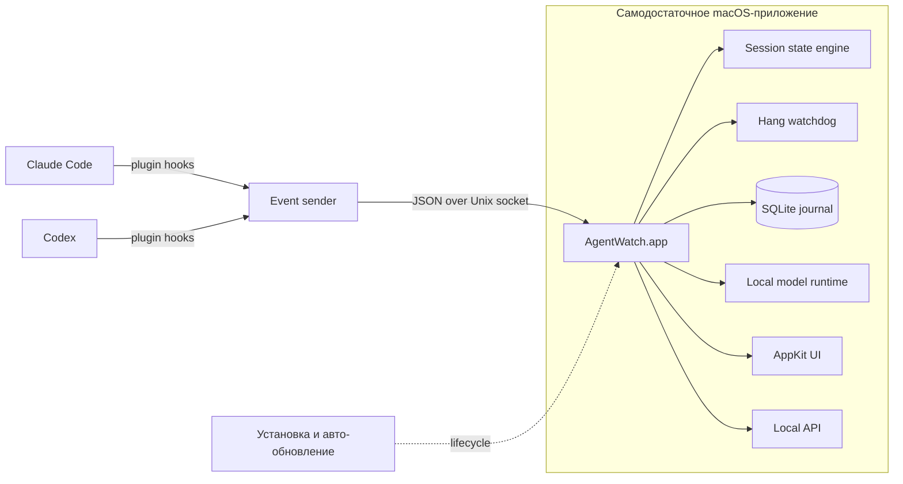

# Agent Watch: как следить за несколькими AI-агентами и замечать зависшие задачи

**Контекст:** Проектирование лёгкой macOS-утилиты для наблюдения за параллельными сессиями Claude
Code и Codex, включая локальную аналитику и обнаружение потенциально зависших shell-команд.
**Дата:** 2026-09-04

---

Когда одновременно работают несколько Claude Code и Codex-сессий, возникает парадокс: агенты
экономят время на программировании, но часть этой экономии съедается постоянным переключением между
окнами.

Нужно периодически проверять:

- закончил ли агент работу;
- не ждёт ли он подтверждения;
- выполняется ли тест или сборка;
- не зависла ли shell-команда;
- не завершилась ли сессия с ошибкой;
- где находится соответствующее окно.

Обычные уведомления решают только часть задачи. Они хорошо сообщают о завершении ответа, но почти
ничего не говорят о сессии, которая уже десять минут выглядит работающей, хотя запущенный процесс
ждёт ввод, сеть или бесконечно повторяет ошибочную операцию.

Agent Watch должен давать не ещё один поток уведомлений, а спокойную общую картину: какие сессии
активны, что они делают и где требуется внимание человека.

Главная идея решения:

> Claude Code и Codex сообщают приложению о lifecycle-событиях через hooks. Самодостаточное macOS-приложение хранит состояние, показывает виджет и позднее подключает дополнительные сигналы для диагностики зависаний.

Чтение текста из терминалов, OCR и анализ скриншотов для основной интеграции не нужны.

> **Состояние реализации на 2026-09-12.** Работает локальная alpha: AppKit HUD, меню, Unix-socket ingress, fail-open sender, нормализация Claude/Codex lifecycle events, чтение транскрипта, debug-window, базовый best-effort focus/закрытие CLI-сессии и самообновление из GitHub Releases. Встраивание в тулинг тоже работает и управляется из окна `Tooling…`: плагин хуков для Claude, слияние для Codex, обёртка статус-строки. Постоянная история, полноценный watchdog, статистика и локальные модели ещё не реализованы. Детальный порядок — в [плане реализации](implementation-plan.md).

---

## 1. Границы продукта

Agent Watch — локальное приложение, а не облачный сервис и не новая оболочка для запуска агентов.

Оно должно:

- видеть параллельные сессии Claude Code и Codex;
- обновлять состояние с допустимой задержкой в 5–10 секунд;
- показывать небольшой виджет поверх окон;
- отличать работу агента от ожидания пользователя;
- показывать фазу работы: планирование, исполнение, ожидание дочерних задач или завершение;
- отражать активные shell-команды, фоновые процессы и сабагентов, включая параллельную работу;
- давать достаточно контекста, чтобы смысл текущей активности был понятен без открытия сессии;
- позволять одним действием вернуться к окну или вкладке выбранной сессии;
- честно помечать потенциальные, а не доказанные зависания;
- хранить локальную историю для восстановления и аналитики;
- почти не использовать CPU и энергию в состоянии покоя.

Первая версия не должна:

- перехватывать терминальный ввод и вывод;
- автоматически завершать процессы;
- отправлять историю работы во внешние сервисы;
- требовать запуска агентов через специальную обёртку;
- использовать LLM для определения базового состояния сессии.

Полезный виджет можно получить уже на одних lifecycle hooks, а сложную диагностику добавлять после
того, как реальное использование покажет, какие случаи действительно мешают.

## 2. Факты и предположения

Наблюдаемую информацию нужно разделять на две категории.

### Факты

Их приложение получает непосредственно от агента:

- сессия началась или закончилась;
- пользователь отправил запрос;
- агент вызвал инструмент;
- shell-команда началась или завершилась;
- сессия находится в режиме планирования, если источник передаёт этот режим;
- запущен или завершён сабагент;
- активны несколько инструментов или фоновых задач;
- запрошено разрешение или ввод;
- ход завершён;
- инструмент вернул ошибку.

### Предположения

Они вычисляются по косвенным признакам:

- команда, возможно, зависла;
- процесс слишком долго не проявляет активности;
- тест зациклился;
- процесс ждёт сеть или интерактивный ввод;
- фоновая задача осталась работать после завершения хода.

Интерфейс не должен смешивать эти категории. Надпись «команда зависла» звучит как доказанный факт.
Корректнее показать:

> Возможно зависла: команда работает 14 минут, последние две минуты не было событий и процесс почти не использовал CPU.

## 3. Целевая архитектура

Система состоит из трёх независимо обновляемых частей.


```mermaid
flowchart LR
    Claude[Claude Code] -->|plugin hooks| Sender[Event sender]
    Codex[Codex] -->|plugin hooks| Sender

    Sender -->|JSON over Unix socket| App[AgentWatch.app]

    subgraph Runtime[Самодостаточное macOS-приложение]
        App --> Core[Session state engine]
        App --> Watchdog[Hang watchdog]
        App --> DB[(SQLite journal)]
        App --> Models[Local model runtime]
        App --> NativeUI[AppKit UI]
        App --> API[Local API]
    end

    Installer[Установка и авто-обновление] -. lifecycle .-> App
```

### AgentWatch.app

Приложение является единственным владельцем runtime-состояния:

- принимает события;
- нормализует форматы Claude и Codex;
- вычисляет состояние сессий;
- хранит журнал;
- показывает menu bar и плавающий `NSPanel`;
- принимает хуковые события через `HookIngressController` и встраивается в агентов через
  `ToolingCoordinator`, а меню статус-бара строит `StatusMenu` — все три отделены от
  `AppDelegate`, который остаётся композицией;
- управляет watchdog и локальными моделями;
- предоставляет локальный API для будущих клиентов.

Отдельный daemon не нужен. Когда окно настроек закрыто, приложение продолжает работать как menu
bar/accessory application. Таким образом долгоживущий процесс остаётся один — само приложение.

### Plugin

Плагин содержит declarative hooks и минимальный sender. Он передаёт событие непосредственно Agent
Watch и не зависит ни от какого промежуточного процесса.

### Установка

Отдельный инструмент установки не нужен. Приложение распространяется готовым пакетом, само проверяет
наличие новой версии при запуске и само ставит hook-интеграции для Claude и Codex.

Это позволяет приложению работать самостоятельно и не заставляет пользователя вручную собирать
несколько компонентов.

## 4. Почему приложение делается на AppKit

Основная причина — не бизнес-логика, а поведение системного интерфейса macOS.

Для виджета нужны:

- `NSStatusItem` в menu bar;
- плавающий `NSPanel` поверх обычных окон;
- `nonactivatingPanel`, чтобы не отнимать фокус у GoLand или терминала;
- поддержка разных Spaces;
- отображение рядом с fullscreen-приложениями;
- корректная обработка sleep/wake;
- сохранение положения и размера виджета.

Это естественно реализуется средствами AppKit. SwiftUI при желании можно использовать внутри сложных
экранов настроек, но системное поведение окна лучше оставить под явным контролем AppKit.

Приложение остаётся модульным, даже если собирается одним bundle:

```text
AgentWatch
├── EventIngress
├── SessionCore
├── Storage
├── HangWatchdog
├── LocalModels
├── LocalAPI
└── UI
    ├── Overlay
    ├── Sessions
    ├── History
    ├── Models
    └── Settings
```

UI подписывается на состояние `SessionCore`, а не содержит правила определения статусов.

## 5. Интеграция через hooks

Claude Code и Codex поддерживают lifecycle hooks, получающие JSON события через stdin. Полезны
события начала и окончания сессии, пользовательского хода, вызова инструмента, запроса
разрешения и завершения работы.
[Claude Code Hooks Reference](https://code.claude.com/docs/en/hooks),
[Codex Hooks](https://learn.chatgpt.com/docs/hooks)

Отсюда приложение получает всё, что знает о жизненном цикле. Как именно оно встраивается в
каждого агента, чем два агента отличаются, чего каждый требует и что про них выяснено опытом —
в отдельном документе: **[Встраивание в агентов](agent-integration.md)**. Там же контракт
отправителя и цена хука.

Первоначальный план — один версионируемый плагин из репозитория `instructions`, публикуемый в
оба менеджера расширений, — **отменён**. Менеджер расширений у Codex есть (`codex plugin add`,
`codex plugin marketplace`), но хуки через плагин он не исполняет: `plugin_hooks` стоит в
стадии `removed`. Одна упаковка на две экосистемы поэтому невозможна: Claude нужен свой
каталог, Codex остаётся слияние в общий файл. Проверка и её ловушки —
в [agent-integration.md](agent-integration.md), §7.

Ниже — то, что от агента уже не зависит: единая модель событий, в которую всё это
нормализуется.

## 6. Единая модель событий

Перенесено в [session-model.md](session-model.md#единая-модель-событий).

## 7. Фаза сессии и граф активностей

Перенесено в [session-model.md](session-model.md#фаза-сессии-и-граф-активностей); как фаза
выглядит в строке — в [widget.md](widget.md#лампочка-фазы).

## 8. Интерфейс: HUD и окно управления

У продукта три поверхности с разными задачами: значок в строке меню, плавающий HUD и окно
управления.

Значок и меню — [menu-bar.md](menu-bar.md); виджет — [widget.md](widget.md); окно настроек —
[settings.md](settings.md); окно тулинга —
[agent-integration.md](agent-integration.md#окно-тулинга); клик по строке —
[session-focus.md](session-focus.md) и [ide-plugin.md](ide-plugin.md).

### Полное окно

Окно настроек и истории ориентируется на UX Handy: sidebar, ясные карточки, разделение установленных
и доступных ресурсов, понятные действия и минимум терминологии.

Предлагаемые разделы:

```text
General
Sessions
History
Models
Integrations
Advanced
About
```

Раздел `Models` повторяет сильные стороны Handy:

- `Downloaded` и `Available to Download`;
- `Active` и `Recommended`;
- краткое описание назначения;
- относительные показатели скорости и качества;
- оценка RAM и размер на диске;
- скачать, активировать, удалить;
- технические параметры только в `Advanced`.

Пользователю полезнее выбирать профиль, а не разбираться в quantization:

- минимум ресурсов;
- сбалансированный;
- лучший анализ;
- ручная настройка.

## 9. Проверка потенциальных зависаний

Перенесено в [session-model.md](session-model.md#проверка-потенциальных-зависаний).

## 10. Локальные модели

Локальная LLM не является источником истины о состоянии сессии. События, таймеры и process signals
обрабатываются обычным кодом.

Модель может быть полезна поверх уже собранных фактов:

- кратко объяснить, почему операция выглядит подозрительно;
- свернуть длинную историю событий в summary;
- предложить понятное имя сессии;
- классифицировать shell-команду как тест, сборку, сервер или watcher;
- сгруппировать повторяющиеся проблемы;
- расставить приоритеты между несколькими сессиями, требующими внимания.

Для первой интеграции подходит Ollama: он упрощает скачивание моделей и запуск локального API.
Архитектура приложения при этом должна иметь provider abstraction, чтобы позднее можно было
использовать MLX или `llama.cpp` без переделки UI.

На ноутбуке с 48 ГБ памяти разумно разделить модели на два режима:

- небольшая 3–8B модель для быстрых on-demand задач;
- 14–32B модель для более глубокого анализа, загружаемая только вручную или при действительно
  подозрительной ситуации.

Модель не загружается вместе с виджетом и выгружается после периода бездействия. Конкретный набор
LLM-функций должен быть согласован отдельно после наблюдения за MVP, иначе легко потратить ресурсы
на возможности, которые красиво выглядят, но редко помогают.

## 11. Установка, обновление и статистика

### Дистрибуция

Приложение распространяется собранным установочным пакетом, публикуемым средствами GitHub.
Отдельного инструмента установки нет.

### Первый запуск

Пустой виджет, которому неоткуда получать события, предлагает `Connect Agent →`.
Нажатие открывает окно Tooling с мастером: выбор Claude/Codex → подключение → проверка сигнала.
Обычное открытие Tooling тоже начинает мастер, если обе интеграции отсутствуют. По центру окно
встаёт только при первом показе за запуск; дальше оно открывается там, где его оставили.
Установленная программа и интеграция показываются отдельно: наличие исполняемого файла проверяет
`AgentInstallationLookup` в PATH, обычных каталогах установки (в том числе `~/.volta/bin`,
`~/.bun/bin`, `~/.nvm/versions/node/*/bin`), в `~/.claude/local/claude` и в бандле Codex. Ничего
при этом не запускается — ни shell, ни сам агент.
«Не найдено» не означает «не установлено» и не запрещает подключение нестандартной установки.

Текущий шаг выделен рамкой и пояснением. Hooks ставятся только явной кнопкой; статусная строка
Claude необязательна. Установка не объявляется доставкой: шаг проверки ждёт факта полученного
события, показывает reload/trust-инструкцию и обновляется по ingress, без idle polling.
Уже записанный факт доставки учитывается, а текст предлагает новую сессию для проверки текущей
конфигурации. Это не проверка доверия ко всем отдельным хукам Codex. Сочетание клавиш для виджета
мастер называет то, которое приложение действительно зарегистрировало; если рабочего сочетания
нет, он говорит, что виджет возвращает пункт `Show Widget` в меню значка, а сочетание можно задать
на странице `General` окна настроек.

`SetupJourney` в Core хранит только навигацию; файловые операции остаются в установщике.
Кнопки мастера означают «установить», а не «переключить»: внешнее изменение файла не превращает
нажатие Install в удаление. Ошибка записи видна в окне, пока его снова не откроют кнопкой
`Open Tooling…`: при каждом таком открытии строка ошибки прошлого действия стирается. `Set Up Again…` повторяет мастер
без сброса сессий, оформления или интеграций; завершить позже можно через возврат к обычному Tooling.

Если виджет уже заполнен обнаруженными процессами, вход остаётся через Tooling. Автоматическое
предложение о новом агенте после первого подключения и память отказа пока не реализованы —
проверки и оставшиеся решения перечислены в [плане релиза](release-plan.md).

### Обновление

Наличие новой версии проверяется при запуске — через пять секунд после старта, чтобы не соревноваться
с тем, чего человек ждёт. Когда версия есть, приложение предлагает обновиться и всегда оставляет
возможность отказаться: «не сейчас» действует до следующего запуска, «пропустить 0.2.0» — до
следующей версии. Проверку можно выключить совсем (`Check for updates on launch` на странице
`General`), и она выключает себя сама в
сборке без бандла: у неё нет версии, которую можно с чем-то сравнить. Выключение в течение
пятисекундной задержки отменяет ещё не начавшийся запрос. Ответ HTTP 404 означает отсутствие
завершённого релиза; HTTP 200 с неразбираемым телом означает ошибку проверки, а не «обновлений нет».

**Это единственное обращение приложения наружу.** Запрос — обычный `GET` к публичному API GitHub, без
параметров и без единого поля о человеке: сравнение версий происходит на машине, а не на той стороне.
GitHub видит то же, что любой сайт: адрес, IP и заголовок `User-Agent` (строка, которой программа
представляется серверу). Его приложение задаёт само, одним словом `AgentWatch`: замерено, иначе
система подставила бы `AgentWatch/<CFBundleVersion> CFNetwork/… Darwin/…` — с номером версии, то есть
ровно то, чего запрос обещает не нести. Спрашивается последний завершённый релиз
(`/releases/latest`), поэтому черновики и сборки с пометкой pre-release не предлагаются никогда — а
это ровно то поведение, которое нужно: сборка, которую пробуют, не должна ставить себя тем, кто
выбрал завершённую версию.

Обновление приложение ставит само: скачивает архив, сверяет его с контрольной суммой из релиза,
распаковывает `ditto`, проверяет печать подписи распакованного бандла (`codesign --verify --strict`,
под любым сертификатом, ad-hoc тоже) и подменяет свой бандл атомарной заменой, после чего запускает
новую копию и выходит. Порядок именно такой, потому что второй экземпляр не поднимется, пока первый
держит сокет: новую копию открывает короткий `sh`, переживающий этот процесс, — и он ждёт не две
секунды, а пока процесс не исчезнет (`kill -0` в цикле), иначе копия, открытая раньше, нашла бы ещё
живой замок и вышла сама.

Весь путь проверяется сквозным тестом (`task e2e-update`): копия версии 0.0.9 собирается в отдельной
папке, запускается со своим каталогом состояния и своим адресом релиза, а кнопки нажимаются через
дерево доступности. Проверено на живом релизе: 0.0.9 → 0.1.0, старый процесс вышел, подпись
установленного бандла цела.

Ключевой факт, который делает такое обновление возможным без нотаризации: флаг `com.apple.quarantine`
ставит не система, а тот, кто скачивает файл, — и браузер его ставит. Скачанное самим приложением
такой пометки не получает и открывается без вопросов. Замерено на настоящем релизе: файл после
загрузки не браузером несёт только `com.apple.provenance`, а распакованный бандл запустился без
единого диалога.

### Статистика

Статистика остаётся внутри приложения и не требует внешнего клиента.

Начальная статистика:

- общее количество сессий;
- количество сессий по Claude/Codex и проектам;
- длительность активной работы;
- время ожидания реакции человека;
- время между завершением хода и следующим возвращением пользователя;
- число ошибок и предупреждений о потенциальном зависании.

Важно отдельно различать:

- `attention wait`: агент явно ждёт разрешение или ввод;
- `review delay`: агент закончил ход, но пользователь ещё не вернулся к результату.

По умолчанию данные остаются локальными. Командная агрегация или отправка телеметрии — отдельное
продуктовое и privacy-решение.

## 12. Локальный API

Для plugin sender и будущих клиентов достаточно небольшого протокола поверх Unix domain socket:

```text
POST /v1/events
GET  /v1/health
GET  /v1/sessions
GET  /v1/stats
GET  /v1/models
POST /v1/models/{id}/download
POST /v1/models/{id}/activate
```

Живому клиенту можно добавить поток обновлений или короткий polling. Протокол версионируется с
первой версии; несовместимый клиент должен получить понятную ошибку с предложением обновления.

Unix socket предпочтительнее TCP-порта:

- не появляется новый сетевой listener;
- меньше поверхность атаки;
- права можно ограничить текущим пользователем;
- отсутствуют диалоги firewall;
- transport работает без сети.

## 13. Энергоэффективность

Базовая версия должна быть событийной:

- никаких скриншотов и OCR;
- никакого постоянного Accessibility polling;
- UI обновляется только при изменении состояния или видимого таймера, и обновляется по строкам:
  событие об одной сессии пересобирает одну строку, а не список. Замерено на одном событии: полная
  пересборка стоила 2,3 мс при одной сессии, 14,8 мс при десяти и 58 мс при сорока, поэтому при
  десятке работающих агентов каждое событие съедало кадр; пересборка по строкам стоит около 1,7 мс
  и от числа сессий не зависит. Правило — в разделе «Что виджет показывает, и как он это
  перерисовывает»;
- на событие приходится одна строка на сессию, а не две: бюджет ширины для имени меряется на той
  самой строке, которая его понесёт, а не на второй, построенной ради замера и выброшенной;
- журнал отладки дописывает одну строку, а не переписывает файл целиком на каждое событие; полная
  перезапись оставляет последние 500 записей, когда файл достигает 1000 строк; между такими
  перезаписями строки только дописываются;
- payload, уже разобранный из JSON, не кодируется обратно в байты ради повторного разбора: редакция
  работает прямо над `JSONValue` и в отправителе, и в приложении;
- хуков регистрируется столько, сколько нужно, и не больше: цена хука — это запуск процесса, а не
  его работа. Замерено на машине с корпоративным агентом безопасности, разрешающим каждый `exec`:
  `fork` без запуска программы — 0,7 мс, `/usr/bin/true` — 255 мс, и цена складывается линейно по
  числу запусков. Агент вызывает хук через оболочку, поэтому один хук стоит 0,78 с, из которых
  собственная работа отправителя — 5–12 мс; отладочная и release-сборки неразличимы. Пока просились
  и `PreToolUse`, и `PostToolUse`, они вместе добавляли 1,55 с к каждому вызову инструмента
  (измерено по кругам `Read`, `Edit` и `Write`, чей пол — 1,57 с). Отсюда вывод, обратный
  ожидаемому: оптимизировать код отправителя бессмысленно, а `PostToolUse` не запрашивается вовсе —
  его единственную работу, закрытие активности, делают и чтение транскрипта, и конец хода;
- процессный watchdog выключен, пока нет активных shell-команд;
- пятнадцатисекундная уборка (снятие связи, удаление закрытых сессий) включается только когда есть
  работа: сессия в наблюдаемой фазе или закрытая сессия при включённом авто-удалении. В состоянии
  покоя таймера нет;
- файловые события агрегируются;
- локальная модель запускается только по требованию;
- история хранится с ограниченным retention.

До начала полноценной реализации стоит определить измеримый budget для idle CPU, памяти и wakeups, а
затем проверять его на каждой крупной стадии. «Лёгкое приложение» должно быть проверяемым свойством,
а не только намерением.

## 14. Отказоустойчивость

Перенесено в [session-recovery.md](session-recovery.md).

## 15. Приватность и безопасность

> Правило, на которое ссылается код: [ADR-0001](adr/0001-nothing-leading-to-a-file-crosses-the-socket.md)
> — ничто, ведущее к файлу, не пересекает сокет. Здесь — подробности и остальные ограничения.

Для отображения статуса не нужны полные prompts, ответы или stdout.

По умолчанию достаточно хранить:

- источник и session ID;
- рабочую директорию или безопасное имя проекта;
- тип инструмента;
- timestamps и продолжительность;
- exit code;
- очищенное краткое описание команды;
- агрегированные показатели активности.

Полную shell-команду лучше не сохранять: она может содержать токены, URL с credentials или значения
переменных окружения.

Числовая телеметрия проверяется до преобразования в `Int`: принимаются только конечные
неотрицательные целые значения не больше 100 миллионов. Переполнение и дробные значения
отбрасываются, а не завершают приложение. Unix-socket проверяет длину UTF-8 пути с учётом
нулевого байта; остановка удаляет только socket, которым владел этот listener, и не трогает
обычный файл или подменённый socket на его месте.

Между запусками приложение переживает четыре вещи, и все четыре лежат в одном каталоге
`~/Library/Application Support/AgentWatch/`: настройки виджета (`settings.json`), журнал отладки
(`event-debug.log`, окно последних записей), `agents-heard.json` — по агенту дата последнего
дошедшего события и признак того, что хуки поставило само приложение, — и
`sessions-remembered.json` со сессиями последнего запуска. В debug-сборке все эти пути,
включая журнал, подчиняются `AGENT_WATCH_SUPPORT_DIR`; release-сборка это переопределение игнорирует.

Журнал отладки занимает на диске не больше 1 МиБ, а одна запись — не больше 1 КиБ в UTF-8;
переводы строк внутри записи становятся пробелами. И история в памяти, и окно отладки держат
только последние 500 записей — окно даже тогда, когда скрыто; при открытии окно встаёт на
последнюю запись. Слишком большой старый журнал при открытии читается только с последнего мегабайта и
сжимается. Перед каждой дописью проверяется настоящий размер файла, а неудавшееся сжатие не
сбрасывает счётчик записей и не открывает путь к росту сверх этих пределов. Повторяется оно не на
каждом событии: следующая попытка — через 500 записей (`maximumEntryCount`), а до неё журнал на
диск ничего не пишет.

В журнал отладки к сообщённому сбою чтения дописывается, на каком шаге оно упало и как систему
назвала ошибку: `transcript unreadable · open: NSCocoaErrorDomain 513`. Шаг — одно из `open`,
`size`, `seek`, `read`, `parse`; ошибка — домен и код, и намеренно не `localizedDescription`,
который цитирует путь к файлу. Строка нужна потому, что одно упавшее чтение бронирует минуту
паузы: треугольник стоит минуту над событием длиной в миллисекунду, и без этой приписки после
него не остаётся ничего — ни удалённого файла, ни изменившихся прав не отличить.

Устройство файла настроек — в [settings.md](settings.md#файл-настроек).

Только последний файл содержит что-то о самих сессиях, поэтому его состав назван целиком:
хешированная метка сессии, агент, порядковый номер строки, имя сессии, имя проекта, ветка, режим,
модель, размер контекста, PID агента и время последнего наблюдения. Рядом с сессиями в том же файле
лежит второй список — пары «этот процесс есть эта сессия»: имя процесса (его номер и время запуска)
и хешированная метка сессии. Ничего нового в файл это не приносит — обе половины уже перечислены
выше, — но лежит отдельно, потому что переживает саму запись о сессии ([session-recovery.md](session-recovery.md)). Ни команд, ни путей, ни
содержания разговора там нет — то же правило, что и на проводе. Открытых вызовов там нет, и фазы
тоже — кроме одной: сессия, ждущая человека, сохраняет её вместе с идентификатором вызова, которого
ждёт, и видом запроса, потому что второго такого хука не придёт ([«Приложение перезапустилось»](session-recovery.md#приложение-перезапустилось)). Всё остальное из фазы не
переживает перезапуск, и это не про приватность, а про ту же причину ([«Приложение перезапустилось»](session-recovery.md#приложение-перезапустилось)).

### Что сессия рассказывает о себе

Виджет показывает четыре вещи, которых нет в hook payload: собственное имя сессии (`custom-title`
или `ai-title` из транскрипта Claude, `thread_name` из индекса тредов Codex), имя проекта, ветку git
и размер контекста. Остальные разрешённые поля протокола — структурные факты (`tool_name`,
`permission_mode`, счётчики), а имя порождается моделью из содержания разговора, поэтому к нему
применим тот же довод, что и к промптам.

**Имя сессии Claude бывает двух видов.** `custom-title` — имя, которое дал человек: `/rename` или
`claude --name`. `ai-title` — название, которое Claude Code сам просит у маленькой модели по первому
запросу не короче 10 знаков; более короткий запрос или слеш-команда только откладывают попытку до
следующего хода. Первое важнее второго — так же, как у самого Claude Code во вкладке терминала и в
`/resume`. Решает самая новая запись `custom-title`: пустая означает, что имя сняли, и тогда снова
действует `ai-title`. Названия может не быть вовсе: пока не пришёл такой запрос и модель не
ответила, при неудачном вызове модели и при `CLAUDE_CODE_DISABLE_TERMINAL_TITLE`, которая выключает
генерацию вместе с заголовком вкладки. Тогда у сессии есть только имя, данное человеком, а без него — никакого. Одно расхождение
принято: при `terminalTitleFromRename: false` вкладка носит `ai-title`, строка — `custom-title`, и
вкладку Ghostty по имени не найти.

Приняты четыре ограничения:

- **читает только hook-процесс.** У приложения нет ни сырого `session_id`, ни `transcript_path`, ни
  `cwd` — все три вычищаются до отправки. Через socket идут только готовые значения;
- **от рабочего каталога уходит только его собственное имя** (`agent-watch`), а не путь к нему.
  Имени достаточно, чтобы опознать проект в карточке, и оно не рассказывает, как устроены каталоги
  на машине. Это уточнение прежнего правила, а не отказ от него: путь по-прежнему не покидает
  hook-процесс;
- **транскрипт Claude читается хвостом в 256 КБ**, а не целиком, и на каждом событии. Размер окна
  выбран по замеру: на восьми свежих транскриптах последняя запись заголовка отстояла от конца на
  0,5–30 КБ, и одного крупного результата инструмента хватило бы, чтобы вытеснить её из окна
  вчетверо меньше — тогда у сессии молча не оказалось бы имени вовсе. Чтение не ограничено границами
  хода: замер показал, что вызов с чтением хвоста 85-мегабайтного транскрипта и вызов без чтения
  файла вовсе занимают одинаковые 0,77 с — это целиком запуск процесса. Ограничение по событиям
  ничего не экономило, но заставляло уже запущенную сессию ждать конца хода, чтобы получить имя;
- **индекс Codex читается целиком для проверки принадлежности.** Это компактные метаданные тредов, а
  не транскрипт. Здесь нельзя искать только в хвосте: найденный `session_id` решает, допустить ли
  событие в виджет, и старая, но ещё активная пользовательская сессия не должна исчезнуть из-за
  того, что после неё создали много других тредов;
- **строки ограничены по длине** — 120 знаков для имени сессии, 60 для имени проекта и ветки, — из
  них удаляются управляющие символы и двунаправленные переопределения (U+202A–202E, U+2066–2069),
  которые иначе заставили бы подпись читаться задом наперёд. Соединитель нулевой ширины при этом
  сохраняется, иначе составной эмодзи распался бы на части. Ни одна строка нигде не сохраняется на
  диск;
- **имя проекта проверяется на границе, а не только в отправителе.** Поле идёт рядом с payload, а не
  внутри него, поэтому через `HookCaptureRedactor` не проходит: значение с разделителем пути
  отбрасывается на входе. Обещание «путь не покидает hook-процесс» держится здесь, а не только
  намерением;
- **счётчик контекста ограничен сверху.** Транскрипт — это файл на диске, в него может писать что
  угодно; число сверх правдоподобного отбрасывается, а перевод дробного числа в целое проверяется на
  переполнение — иначе одно значение вида `1e30` роняло бы hook-процесс, который весь написан ради
  того, чтобы не падать.

Отдельно — **признак фонового запуска**. `run_in_background` лежит внутри `tool_input`, а этот
объект содержит саму команду и вычищается целиком. Ослаблять правило ради одного значения нельзя,
поэтому hook-процесс читает флаг из сырого payload и передаёт его рядом с payload, как отдельный
булев факт: `HookIngressRequest.toolRunsInBackground`. Флаг — не содержимое, и через него нельзя
восстановить ни команду, ни путь. Принимается только настоящий булев тип: строка `"true"` — это
форма payload, которую никто не обещал, и догадка о ней была бы выдумыванием факта. Проверяется
тестом на настоящем отправителе: флаг доезжает, а команда рядом с ним — нет.

Размер контекста берётся из блока `usage` последнего хода: `input_tokens`, `cache_read_input_tokens`
и `cache_creation_input_tokens`. Процента там нет, и он не вычисляется: транскрипт нигде не говорит,
долей от чего эти числа являются, а таблица размеров окна по моделям молча устарела бы на следующей
модели. Квот аккаунта (5 часов, 7 дней) в файлах сессии нет вовсе — они приходят только от
источника, который сам их сообщает.

Одно ограничение записано честно: срок в 100 мс, которым отправитель ограничивает чтение stdin и
запись в socket, **не покрывает чтение файла**. Оно синхронное, и на локальном диске это доли
миллисекунды (замер выше), но транскрипт или `CODEX_HOME` на зависшем сетевом томе заблокируют
hook-процесс. Принято как риск: сессии агентов работают в локальных каталогах, а перенос чтения на
отдельный поток ради этого случая стоит дороже, чем он стоит. Если случай встретится — чтение уходит
в поток с ожиданием по сроку.

Форматы `custom-title`, `ai-title`, `gitBranch`, `thread_name` и `usage` — недокументированные
внутренние детали Claude Code и Codex, они уже менялись. Поэтому любая неудача чтения означает
«не известно», а не ошибку.

**Чего на проводе больше нет.** Каждое поле, пересекающее границу процесса, — это поверхность, и
поверхность без читателя не оправдана ничем. Убраны три:

- `turn_id` в конверте события (в payload он по-прежнему хешируется — там он нужен для корреляции
  при разборе захваченных событий);
- имя инструмента как текст активности: `SessionActivity.summary` нигде не отображался. Вид работы
  по-прежнему определяется по имени, но само имя дальше нормализатора не идёт;
- время сброса квоты (`five_hour_resets_at`, `seven_day_resets_at`): разбиралось и не показывалось.

Отдельная команда `AgentWatchCapture`, которой раньше смотрели сырые payload, удалена: свою
задачу она выполнила, а разбор несовпадений теперь делает временный raw capture в debug-сборке.
Вместе с ней ушла и байтовая входная точка редактора в `AgentWatchCore` — после удаления
команды её звал только собственный тест, а код, у которого единственный вызывающий — тест,
именно так и загнивает. Тесты редакции ходят от сырых байтов через `JSONDecoder`, то есть тем
же путём, каким приходит socket.

Следствие, которое стоит знать: allowlist имён инструментов — фиксированный список, и всё, чего в
нём нет, приходит как `<redacted>`. Замерено по шести свежим транскриптам: это 12% всех вызовов —
весь MCP, `ToolSearch` и `Agent`. Сегодня это верный ответ (все они и есть «прочий инструмент»), но
случай отвечать по имени инструмента вне списка нужно понимать как невозможный, а не забытый. Тест
на это ходит через редактор, а не мимо него, иначе он проверяет строку, которую socket доставить не
может.

Дополнительные меры:

- socket доступен только текущему пользователю;
- база не синхронизируется в облако;
- старые события автоматически удаляются;
- известные секреты редактируются до записи;
- входной JSON никогда не исполняется;
- плагин и app bundle подписываются и версионируются;
- установка hooks прозрачна и обратима.

### Встраивание в чужие инструменты

Приложение пишет в три чужих места: каталог плагина под `~/.claude/skills/`, ключ `statusLine`
в `~/.claude/settings.json` и `~/.codex/hooks.json`. Правило одно и формулируется по
содержимому, а не по владельцу: **копия делается перед всякой записью в то, что писало не
приложение** — под него попадает и файл в нашем собственном каталоге, если он хранит команду
человека.

Чужой скрипт не редактируется ни при каких условиях; статус-строка получает свою обёртку,
пропускающую исходную команду насквозь. Механизм целиком, включая доверие к хукам у Codex и
разбор того, почему «установлено» не означает «работает», —
в [Встраивании в агентов](agent-integration.md).

**Это же свойство закрывает дорогу в Mac App Store, и решение принято: туда не идём.** Правило
2.4.5 гайдлайнов Apple требует от приложения из Store быть «self-contained, single app installation
bundle», запрещает «install code or resources in shared locations» и «install … additional code, or
resources to add functionality», а чужие данные разрешает менять только через API самой Apple.
Каталог плагина под `~/.claude/skills/`, ключ в чужом `settings.json` и слияние в
`~/.codex/hooks.json` — это ровно перечисленное. Плагин IDE в этот список как раз не входит: его
ставит сама IDE из файла, а приложение только даёт путь — но трёх остальных хватает. Закладкой
на выбранный человеком каталог это не обходится: песочница и правило ревью — разные слои, и запрет
здесь во втором. Версия для Store существует, но она заменяет «поставить» на «показать, что
вставить», то есть это другой продукт. Поэтому раздача — подписанный и нотаризованный bundle.

Парная форма «показать, что вставить» нужна и без Store. Сегодня, когда запись не удалась — нет
прав, домашний каталог только для чтения, шаг доверия у Codex делается руками, — приложению нечего
предложить, кроме «не получилось».

### Чтение транскрипта сессии

Перенесено в [transcript-reader.md](transcript-reader.md).

### Временный raw capture в debug-сборке

Для разбора несовпадений между реальными hook-payload и нормализованным состоянием debug-сборка
может по явному локальному переключателю сохранить исходные payload. Это намеренное исключение из
обычного правила о редактировании данных и не входит в release-сборку — а бандл, который собирает
`task build-app`, и есть release, поэтому установленное приложение рекордера не содержит вовсе.
Запись выключена по умолчанию, действует 30 минут и прекращается в самом hook-процессе после
истечения срока — даже когда приложение уже не запущено.

Payload передаётся дочернему процессу через безымянный объект разделяемой памяти, и у этой
передачи два ограничения Darwin, каждое из которых молча ломает её целиком. Имя объекта не
может быть длиннее 31 символа вместе со слэшем: полный UUID давал 55, и `shm_open`
отвечал `ENAMETOOLONG` при каждом вызове. Размер объекта округляется вверх до страницы, то
есть 61 байт payload приезжает объектом в 16384 байта — проверять размер на равенство
нельзя, только на «не меньше». Обе ошибки существовали одновременно, обе выглядели как
пустой каталог, и ни один модульный тест их не видел, потому что все они звали рекордер
напрямую. Поэтому есть сквозной тест на весь путь целиком, а переменная окружения
`AGENT_WATCH_DEBUG_CAPTURE_DIR` (только в debug-сборке) переносит каталог захвата, чтобы
такому тесту было куда писать.

Захват fail-open: ошибка чтения настройки, занятая блокировка или ошибка диска
пропускает только диагностическую запись, но не меняет отправку события в Agent
Watch и не ждёт записи raw-файла в hook-процессе. Запуск дочернего процесса стоит
последним, уже после отправки события, чтобы диагностика не оплачивалась задержкой агента.
Payload вклеивается в строку байт в байт, поэтому внешние пробелы обрезаются, а payload с
переводом строки внутри отбрасывается целиком: одна запись обязана быть одной строкой, а
перекодировать разобранное значение значило бы потерять точные числа и повторяющиеся
ключи — то самое, ради чего raw-захват и держат. Файлы принадлежат только текущему
пользователю. Пять JSONL
сегментов по 2 MiB образуют кольцевой журнал: перед переходом на новый сегмент
удаляется самый старый, поэтому суммарный объём raw-payload не превышает 10 MiB.
Обычный Event Debug остаётся отдельным, компактным журналом редактированных
нормализованных событий; он служит быстрой картиной для человека, а raw capture —
коротким доказательством для диагностики.

**Срок записи и срок хранения — разные вещи, и второй принадлежит человеку.** Тридцать минут
ограничивают, сколько времени идут записи, и ничего не говорят о том, сколько они лежат.
Складывать удаление в остановку нельзя: останавливают запись именно затем, чтобы прочитать
записанное. Поэтому удаление — отдельное действие меню, оно называет объём и показывается
только когда есть что удалять; само его присутствие и есть ответ на вопрос «осталось ли
что-нибудь на диске», которого раньше не давал никто. Удаляются только файлы с известными
именами сегментов, а не содержимое каталога: каталог мог бы содержать и чужое.

### Отвергнутое событие тоже новость

Перенесено в [session-model.md](session-model.md#отвергнутое-событие-тоже-новость).

### Порядок событий на приёме

Перенесено в [session-model.md](session-model.md#порядок-событий-на-приёме).

### Приём Codex-сессий

Codex Desktop вызывает hook и для внутренней служебной сессии, которая не создаёт тред в
`session_index.jsonl`. Отправитель отсекает её тем же чтением индекса, которым берёт имя, — то
есть **не** фильтром по содержимому prompt и не опросом. Подробности
в [Встраивании в агентов](agent-integration.md).

## 16. Порядок развития

Работа делится на семь последовательных стадий:

1. AppKit MVP с точными lifecycle-состояниями и ранним dogfooding.
2. Встраивание в оба агента средствами самого приложения — у каждого своим механизмом, потому
   что общего нет (§5).
3. Установка, обновление и первый запуск.
4. Отдельно спроектированный watchdog потенциальных зависаний.
5. Полноценные настройки и Handy-подобный management UI.
6. Исследование LLM-сценариев и интеграция через Ollama после отдельного согласования функций.
7. Локальная статистика.

Технический spike первой стадии завершён: набор lifecycle hooks подтверждён на Claude CLI и Codex,
обезличенные fixtures и Unix-socket transport добавлены в репозиторий. Следующий узкий этап —
оформить нынешнюю локальную hook-конфигурацию как штатный plugin, не добавляя launcher или terminal
proxy.

Подробные deliverables, зависимости и критерии готовности зафиксированы в [плане
реализации](implementation-plan.md).

## Итоговая рекомендация

Практичная архитектура выглядит так:

> Самодостаточное AppKit-приложение принимает lifecycle-события Claude Code и Codex из версионируемого plugin, сводит их к общей машине состояний и показывает лёгкий HUD. Приложение само ставит интеграции и обновляется, а позднее показывает локальную аналитику. Watchdog и локальная LLM добавляются после проверки базового продукта в ежедневной работе.

Такой порядок быстро даёт полезный результат и сохраняет пространство для развития. Мы не строим
сложную платформу до того, как поймём реальные паттерны зависаний и наиболее полезные LLM-сценарии.
