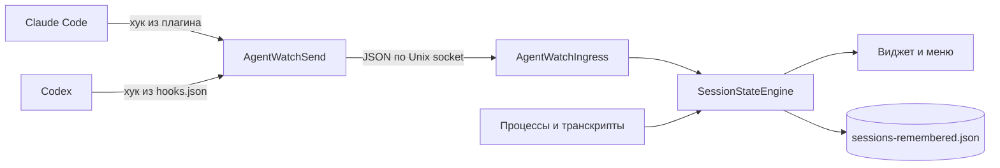

# Архитектура Agent Watch

Здесь — задача, границы продукта, из каких частей собрано приложение, как событие от агента доходит
до экрана, что лежит на диске и что из данных сессии приложение видит. Чего здесь нет: подробности
каждой части — в документах `docs/`, на которые ссылается текст ниже; этапы и открытые решения —
[implementation-plan.md](implementation-plan.md); решения с их причинами — [docs/adr/](adr/).

## Задача

Когда одновременно работают несколько Claude Code и Codex-сессий, возникает парадокс: агенты
экономят время на программировании, но часть этой экономии съедается постоянным переключением между
окнами.

Нужно периодически проверять:

- закончил ли агент работу;
- не ждёт ли он подтверждения;
- выполняется ли тест или сборка;
- не зависла ли shell-команда;
- не завершилась ли сессия с ошибкой;
- где находится соответствующее окно.

Обычные уведомления решают только часть задачи. Они хорошо сообщают о завершении ответа, но почти
ничего не говорят о сессии, которая уже десять минут выглядит работающей, хотя запущенный процесс
ждёт ввод, сеть или бесконечно повторяет ошибочную операцию.

Agent Watch должен давать не ещё один поток уведомлений, а спокойную общую картину: какие сессии
активны, что они делают и где требуется внимание человека.

Главная идея решения:

> Claude Code и Codex сообщают приложению о lifecycle-событиях через hooks. Самодостаточное macOS-приложение хранит состояние, показывает виджет и позднее подключает дополнительные сигналы для диагностики зависаний.

Чтение текста из терминалов, OCR и анализ скриншотов для основной интеграции не нужны.

## Границы продукта

Agent Watch — локальное приложение, а не облачный сервис и не новая оболочка для запуска агентов.

Оно должно:

- видеть параллельные сессии Claude Code и Codex;
- обновлять состояние с допустимой задержкой в 5–10 секунд;
- показывать небольшой виджет поверх окон;
- отличать работу агента от ожидания пользователя;
- показывать фазу работы: планирование, исполнение, ожидание дочерних задач или завершение;
- отражать активные shell-команды, фоновые процессы и сабагентов, включая параллельную работу;
- давать достаточно контекста, чтобы смысл текущей активности был понятен без открытия сессии;
- позволять одним действием вернуться к окну или вкладке выбранной сессии;
- честно помечать потенциальные, а не доказанные зависания;
- хранить локальную историю для восстановления и аналитики;
- почти не использовать CPU и энергию в состоянии покоя.

Приложение не должно:

- перехватывать терминальный ввод и вывод;
- автоматически завершать процессы;
- отправлять историю работы во внешние сервисы;
- требовать запуска агентов через специальную обёртку;
- использовать LLM для определения базового состояния сессии.

## Факты и предположения

Наблюдаемую информацию нужно разделять на две категории.

### Факты

Их приложение получает непосредственно от агента:

- сессия началась или закончилась;
- пользователь отправил запрос;
- агент вызвал инструмент;
- shell-команда началась или завершилась;
- сессия находится в режиме планирования, если источник передаёт этот режим;
- запущен или завершён сабагент;
- активны несколько инструментов или фоновых задач;
- запрошено разрешение или ввод;
- ход завершён;
- инструмент вернул ошибку.

### Предположения

Они вычисляются по косвенным признакам:

- команда, возможно, зависла;
- процесс слишком долго не проявляет активности;
- тест зациклился;
- процесс ждёт сеть или интерактивный ввод;
- фоновая задача осталась работать после завершения хода.

Интерфейс не должен смешивать эти категории. Надпись «команда зависла» звучит как доказанный факт.
Корректнее показать:

> Возможно зависла: команда работает 14 минут, последние две минуты не было событий и процесс почти не использовал CPU.

## Части приложения

Приложение — один Swift Package из нескольких целей (targets) и отдельный плагин JetBrains IDE:

- `AgentWatchCore` — состояние сессий и правила над ним: события, фазы, порядок строк, что
  переживает перезапуск. Не импортирует AppKit и не открывает сокетов, поэтому проверяется тестами
  без запущенного приложения. Менять состояние можно только через `SessionStateEngine`
  ([ADR-0004](adr/0004-one-door-into-session-state.md)).
- `AgentWatchApp` — жизнь приложения в macOS и всё, что видно: виджет, меню, окна настроек и
  тулинга. Приём хуков (`HookIngressController`), наблюдение за живыми сессиями
  (`SessionSupervisor`, [ADR-0007](adr/0007-the-session-supervisor-stays-in-the-app.md)), встраивание
  в агентов (`ToolingCoordinator`) и меню (`StatusMenu`) отделены от `AppDelegate`, который только
  собирает их вместе.
- `AgentWatchIngress` — сервер сокета, и ничего больше
  ([ADR-0006](adr/0006-the-socket-server-stays-out-of-core.md)).
- `AgentWatchSend` — команда, которую агент запускает как хук. Что она говорит и как, решает
  библиотека `AgentWatchSender`: строит запрос из payload на stdin и отдаёт его в сокет.
- `AgentWatchLookup` — что говорит машина: какие процессы агентов запущены, какой из них запустил
  этот хук, как сессия называет себя в своих файлах. Её спрашивают и приложение, и хук; сама она
  ничего не отправляет.
- `ide-plugin/` — плагин на Kotlin, который находит вкладку терминала сессии внутри IDE
  ([ide-plugin.md](ide-plugin.md)). В сборку Swift не входит.

Отдельный daemon не нужен. Когда окно настроек закрыто, приложение продолжает работать как menu
bar/accessory application. Таким образом долгоживущий процесс остаётся один — само приложение.

## Путь события

```mermaid
flowchart LR
    Claude[Claude Code] -->|хук из плагина| Send[AgentWatchSend]
    Codex[Codex] -->|хук из hooks.json| Send
    Send -->|JSON по Unix socket| Ingress[AgentWatchIngress]
    Ingress --> Engine[SessionStateEngine]
    Machine[Процессы и транскрипты] --> Engine
    Engine --> UI[Виджет и меню]
    Engine --> Disk[(sessions-remembered.json)]
```

1. Агент запускает хук — `AgentWatchSend`. Тот оставляет из payload только разрешённые поля
   ([ADR-0001](adr/0001-nothing-leading-to-a-file-crosses-the-socket.md)), дописывает то, что
   прочитал в транскрипте сессии, — имя, ветку, размер контекста
   ([transcript-reader.md](transcript-reader.md)), — и отдаёт запрос в сокет. Любая
   неудача пропускается молча: наблюдение не должно мешать агенту. Что отправитель обязан делать —
   в [agent-integration.md](agent-integration.md).
2. Приложение принимает запрос, сводит payload Claude и Codex к одной модели событий и передаёт
   событие в `SessionStateEngine` — [session-model.md](session-model.md).
3. Хуки — не единственный источник. Приложение само читает хвост транскрипта каждой работающей
   сессии: хуки сообщают о конце вызова только при успехе и молчат о прерванном ходе, а транскрипт
   записывает и то и другое. Сканер процессов находит агентов, о которых хуки не сообщили, и
   замечает их выход — [session-recovery.md](session-recovery.md).
4. Виджет и меню перерисовываются только при изменении состояния — [widget.md](widget.md),
   [menu-bar.md](menu-bar.md). Клик по строке возвращает к сессии —
   [session-focus.md](session-focus.md).

Транспорт — Unix socket, а не TCP-порт: не появляется сетевой listener, права ограничены текущим
пользователем, нет диалогов firewall, и всё работает без сети.

## Почему приложение делается на AppKit

Основная причина — не бизнес-логика, а поведение системного интерфейса macOS.

Для виджета нужны:

- `NSStatusItem` в menu bar;
- плавающий `NSPanel` поверх обычных окон;
- `nonactivatingPanel`, чтобы не отнимать фокус у GoLand или терминала;
- поддержка разных Spaces;
- отображение рядом с fullscreen-приложениями;
- корректная обработка sleep/wake;
- сохранение положения и размера виджета.

Это естественно реализуется средствами AppKit. SwiftUI при желании можно использовать внутри сложных
экранов настроек, но системное поведение окна лучше оставить под явным контролем AppKit.

UI читает состояние из `AgentWatchCore` и не содержит правил определения статусов.

## Интеграция через hooks

Claude Code и Codex поддерживают lifecycle hooks, получающие JSON события через stdin. Полезны
события начала и окончания сессии, пользовательского хода, вызова инструмента, запроса
разрешения и завершения работы.
[Claude Code Hooks Reference](https://code.claude.com/docs/en/hooks),
[Codex Hooks](https://learn.chatgpt.com/docs/hooks)

Отсюда приложение получает всё, что знает о жизненном цикле. Как именно оно встраивается в
каждого агента, чем два агента отличаются, чего каждый требует и что про них выяснено опытом —
в отдельном документе: **[Встраивание в агентов](agent-integration.md)**. Там же контракт
отправителя и цена хука.

Интеграции приложение ставит само, записью в файлы агентов; правила такой записи — в
[«Обращение с чужими файлами»](agent-integration.md#обращение-с-чужими-файлами). Из-за этой записи
приложения нет в Mac App Store — [ADR-0020](adr/0020-not-in-the-mac-app-store.md).

## Энергоэффективность

Приложение событийное:

- никаких скриншотов и OCR;
- никакого постоянного Accessibility polling;
- UI обновляется только при изменении состояния или видимого таймера, и обновляется по строкам:
  событие об одной сессии пересобирает одну строку, а не список. Замерено на одном событии: полная
  пересборка стоила 2,3 мс при одной сессии, 14,8 мс при десяти и 58 мс при сорока, поэтому при
  десятке работающих агентов каждое событие съедало кадр; пересборка по строкам стоит около 1,7 мс
  и от числа сессий не зависит. Правило — в
  [«Что виджет показывает, и как он это перерисовывает»](widget.md#что-виджет-показывает-и-как-он-это-перерисовывает);
- на событие приходится одна строка на сессию, а не две: бюджет ширины для имени меряется на той
  самой строке, которая его понесёт, а не на второй, построенной ради замера и выброшенной;
- журнал отладки дописывает одну строку, а не переписывает файл целиком на каждое событие; полная
  перезапись оставляет последние 500 записей, когда файл достигает 1000 строк; между такими
  перезаписями строки только дописываются;
- payload, уже разобранный из JSON, не кодируется обратно в байты ради повторного разбора: редакция
  работает прямо над `JSONValue` и в отправителе, и в приложении;
- хуков регистрируется столько, сколько нужно, и не больше: цена хука — это запуск процесса, а не
  его работа. Замерено на машине с корпоративным агентом безопасности, разрешающим каждый `exec`:
  `fork` без запуска программы — 0,7 мс, `/usr/bin/true` — 255 мс, и цена складывается линейно по
  числу запусков. Агент вызывает хук через оболочку, поэтому один хук стоит 0,78 с, из которых
  собственная работа отправителя — 5–12 мс; отладочная и release-сборки неразличимы. Пока просились
  и `PreToolUse`, и `PostToolUse`, они вместе добавляли 1,55 с к каждому вызову инструмента
  (измерено по кругам `Read`, `Edit` и `Write`, чей пол — 1,57 с). Отсюда вывод, обратный
  ожидаемому: оптимизировать код отправителя бессмысленно, а `PostToolUse` не запрашивается вовсе —
  его единственную работу, закрытие активности, делают и чтение транскрипта, и конец хода;
- пятнадцатисекундная уборка (снятие связи, удаление закрытых сессий) включается только когда есть
  работа: сессия в наблюдаемой фазе или закрытая сессия при включённом авто-удалении. В состоянии
  покоя таймера нет;

## Что лежит на диске

Между запусками приложение переживает четыре вещи, и все четыре лежат в одном каталоге
`~/Library/Application Support/AgentWatch/`: настройки виджета (`settings.json`), журнал отладки
(`event-debug.log`, окно последних записей), `agents-heard.json` — по агенту дата последнего
дошедшего события и признак того, что хуки поставило само приложение, — и
`sessions-remembered.json` со сессиями последнего запуска. В debug-сборке все эти пути,
включая журнал, подчиняются `AGENT_WATCH_SUPPORT_DIR`; release-сборка это переопределение игнорирует.

Журнал отладки занимает на диске не больше 1 МиБ, а одна запись — не больше 1 КиБ в UTF-8;
переводы строк внутри записи становятся пробелами. И история в памяти, и окно отладки держат
только последние 500 записей — окно даже тогда, когда скрыто; при открытии окно встаёт на
последнюю запись. Слишком большой старый журнал при открытии читается только с последнего мегабайта и
сжимается. Перед каждой дописью проверяется настоящий размер файла, а неудавшееся сжатие не
сбрасывает счётчик записей и не открывает путь к росту сверх этих пределов. Повторяется оно не на
каждом событии: следующая попытка — через 500 записей (`maximumEntryCount`), а до неё журнал на
диск ничего не пишет.

В журнал отладки к сообщённому сбою чтения дописывается, на каком шаге оно упало и как систему
назвала ошибку: `transcript unreadable · open: NSCocoaErrorDomain 513`. Шаг — одно из `open`,
`size`, `seek`, `read`, `parse`; ошибка — домен и код, и намеренно не `localizedDescription`,
который цитирует путь к файлу. Строка нужна потому, что одно упавшее чтение бронирует минуту
паузы: треугольник стоит минуту над событием длиной в миллисекунду, и без этой приписки после
него не остаётся ничего — ни удалённого файла, ни изменившихся прав не отличить.

Устройство файла настроек — в [settings.md](settings.md#файл-настроек).

Только последний файл содержит что-то о самих сессиях, поэтому его состав назван целиком:
хешированная метка сессии, агент, порядковый номер строки, имя сессии, имя проекта, ветка, режим,
модель, размер контекста, PID агента и время последнего наблюдения. Рядом с сессиями в том же файле
лежит второй список — пары «этот процесс есть эта сессия»: имя процесса (его номер и время запуска)
и хешированная метка сессии. Ничего нового в файл это не приносит — обе половины уже перечислены
выше, — но лежит отдельно, потому что переживает саму запись о сессии ([session-recovery.md](session-recovery.md)). Ни команд, ни путей, ни
содержания разговора там нет — то же правило, что и на проводе. Открытых вызовов там нет, и фазы
тоже — кроме одной: сессия, ждущая человека, сохраняет её вместе с идентификатором вызова, которого
ждёт, и видом запроса, потому что второго такого хука не придёт ([«Приложение перезапустилось»](session-recovery.md#приложение-перезапустилось)). Всё остальное из фазы не
переживает перезапуск, и это не про приватность, а про ту же причину ([«Приложение перезапустилось»](session-recovery.md#приложение-перезапустилось)).

## Приватность и безопасность

> Правило, на которое ссылается код: [ADR-0001](adr/0001-nothing-leading-to-a-file-crosses-the-socket.md)
> — ничто, ведущее к файлу, не пересекает сокет. Здесь — подробности и остальные ограничения.

Для отображения статуса не нужны полные prompts, ответы или stdout.

Числовая телеметрия проверяется до преобразования в `Int`: принимаются только конечные
неотрицательные целые значения не больше 100 миллионов. Переполнение и дробные значения
отбрасываются, а не завершают приложение. Unix-socket проверяет длину UTF-8 пути с учётом
нулевого байта; остановка удаляет только socket, которым владел этот listener, и не трогает
обычный файл или подменённый socket на его месте.

**Каждое поле, пересекающее границу процесса, — это поверхность, и поверхность без читателя не
оправдана ничем.** Поэтому на проводе нет:

- `turn_id` в конверте события (в payload он хешируется — там он нужен для корреляции при разборе
  захваченных событий);
- имени инструмента как текста активности: вид работы определяется по имени, но само имя дальше
  нормализатора не идёт;
- времени сброса квоты (`five_hour_resets_at`, `seven_day_resets_at`): его никто не показывает.

Следствие, которое стоит знать: allowlist имён инструментов — фиксированный список, и всё, чего в
нём нет, приходит как `<redacted>`. Замерено по шести свежим транскриптам: это 12% всех вызовов —
весь MCP, `ToolSearch` и `Agent`. Сегодня это верный ответ (все они и есть «прочий инструмент»), но
случай отвечать по имени инструмента вне списка нужно понимать как невозможный, а не забытый. Тест
на это ходит через редактор, а не мимо него, иначе он проверяет строку, которую socket доставить не
может.

Тесты редакции ходят от сырых байтов через `JSONDecoder`, то есть тем же путём, каким приходит
socket.

Дополнительные меры:

- socket доступен только текущему пользователю;
- старые события автоматически удаляются;
- известные секреты редактируются до записи;
- входной JSON никогда не исполняется;
- плагин и app bundle подписываются и версионируются;
- установка hooks прозрачна и обратима.

### Что сессия рассказывает о себе

Виджет показывает четыре вещи, которых нет в hook payload: собственное имя сессии (`custom-title`
или `ai-title` из транскрипта Claude, `thread_name` из индекса тредов Codex), имя проекта, ветку git
и размер контекста. Остальные разрешённые поля протокола — структурные факты (`tool_name`,
`permission_mode`, счётчики), а имя порождается моделью из содержания разговора, поэтому к нему
применим тот же довод, что и к промптам.

**Имя сессии Claude бывает двух видов.** `custom-title` — имя, которое дал человек: `/rename` или
`claude --name`. `ai-title` — название, которое Claude Code сам просит у маленькой модели по первому
запросу не короче 10 знаков; более короткий запрос или слеш-команда только откладывают попытку до
следующего хода. Первое важнее второго — так же, как у самого Claude Code во вкладке терминала и в
`/resume`. Решает самая новая запись `custom-title`: пустая означает, что имя сняли, и тогда снова
действует `ai-title`. Названия может не быть вовсе: пока не пришёл такой запрос и модель не
ответила, при неудачном вызове модели и при `CLAUDE_CODE_DISABLE_TERMINAL_TITLE`, которая выключает
генерацию вместе с заголовком вкладки. Тогда у сессии есть только имя, данное человеком, а без него — никакого. Одно расхождение
принято: при `terminalTitleFromRename: false` вкладка носит `ai-title`, строка — `custom-title`, и
вкладку Ghostty по имени не найти.

Приняты четыре ограничения:

- **читает только hook-процесс.** У приложения нет ни сырого `session_id`, ни `transcript_path`, ни
  `cwd` — все три вычищаются до отправки. Через socket идут только готовые значения;
- **от рабочего каталога уходит только его собственное имя** (`agent-watch`), а не путь к нему.
  Имени достаточно, чтобы опознать проект в карточке, и оно не рассказывает, как устроены каталоги
  на машине. Это уточнение прежнего правила, а не отказ от него: путь по-прежнему не покидает
  hook-процесс;
- **транскрипт Claude читается хвостом в 256 КБ**, а не целиком, и на каждом событии. Размер окна
  выбран по замеру: на восьми свежих транскриптах последняя запись заголовка отстояла от конца на
  0,5–30 КБ, и одного крупного результата инструмента хватило бы, чтобы вытеснить её из окна
  вчетверо меньше — тогда у сессии молча не оказалось бы имени вовсе. Чтение не ограничено границами
  хода: замер показал, что вызов с чтением хвоста 85-мегабайтного транскрипта и вызов без чтения
  файла вовсе занимают одинаковые 0,77 с — это целиком запуск процесса. Ограничение по событиям
  ничего не экономило, но заставляло уже запущенную сессию ждать конца хода, чтобы получить имя;
- **индекс Codex читается целиком для проверки принадлежности.** Это компактные метаданные тредов, а
  не транскрипт. Здесь нельзя искать только в хвосте: найденный `session_id` решает, допустить ли
  событие в виджет, и старая, но ещё активная пользовательская сессия не должна исчезнуть из-за
  того, что после неё создали много других тредов;
- **строки ограничены по длине** — 120 знаков для имени сессии, 60 для имени проекта и ветки, — из
  них удаляются управляющие символы и двунаправленные переопределения (U+202A–202E, U+2066–2069),
  которые иначе заставили бы подпись читаться задом наперёд. Соединитель нулевой ширины при этом
  сохраняется, иначе составной эмодзи распался бы на части. Ни одна строка нигде не сохраняется на
  диск;
- **имя проекта проверяется на границе, а не только в отправителе.** Поле идёт рядом с payload, а не
  внутри него, поэтому через `HookCaptureRedactor` не проходит: значение с разделителем пути
  отбрасывается на входе. Обещание «путь не покидает hook-процесс» держится здесь, а не только
  намерением;
- **счётчик контекста ограничен сверху.** Транскрипт — это файл на диске, в него может писать что
  угодно; число сверх правдоподобного отбрасывается, а перевод дробного числа в целое проверяется на
  переполнение — иначе одно значение вида `1e30` роняло бы hook-процесс, который весь написан ради
  того, чтобы не падать.

Отдельно — **признак фонового запуска**. `run_in_background` лежит внутри `tool_input`, а этот
объект содержит саму команду и вычищается целиком. Ослаблять правило ради одного значения нельзя,
поэтому hook-процесс читает флаг из сырого payload и передаёт его рядом с payload, как отдельный
булев факт: `HookIngressRequest.toolRunsInBackground`. Флаг — не содержимое, и через него нельзя
восстановить ни команду, ни путь. Принимается только настоящий булев тип: строка `"true"` — это
форма payload, которую никто не обещал, и догадка о ней была бы выдумыванием факта. Проверяется
тестом на настоящем отправителе: флаг доезжает, а команда рядом с ним — нет.

Размер контекста берётся из блока `usage` последнего хода: `input_tokens`, `cache_read_input_tokens`
и `cache_creation_input_tokens`. Процента там нет, и он не вычисляется: транскрипт нигде не говорит,
долей от чего эти числа являются, а таблица размеров окна по моделям молча устарела бы на следующей
модели. Квот аккаунта (5 часов, 7 дней) в файлах сессии нет вовсе — они приходят только от
источника, который сам их сообщает.

Одно ограничение записано честно: срок в 100 мс, которым отправитель ограничивает чтение stdin и
запись в socket, **не покрывает чтение файла**. Оно синхронное, и на локальном диске это доли
миллисекунды (замер выше), но транскрипт или `CODEX_HOME` на зависшем сетевом томе заблокируют
hook-процесс. Принято как риск: сессии агентов работают в локальных каталогах, а перенос чтения на
отдельный поток ради этого случая стоит дороже, чем он стоит. Если случай встретится — чтение уходит
в поток с ожиданием по сроку.

Форматы `custom-title`, `ai-title`, `gitBranch`, `thread_name` и `usage` — недокументированные
внутренние детали Claude Code и Codex, они уже менялись. Поэтому любая неудача чтения означает
«не известно», а не ошибку.

### Временный raw capture в debug-сборке

Для разбора несовпадений между реальными hook-payload и нормализованным состоянием debug-сборка
может по явному локальному переключателю сохранить исходные payload. Это намеренное исключение из
обычного правила о редактировании данных и не входит в release-сборку — а бандл, который собирает
`task build-app`, и есть release, поэтому установленное приложение рекордера не содержит вовсе.
Запись выключена по умолчанию, действует 30 минут и прекращается в самом hook-процессе после
истечения срока — даже когда приложение уже не запущено.

Payload передаётся дочернему процессу через безымянный объект разделяемой памяти, и у этой
передачи два ограничения Darwin, каждое из которых молча ломает её целиком. Имя объекта не
может быть длиннее 31 символа вместе со слэшем: полный UUID давал 55, и `shm_open`
отвечал `ENAMETOOLONG` при каждом вызове. Размер объекта округляется вверх до страницы, то
есть 61 байт payload приезжает объектом в 16384 байта — проверять размер на равенство
нельзя, только на «не меньше». Обе ошибки существовали одновременно, обе выглядели как
пустой каталог, и ни один модульный тест их не видел, потому что все они звали рекордер
напрямую. Поэтому есть сквозной тест на весь путь целиком, а переменная окружения
`AGENT_WATCH_DEBUG_CAPTURE_DIR` (только в debug-сборке) переносит каталог захвата, чтобы
такому тесту было куда писать.

Захват fail-open: ошибка чтения настройки, занятая блокировка или ошибка диска
пропускает только диагностическую запись, но не меняет отправку события в Agent
Watch и не ждёт записи raw-файла в hook-процессе. Запуск дочернего процесса стоит
последним, уже после отправки события, чтобы диагностика не оплачивалась задержкой агента.
Payload вклеивается в строку байт в байт, поэтому внешние пробелы обрезаются, а payload с
переводом строки внутри отбрасывается целиком: одна запись обязана быть одной строкой, а
перекодировать разобранное значение значило бы потерять точные числа и повторяющиеся
ключи — то самое, ради чего raw-захват и держат. Файлы принадлежат только текущему
пользователю. Пять JSONL
сегментов по 2 MiB образуют кольцевой журнал: перед переходом на новый сегмент
удаляется самый старый, поэтому суммарный объём raw-payload не превышает 10 MiB.
Обычный Event Debug остаётся отдельным, компактным журналом редактированных
нормализованных событий; он служит быстрой картиной для человека, а raw capture —
коротким доказательством для диагностики.

**Срок записи и срок хранения — разные вещи, и второй принадлежит человеку.** Тридцать минут
ограничивают, сколько времени идут записи, и ничего не говорят о том, сколько они лежат.
Складывать удаление в остановку нельзя: останавливают запись именно затем, чтобы прочитать
записанное. Поэтому удаление — отдельное действие меню, оно называет объём и показывается
только когда есть что удалять; само его присутствие и есть ответ на вопрос «осталось ли
что-нибудь на диске». Удаляются только файлы с известными
именами сегментов, а не содержимое каталога: каталог мог бы содержать и чужое.
