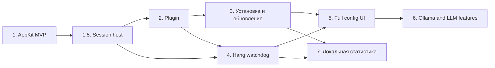

# План реализации Agent Watch

**Статус:** этап 1 — функциональная alpha и dogfooding; встраивание в оба агента приложение уже
делает само, следующий этап — готовый к раздаче пакет
**Дата актуализации:** 2026-09-12
**Связанный документ:** [архитектура и продуктовая статья](architecture.md)
**Локальный репозиторий:** `~/CommonProjects/agent-watch`

---

## Цель

Создать лёгкое самодостаточное macOS-приложение, которое показывает состояния параллельных Claude
Code и Codex-сессий, а затем постепенно получает диагностику зависаний, удобную настройку и
локальные LLM-возможности.

План намеренно разбит на вертикальные стадии. Каждая должна дать проверяемый пользовательский
результат и новую обратную связь, а не только подготовить инфраструктуру для следующей.

## Зафиксированные решения

- Первый релиз — только Apple Silicon (ARM64), macOS 14+. Intel и universal-сборка не планируются.
- Runtime и единственный источник состояния находятся в `AgentWatch.app`.
- Отдельный daemon не создаётся.
- Приложение строится AppKit-first и продолжает работать после закрытия окна настроек.
- Claude и Codex передают события напрямую приложению через hooks.
- Общей упаковки на две экосистемы нет: у Claude Code это каталог-плагин, который приложение
  создаёт целиком, у Codex — слияние в его собственный файл хуков. Почему одного механизма не
  получилось — `docs/architecture.md` §5.
- Установку, обновление и проверку интеграций выполняет само приложение; отдельного инструмента
  установки нет.
- SQLite является внутренней деталью приложения; внешние клиенты используют версионированный
  локальный API.
- Базовые состояния вычисляются детерминированно. LLM не участвует в определении фактов.
- Watchdog сообщает о потенциальном зависании и объясняет причины, но не выдаёт эвристику за
  доказанный факт.
- Данные и аналитика локальны по умолчанию.

## Последовательность и зависимости

Этапы 4 и 7 могут частично идти параллельно после стабилизации event model и локального API. Этап 6
начинается только после отдельного выбора LLM-сценариев.

### Состояние этапов

| Этап | Статус | Ближайший результат |
|---|---|---|
| 1. AppKit MVP | **active dogfooding** | Рабочий HUD получает Claude/Codex события, показывает состояния, активности и свежесть сигналов. У виджета один вход (`WidgetState`) и перерисовка по строкам; приём событий и встраивание вынесены из `AppDelegate` |
| 1.5. Session host | **partially complete** | Для CLI известен host-процесс; завершение процесса и фокус приложения работают best-effort. Фоновая сессия Claude открывается кликом по строке в новой вкладке Ghostty через `claude attach`. Сессия, отправленная в фон командой `/bg`, продолжает свою строку, а не заводит вторую: копия узнаётся по `--fork-session --resume` в аргументах процесса. Закрытие сессии определяется тремя способами: `SessionEnd`, завершение процесса или приложения, потеря связи по времени |
| 2. Встраивание в агентов | **partially complete** | Хуки Claude ставятся собственным плагином в `~/.claude/skills/agent-watch/`; чужой `settings.json` не пишется. Codex сливается в его собственный файл, статус-строка идёт через свою обёртку. Всё управляется из окна `Tooling…` |
| 3. Установка и обновление | **partially complete** | Установка интеграций из приложения сделана (окно `Tooling…`, состояние «не установлено / установлено / установлено, но ничего не приходило / не хватает хуков / отправитель исчез / файл не читается», полное снятие). Самообновление сделано. Осталось: нотаризация, образ `.dmg`, первый запуск как сценарий |
| 4. Hang watchdog | planned | Объяснимое предупреждение о потенциальном зависании |
| 5. Full config UI | planned | Полноценная настройка без редактирования файлов |
| 6. Ollama и LLM | planned, product gate required | Реализация только выбранных и проверяемых LLM-сценариев |
| 7. Локальная статистика | planned | Локальная аналитика по сессиям и ожиданиям |

## Исправления по предрелизному ревью — 2026-09-12

R04 исключено по продуктовому решению: поддерживается только ARM64.

- Исправлены обновление sender-ссылки и независимость тестов от установленного приложения.
- Ограничены числовые входы; status line принимает вложенные агрегаты Claude, сохраняет опции
  и передаёт stdin всей пользовательской команде.
- Transcript проверяет происхождение lifecycle-записей, различает ошибку фонового запуска,
  сохраняет ожидание при завершении параллельного вызова и восстанавливает отмену до первого чтения.
- Смена plan mode учитывается в событиях; прочитанный хук не удерживает ускоренный опрос.
- Кнопка закрытия молчащей строки появляется по своему сроку; listener безопасно проверяет и
  освобождает socket; журнал уважает изоляцию debug-копии.
- Некорректный успешный HTTP-ответ считается сбоем проверки; отключение автоматической проверки
  отменяет отложенный запрос. Сквозной тест сохраняет диагностику вместо молчаливого таймаута.
- Добавлены регрессионные тесты, test targets в Xcode, CI плагина и проверка платформ 251/261.
  Нарушение обязательного условия теста теперь является ошибкой, а не причиной пропуска.

Проверено: `task verify-all` (включая настоящее обновление 0.0.9 → 0.1.0), затем `task verify`
после последней правки временной границы. В Swift 781 тест: две специальные пробы пропускаются
в обычном наборе и запущены отдельно. 16 тестов плагина и verifier на 251/261 проходят; тесты
координатора повторены с пустым каталогом поддержки. Все 12 изображений интерфейса совпали с
проверенными до изменений. Два независимых ревьюера проверили окончательный код; найденные ими
дополнительные случаи со старыми/недатированными записями ожидания исправлены и покрыты тестами.

Ручная проверка нового плагина в работающих IDE и запуск на macOS 14 остаются проверками
релизной матрицы; здесь использовались macOS 15 и автоматический verifier. Публикация не выполнялась.

## Этап 1. AppKit MVP и dogfooding

**Цель:** получить полезный виджет с достоверными состояниями сессий без диагностики зависаний.

**Текущий результат:** отдельный Swift Package уже содержит AppKit menu bar application,
non-activating HUD, Unix-socket ingress и короткоживущий fail-open sender. Он принимает реальные
Claude и Codex hook events, отображает сессии, plan mode, shell/subagent/background activities,
запросы внимания и debug-журнал. Это alpha для ежедневного dogfooding, а не законченный продукт.

**Отложено осознанно:** построение меню статус-бара остаётся в `AppDelegate` — около 400 строк из
его 660. Вынос механический, но у меню нет ни одного теста, поэтому переносить его следует после
того, как появятся характеризующие тесты на текущее поведение (галочки по настройкам, заголовки,
пересчёт при открытии). Без них регресс в меню некому заметить.

### Foundation milestone — завершён 2026-09-03

- [x] Создан отдельный репозиторий `~/CommonProjects/agent-watch`.
- [x] Инициализирован локальный Git на ветке `main`, создан коммит `a2f0779`.
- [x] Добавлены SwiftPM, AppKit menu bar shell и non-activating HUD.
- [x] Доменная модель сессий и параллельных активностей вынесена в AppKit-free модуль
  `AgentWatchCore`.
- [x] Реализован детерминированный reducer базовых фаз и activities.
- [x] Добавлены `swift format`, строгий lint, warnings-as-errors build и repository-local pre-commit
  hook.
- [x] Добавлена воспроизводимая сборка ad-hoc signed `AgentWatch.app`.
- [x] Полный `task verify` проходит на Xcode 16.4.
- [x] Все 16 reducer-тестов проходят.
- [x] Проведено независимое ревью итогового снимка без замечаний.
- [x] Реализованы Unix-socket ingress, owner-only socket и fail-open sender с коротким deadline.
- [x] HUD отображает реальные Claude/Codex сессии, их primary phase и параллельные activities.
- [x] Добавлены debug-window, управление видимостью HUD, highlight, палитра и прозрачность фона.
- [x] Добавлены single-instance guard по умолчанию и опциональный multi-instance режим.
- [x] Позиция HUD сохраняется, валидируется относительно подключённых экранов и восстанавливается в
  правом верхнем углу основного экрана при необходимости.
- [x] Базовые регрессионные тесты покрывают reducer, protocol, socket transport, single-instance
  control, отображение статусов и geometry/highlight edge cases.

Foundation был отдельным техническим milestone. Теперь ценность MVP уже проверяется на живых
сессиях; важнее всего собирать случаи неверного или неясного статуса, а не расширять транспорт без
такой обратной связи.

## Этап 1.5. Session host: закрытие терминала и фокус

**Цель:** связать Claude-сессию с фактическим процессом агента без launcher'а и использовать эту
связь для двух действий: достоверно показать завершение сессии после закрытия IDE-терминала и
поднять окно host-приложения кликом по строке сессии.

### Фактические границы текущей версии

- helper hook передаёт только безопасную process identity: PID агента; родительская цепочка читается
  локально внутри приложения и никуда не передаётся. Transcript, команда, текст терминала и его
  содержимое не собираются;
- Agent Watch наблюдает завершение активного Claude PID системным event source, без периодического
  polling;
- завершение PID показывается как факт `session closed`, а не как догадка о причине закрытия;
- клик по строке активирует host application (GoLand, Ghostty и т. п.) best-effort;
- переход к конкретной terminal tab делается через плагин для JetBrains IDE (`ide-plugin/`),
  который выбирает вкладку по номеру процесса агента. Обе стороны написаны и проверены на живой
  GoLand 2026.1: вкладка нужного проекта выбралась, каретка оказалась в терминале. Спрашивается
  IDE при четырёх условиях — бандл JetBrains, своя схема в бандле, установленный демон JetBrains,
  плагин хоть раз ответил на `ping`; не выполнено любое — поднимается только окно, как прежде.
  Для Ghostty переход тоже сделан, но другим путём: словарь AppleScript, ключ — имя вкладки,
  которое агент пишет в неё сам. Проверено живьём;
- уже открытые сессии без нового hook-события не получают process identity задним числом;
- Codex Desktop получает переход к приложению по клику на строке и не получает per-session process watcher: его
  runtime общий для нескольких задач. Завершение самого приложения при этом наблюдается и закрывает
  все его desktop-сессии;
- сессия, о которой не может сообщить ни один точный сигнал, через 30 минут молчания помечается как
  `no signal`. Это обратимое состояние, а не вывод о смерти сессии.
- к сессии возвращает клик по её строке — по любому месту, кроме `×`; отдельной кнопки `↗` в строке
  больше нет, её место отдано имени. Строка отвечает на клик всегда, и это решение: переход был
  недоступен, пока приложение не могло назвать окно, а ответ на этот вопрос вычислялся один раз при
  первом хуке и больше не пересматривался — строка оставалась мёртвой и после того, как её
  приложение появлялось. Что даст один клик, говорит карточка строки словами (§8 архитектуры).
  Фоновая сессия — та, что живёт в pty агента без окна, — по клику открывается в новой вкладке
  Ghostty командой `claude attach <job id>`; идентификатор задания читается из
  `~/.claude/sessions/<pid>.json` в момент клика.
- сессия, отправленная в фон (`/bg`), не становится второй строкой: Claude Code продолжает её копией
  `claude --fork-session --resume <транскрипт>` под новым идентификатором, отправитель называет
  исходную сессию полем `forked_from_session_id`, и движок направляет события копии в исходную
  строку (§14 архитектуры, «Сессию отправили в фон»). Фоновость копии узнаётся по помощнику
  `bg-pty-host` над процессом агента, а не только по команде самого агента. Терминал, из которого
  набрали `/bg`, продолжает показывать сессию (замерено: `parkedJobId` в его записи реестра), и пока
  он жив, строка выглядит и кликается как терминальная, а клик поднимает его вкладку, а не открывает
  `claude attach` второй раз; его выход возвращает строке вид `background`. После `/fork` исходная
  сессия первым же своим ходом отпускает копию в отдельную строку, и отпущенная копия помнится на
  строке исходной, иначе следующий хук копии склеил бы их обратно. `/branch`
  (Claude Code 2.1.270) под это правило не подпадает и не должен: это новая сессия в том же
  процессе, исходная не закрывается, и две строки на один процесс — верный ответ. Решено, не
  делается.
- фоновая сессия получает строку не на старте, а на первом признаке работы: вид агентов держит одну
  живую фоновую сессию и подменяет её прогретой заготовкой (`bg-spare`) сразу после того, как
  текущая остановлена, а каждая заготовка шлёт `SessionStart` и через секунды `SessionEnd` — три
  пустые строки за пятнадцать секунд на один `/stop` (замерено по `~/.claude/daemon.log`, §14
  архитектуры).

### Критерии готовности

- закрытие обычного Claude в GoLand Terminal переводит связанную сессию в `session closed` не
  позднее чем через 10 секунд;
- клик по строке активирует корректное host application или карточка честно говорит, что поднимать
  нечего;
- завершение процесса не интерпретируется как нормальный `Stop` turn;
- нет launcher'а, PTY proxy и постоянного polling;
- process mapping и exit transitions покрыты детерминированными тестами.

### Hook spike — завершён для MVP

- зафиксировать реальные payload Claude Code и Codex hooks;
- проверить Claude CLI во встроенном терминале GoLand;
- проверить Codex Desktop;
- составить минимальную таблицу соответствия событий;
- проверить доступность `plan` mode и его переходов;
- проверить `SubagentStart`/`SubagentStop`, идентификаторы, типы и возможность parent-child
  correlation;
- проверить признаки background-задач и несколько параллельных tool calls;
- проверить доставку JSON в приложение через Unix socket;
- измерить задержку и накладные расходы sender;
- определить отсутствующие и различающиеся события.

Spike ограничивается несколькими рабочими сценариями и заканчивается решением, достаточны ли hooks
для MVP. Исследование внутренних баз, OCR и PTY в него не входят.

### Event protocol v1 — реализован и используется в alpha

На реальных обезличенных fixtures Claude Code и Codex подтверждён минимальный общий lifecycle. В
`AgentWatchCore` он нормализуется в `EventEnvelope v1`, а затем детерминированно применяется к
`SessionStateEngine`.

Что во что превращается. Какие из этих событий у кого запрашиваются — в
`docs/agent-integration.md`; здесь только нормализация, и понимает нормализатор больше, чем
запрашивается, потому что событие может прийти от установки, сделанной руками или старой
версией.

| Hook | Нормализованный факт | Оговорки |
|---|---|---|
| `SessionStart` | `session.started` | сброс, который он делает, и есть реакция на `/clear` |
| `SessionEnd` | `session.ended` → `session closed` | одинаково для обоих источников |
| `UserPromptSubmit` | `turn.started` | |
| `Stop` | `turn.completed` | закрывает всё, что ход не переживает |
| `StopFailure` | `turn.failed` | ход кончился ошибкой API, а не ответом |
| `Interrupt` | `turn.interrupted` | только Codex; садится в `idle`, а не в `completed` |
| `PreToolUse` | `activity.started` | `Bash` отображается как shell |
| `PostToolUse` / `PostToolUseFailure` / `PermissionDenied` | `activity.completed` / `activity.failed` | первое понимается, но не запрашивается |
| `PreCompact` / `PostCompact` | `activity.started` / `activity.completed` | одна активность на сессию: сессия сжимает один контекст за раз |
| `SubagentStart` / `SubagentStop` | `activity.started` / `activity.completed` | единственная активность, переживающая ход |
| `PermissionRequest` | `user_input.required` (approval) | |
| `AskUserQuestion` | `user_input.required` (choice) | когда приходит как `PreToolUse` |
| `StatusLine` | `status.updated` (context/usage) | только Claude; у Codex отклоняется |
| `permission_mode: plan` | режим планирования | только при явном значении; отсутствующее не угадывается |

Отдельно проверено и зафиксировано как **невозможное через hooks**: вызовы серверных инструментов
Anthropic API, в том числе `advisor`. В транскрипте они записаны как `server_tool_use` с
идентификатором `srvtoolu_…`, то есть выполняются не клиентом, поэтому `PreToolUse`/`PostToolUse`
для них не срабатывают. Хук `MessageDisplay` подключался для проверки: он приходит на каждую порцию
отображаемого текста и не содержит имени инструмента ни в каком виде. Единственный оставшийся путь —
чтение транскрипта приложением, и он реализован. Измерено на реальном транскрипте (32 вызова):
начало — `server_tool_use` с `name: "advisor"` и собственным `id`, конец — `advisor_tool_result` с
тем же значением в `tool_use_id`; обе записи лежат в `message.content`, там же, где читатель
разбирает `tool_result`. Виджет показывает такой вызов как активность `advisor` — значком без числа,
рядом с компактификацией, потому что обе означают, что сессия не делает больше ничего. Это
единственная активность, которую читатель транскрипта **открывает**, а не только закрывает, и
открывает узким событием `activityObserved`, не трогающим фазу. У Codex эквивалента нет.

В v1 пока намеренно не входят или имеют ограниченную семантику:

- надёжные parent-child связи между activities: UI строит только подтверждённую связь, иначе список
  плоский;
- универсальное определение background-задач: виджет может показать такую activity, если источник
  передал факт, но не угадывает её по тишине;
- ошибки инструмента/агента и disconnect.

Они не будут показываться как предполагаемые факты. Для каждого нужен отдельный реальный fixture и
решение о корреляции до расширения схемы.

### Реализация

- каркас AppKit menu bar application;
- прокручиваемый список сессий со счётчиком скрытых строк;
- изменяемый пользователем размер, отдельные блокировки перемещения и размера;
- компактный non-activating `NSPanel` поверх окон;
- Unix socket listener;
- минимальный local API для приёма событий, health check и чтения списка сессий;
- адаптеры Claude/Codex payload;
- state machine основной фазы и отдельный activity graph;
- поддержка одновременно активных shell-команд, background tasks и сабагентов;
- список сессий с фазой, режимом, важнейшими активностями и длительностью;
- минималистичный визуальный язык на цветах, иконках и коротких badges;
- раскрываемая схема parent-child activities при наличии достоверной связи;
- переход к сессии кликом по её строке и best-effort `SessionLocator`;
- активация host application с возможностью позднее добавить точную навигацию;
- память о сессиях последнего запуска и возврат к ним при старте — сделано;
- простой debug-screen с последними нормализованными событиями;
- capability/health status для каждой интеграции.

### Базовые фазы и активности

- планирование;
- исполнение;
- ожидание дочерних задач;
- выполняет shell-команду;
- выполняет фоновые задачи;
- выполняет одного или нескольких сабагентов;
- ждёт пользователя;
- готово;
- ошибка;
- нет связи.

### Dogfooding

- сначала использовать приложение самим в реальных параллельных задачах;
- вести короткий список неверных и непонятных состояний;
- записывать ситуации, когда всё равно пришлось вручную открывать сессию;
- затем дать debug-сборку нескольким коллегам;
- собирать только осознанно отправленный feedback, без фоновой отправки transcript или команд.

### Критерии готовности

- одновременно отображаются Claude и Codex-сессии;
- режим планирования визуально отличается от исполнения;
- основной агент, ожидающий дочернюю работу, не выглядит как безымянное состояние «работает»;
- HUD показывает до двух ключевых активностей и количество остальных, оставаясь однострочным для
  каждой сессии;
- раскрытие показывает дерево или честный плоский список shell/background/subagent activities;
- клик по строке как минимум активирует правильное host application;
- точный переход используется только при наличии достоверного window/tab locator;
- недоступная точность навигации явно отражена в tooltip, неверная вкладка не выбирается
  эвристически;
- переходы фаз и жизненный цикл параллельных активностей соответствуют тестовым сценариям;
- закрытие окна не останавливает мониторинг;
- отключённый Agent Watch не замедляет и не ломает агента;
- перезапуск возвращает сессии, за которые ещё есть кому поручиться, и не возвращает остальные;
- idle CPU, память и wakeups измерены;
- feedback достаточен для уточнения этапов 4 и 5.

## Этап 2. Штатная установка хуков из приложения

**Цель:** заменить временную debug-конфигурацию hooks на штатную и обратимую установку.

Задумывалась она как один версионируемый plugin в `instructions` на обе экосистемы. Так не
вышло, и не потому, что у Codex нет менеджера расширений — он есть: хуки через плагин Codex не
исполняет, `plugin_hooks` стоит в стадии `removed`. Поэтому у каждого агента свой механизм, а
единственное, что осталось общим, — сам отправитель. Разбор в `docs/agent-integration.md` §7,
принятая схема — там же в §2.

### Работы

- у Claude Code — собственный каталог-плагин под `~/.claude/skills/`, который приложение
  создаёт и удаляет целиком, не касаясь чужого `settings.json`;
- у Codex — слияние наших записей в `~/.codex/hooks.json` с сохранением чужих;
- положить отправителя в бандл и указывать на него постоянной ссылкой;
- обеспечить короткий timeout и fail-open поведение;
- добавить schema/protocol version в каждое событие;
- добавить генерационные и smoke-тесты;
- проверить установку, обновление, отключение и удаление в обеих экосистемах;
- описать обязательное подтверждение доверия hooks в Codex.

### Критерии готовности

- установка не требует ручной правки settings-файлов;
- тестовое событие появляется в Agent Watch;
- выключенное приложение не влияет на работу агента;
- обновление не создаёт дублирующиеся hooks;
- удаление полностью прекращает доставку событий и не трогает чужие записи.

## Этап 3. Установка, обновление и первый запуск

**Цель:** довести путь от скачанного пакета до работающего мониторинга без ручной сборки
компонентов.

### Дистрибуция

Установочный пакет собирается и публикуется средствами GitHub. Отдельного инструмента установки нет:
всё, что нужно для интеграции с агентами, приложение несёт с собой. Требования целиком, что из них
закрыто и как устроен релиз сейчас — в [дистрибуции](distribution.md).

### Работы

Сделано (как именно — в [дистрибуции](distribution.md) и в архитектуре, §11):

- подписываемый release artifact приложения (`task release`, `release.yml`);
- канал публикации и manifest версий: GitHub Releases, `/releases/latest`;
- проверка checksum; проверка подписи — `codesign --verify` по печати архива, полноценная —
  с сертификатом Developer ID;
- проверка новой версии при каждом запуске и по команде из меню, с отказом от конкретной версии;
- плагин хуков в приложении и его установка из окна `Tooling…`, отдельно для каждого агента;
- список установленных и неустановленных инструментов при каждом открытии окна и в меню;
- обновление и перезапуск работающего приложения без момента, когда оно не установлено.

Осталось:

- запоминать выбор пользователя и возвращаться к вопросу только при появлении нового инструмента;
- проводить пользователя через trust-step Codex hooks;
- открывать окно по центру основного экрана при первом запуске.

### Критерии готовности

- новая машина проходит путь от скачанного пакета до работающего HUD без ручного редактирования
  settings-файлов;
- повторная установка интеграции идемпотентна (повторный запуск ничего не меняет);
- обновление сохраняет настройки и историю;
- отказ от обновления не мешает работе текущей версии;
- новый агентский инструмент, появившийся после первой установки, обнаруживается и предлагается к
  подключению;
- несовместимые версии диагностируются понятным сообщением;
- удаление не затрагивает пользовательские данные без отдельного выбора.

## Этап 4. Проверка потенциальных зависаний

**Цель:** отличать просто долгую работу от операций, которые с высокой вероятностью перестали
продвигаться.

### Сначала — проектирование на реальных данных

- собрать из dogfooding типовые длительные и реально зависшие операции;
- определить доступность PID/process-tree для Claude и Codex;
- проверить стоимость CPU, I/O и FSEvents sampling;
- определить объяснимые сигналы и мягкие пороги;
- разделить foreground tool calls и фоновые процессы;
- определить поведение после sleep/wake.

### Реализация

- возраст незакрытой shell-операции;
- адаптивный sampling только активных операций;
- process existence и CPU-time delta;
- файловая активность через FSEvents;
- несколько измерений перед предупреждением;
- объяснимый `stuck score`;
- действия `snooze` и «ожидаемо долгая команда»;
- локальные baseline по типам команд после накопления истории.

### Не входит в первую версию watchdog

- чтение всего stdout;
- универсальный PTY proxy;
- автоматическое завершение процесса;
- точный контроль любого процесса, запущенного через `&`;
- LLM как единственный детектор зависания.

### Критерии готовности

- предупреждение всегда содержит наблюдаемые причины;
- обычные долгие сборки не создают постоянный шум;
- ожидаемое предупреждение можно быстро подавить;
- sleep не увеличивает ошибочно длительность работы;
- overhead watchdog измерен отдельно от idle-режима;
- эвристики покрыты воспроизводимыми сценариями и тестами.

## Этап 5. Полноценный config и management UI

**Цель:** сделать настройку понятной без редактирования файлов и знания внутренней архитектуры.

### Разделы

- General;
- Sessions;
- History;
- Models;
- Integrations;
- Advanced;
- About.

### UX-принципы

- ориентироваться на ясность Handy, а не копировать его визуально;
- сохранять общий язык цветов, SF Symbols и badges, заложенный в MVP;
- показывать текущее состояние интеграции и следующее действие;
- использовать карточки и человеческие описания;
- скрывать технические параметры в `Advanced`;
- показывать последствия удаления данных или модели до подтверждения;
- сохранять работоспособные defaults без обязательной настройки.

### Настройки

- запуск при входе;
- видимость и положение HUD;
- retention истории;
- отображаемые проекты и источники;
- уровни предупреждений и snooze;
- приватность сохраняемых команд;
- интеграции и их health;
- модели и лимит памяти.

### Критерии готовности

- базовая настройка выполняется полностью через UI;
- состояние интеграции диагностируется без чтения логов;
- экран Integrations показывает доступный уровень навигации для Codex и GoLand;
- все настройки имеют безопасные defaults;
- HUD остаётся компактным;
- management window не держит локальную модель в памяти после закрытия.

## Этап 6. Ollama и согласованные LLM-функции

**Цель:** добавить локальную интеллектуальную обработку только для сценариев, доказавших полезность.

### Обязательный product gate

Перед реализацией отдельно выбрать функции из кандидатов:

- объяснение подозрительного зависания;
- summary сессии;
- автоматическое короткое имя сессии;
- классификация shell-команд;
- группировка повторяющихся проблем;
- приоритизация сессий, требующих внимания.

Для каждой функции нужны примеры входа, ожидаемый результат, latency budget и способ понять, что она
действительно помогает.

### Технический scope после согласования

- provider interface для local inference;
- Ollama как первый provider;
- каталог рекомендованных моделей;
- экраны Downloaded/Available в стиле Handy;
- профили «минимум ресурсов», «сбалансированный», «лучший анализ»;
- lazy loading и выгрузка после idle timeout;
- ограничение контекста и редактирование секретов;
- fallback на полностью детерминированное поведение.

### Критерии готовности

- приложение полезно и без модели;
- модель никогда не определяет фактическое lifecycle-состояние;
- idle-приложение не держит модель загруженной;
- до скачивания видны размер, потребление памяти и назначение;
- ошибка Ollama или inference не ломает мониторинг;
- функции проверены на заранее подготовленных примерах.

## Этап 7. Локальная статистика

**Цель:** дать локальную аналитику по накопленному журналу сессий.

### Работы

- версионировать read API приложения;
- добавить агрегацию по источнику, проекту и периоду;
- отдельно считать `attention wait` и `review delay`;
- показывать ошибки и suspected-stuck incidents;
- определить retention и экспорт;
- отдельно решить вопрос централизованной статистики.

### Критерии готовности

- метрики имеют однозначные определения;
- агрегаты можно проверить на небольшом журнале вручную;
- внешние читатели идут через версионированный API, а не через внутреннюю SQLite;
- данные остаются локальными, пока обратное не выбрано отдельно.

## Сквозные требования

### Производительность

До основной реализации определить budgets для idle CPU, resident memory без модели, wakeups, времени
hook sender, задержки HUD и overhead watchdog. Численные пороги следует получить на spike-сборке
целевого Mac, а не угадать заранее.

### Приватность

- не хранить prompts, ответы и stdout по умолчанию;
- редактировать чувствительные аргументы до записи;
- использовать локальное хранение и ограниченный retention;
- не добавлять централизованную телеметрию без отдельного решения.

### Совместимость

- версия события вводится с первой debug-сборки;
- local API версионируется;
- приложение принимает предыдущую совместимую версию plugin;
- `doctor` объясняет version skew и способ исправления.

### Качество

- state machine проверяется табличными unit-тестами;
- адаптеры проверяются на обезличенных payload fixtures;
- installer и plugin имеют smoke-тесты;
- каждая найденная ошибка перехода получает regression fixture;
- performance budgets проверяются перед расширением dogfooding.

## Ближайший milestone: готовый к раздаче пакет

**Цель:** довести установку до того, чтобы приложение можно было отдать другому человеку, не
меняя UX запуска агента. Встраивание в оба агента уже делает само приложение (этап 2).

### Что уже доказано

- обе интеграции доставляют реальные lifecycle events в приложение через Unix socket;
- sender ограничен коротким deadline и не блокирует агента, если приложение не запущено;
- нормализация и reducer покрыты fixture- и regression-тестами;
- debug-window показывает принятые нормализованные события;
- состояние «тихо» / «нет свежей активности» — только presentation-сигнал. Оно не меняет lifecycle и
  не является детектором зависания. Фазу меняет отдельный, гораздо более длинный порог потери связи
  (30 минут), и только для сессий, о смерти которых не может сообщить ни один точный сигнал. В
  виджете этот сигнал выражен цветом таймера строки, а не словами;
- имя сессии добывает hook-процесс: `ai-title` из транскрипта Claude, `thread_name` из индекса
  тредов Codex. Путь к этим файлам на провод не идёт никогда. Пока хуки идут, приложение их не
  открывает вовсе; при догоне после перезапуска открывает — найдя сам, по хешу имени, как ищет
  транскрипт (§14). Читается хвост файла в 256 КБ на каждом событии: замер показал, что чтение стоит неразличимо мало на фоне запуска
  процесса, а ограничение по границам хода заставляло уже запущенную сессию долго ждать своего
  имени;
- фазу сессии в виджете показывает лампочка-индикатор, а не слово. Порядок строк фиксирован порядком
  появления сессии; вниз уходят только закрытые;
- строку объясняет одна карточка при наведении, а не подсказка на каждой картинке. В ней имя,
  источник, клиент, фаза, проект, ветка git, давность события, активности словами и размер
  контекста;
- кромка виджета подсвечивается под курсором, наведённая строка подсвечивается. Курсор при этом не
  меняется: macOS показывает курсор изменения размера только над окном в фокусе, а виджет фокус не
  берёт — подсветка нарисована вместо него (`docs/architecture.md` §8);
- у вызова инструмента несколько концов, и хуками слушаются два: `PostToolUseFailure` и
  `PermissionDenied` (последнее — про автоматический режим; отказ человека в диалоге документация не
  описывает). Успешный конец берётся из транскрипта или из конца хода — `PostToolUse` не
  запрашивается, см. `docs/agent-integration.md`. Вызов, о конце которого не сообщает никто —
  прерванный или отклонённый человеком, — хуками не наблюдаем вовсе: замерено с контролем, что
  прерванный ход не присылает ни `Stop`, ни `StopFailure`, тогда как та же сессия прислала `Stop`
  дважды за ходы, закончившиеся обычно. Раньше здесь было записано, что такой вызов убирает `Stop`;
  это оказалось неверно, и настоящий конец берётся из транскрипта — см. `docs/architecture.md` §15.
  Переживать конец хода может только сабагент, и это объявляется признаком на активности, а не
  выводится из её вида;
- фоновый шелл виден как фоновая работа со своим значком, а не как обычный шелл: признак
  `run_in_background` вытащен hook-процессом из `tool_input` отдельным булевым полем, потому что сам
  `tool_input` содержит команду и вычищается целиком. Успешный ответ вызова его не закрывает —
  замерено, что фоновая команда отвечает за ~5 секунд и работает дальше, — а закрывает конец хода:
  настоящий конец команды через хуки не наблюдаем;
- вызов `Agent` тоже возвращается почти сразу (медиана 2.1 с на 152 вызовах), поэтому сабагента
  описывает только пара `SubagentStart`/`SubagentStop`, а сам вызов считается обычным вызовом
  инструмента — иначе один сабагент считался за два. Проверено на живом сабагенте: `SubagentStart`,
  `SubagentStop` и собственные вызовы инструментов сабагента несут `session_id` родителя, а сабагент
  различается полем `agent_id` — значит лишних строк они не создают, а их работа считается работой
  родительской сессии;
- сжатие контекста видно как отдельный вид работы (`PreCompact` → `PostCompact`): это единственное
  объяснение того, почему строка замолчала, ничего не ожидая. Правая часть строки отведена под
  изменчивое — виды работы и заполнение контекста. В строке это только процент; счётчик токенов ушёл
  в карточку при наведении, где есть место и для доли, и для числа, а в строке он был самым длинным
  и наименее полезным. Без процента строка показывает счётчик, потому что пустая колонка читалась бы
  как «контекст неизвестен»;
- таймер строки пишет в ярлык, только когда тот читается иначе: 96 записей из 2400 за пять минут на
  восьми строках. Сам тик стоит 11 микросекунд, поэтому опрашивать реже незачем — экономятся записи
  и перерисовки, а не пробуждения;
- счётчики, размер контекста и кнопка удаления стоят колонкой у правого края: строке задаётся ширина
  виджета, а всю свободную ширину забирает распорка перед ними;
- активности подметает не только `Stop`, но и следующий `UserPromptSubmit`, с тем же исключением для
  сабагента. Замерено по журналу событий приложения: за 39 минут 8 начатых ходов против 4
  завершённых, одна сессия начала четыре хода подряд без `Stop`. Пока подметал только `Stop`, вызов
  без сообщённого конца жил в счётчиках через все следующие ходы;
- у сессии, которую никто не назвал, имени нет: запасное имя из названия продукта убрано, потому что
  оно повторяло значок агента и дублировалось в карточке;
- концы, о которых не сообщает ни один хук, приложение читает из транскрипта сессии: приращение
  файла разбирается по расписанию, привязанному к событиям, и только пока хотя бы одна сессия
  заявляет о работе. Хук подтягивает ближайшее чтение к себе — через полсекунды после него, — но не
  чаще, чем раз в N секунд, и не позже, чем через 2N; N настраивается в меню (по умолчанию 5 с) и
  выключается там же. Правило вынесено в `TranscriptReadSchedule` и проверяется без диска. Это
  второй источник рядом с хуками, а не вместо них. Замерено по журналу событий приложения: читатель
  закрывает 99% активностей Claude и 98% Codex, промахи — вызовы, которые ещё выполнялись. Сбои
  чтения видны, а не поглощаются: четыре случая (файл не найден, файл не читается, приращение
  неправдоподобно велико и было пропущено, необъяснённое молчание) показываются треугольником в
  строке, фразой в карточке, строкой в окне отладки и сводкой в меню. Молчанием считается только
  тишина при остановившемся файле: прирост транскрипта засчитывается за услышанное, даже когда ни
  одной строки из него читатель не взял.
- строка Codex показывала заметно меньше строки Claude: не было ни размера контекста, ни ветки, ни
  модели, потому что sender берёт данные Codex из `session_index.jsonl`, где есть только имя треда.
  Всё это лежит в rollout-файле, который приложение и так читает по таймеру, поэтому размер
  контекста и модель достаются даром — эти строки уже проходили через разбор и выбрасывались. Ветку
  и вид треда (человек, субагент, проверяющий) даёт первая запись файла, прочитанная один раз при
  его нахождении. Модель — единственный сигнал, который пишут оба агента, поэтому она появилась и у
  Claude: одна строка карточки означает одно и то же в обеих строках. Сессию, о которой приложение
  сообщило сбой, теперь можно убрать сразу, не дожидаясь получаса тишины;
- debug-сборка умеет по явному 30-минутному переключателю записывать исходные hook-payload в
  локальный кольцевой JSONL-журнал. Это диагностическое исключение из обычной privacy-модели: режим
  выключен по умолчанию, отсутствует в release-сборке, не влияет на fail-open доставку и хранит не
  более 10 MiB. Передача payload дочернему процессу упиралась в два ограничения Darwin сразу — длину
  имени объекта разделяемой памяти и округление его размера до страницы, — и обе выглядели как
  пустой каталог, потому что каждый тест звал рекордер напрямую. Теперь весь путь проверяется
  сквозным тестом на настоящем бинарнике; следующий dogfooding-прогон сопоставит payload
  пользовательского и служебного Codex-тредов, прежде чем вводить фильтр дублей.

### Что сделано по итогам сквозного ревью кодовой базы

Ревью проведено 2026-09-04 по всем 35 файлам `Sources`; тесты просмотрены выборочно. Кроме двух
пунктов выше, из него сделано:

- карточка при наведении стареет вместе с таймером строки — раньше «Last event N ago» в ней замирало
  до следующего события;
- в карточке больше нет «1 compacting context»: у сжатия число не печатается, как и в строке;
- нормализатор собирает конверт события одной локальной функцией вместо двенадцати почти одинаковых
  конструкций по семь общих аргументов;
- с провода убраны три поля без читателя: `turn_id` в конверте, имя инструмента как текст активности
  и время сброса квоты;
- одна реализация вместо двух-трёх: `sockaddr_un`, ожидание по сроку через `poll`, разбор `--ключ
  значение` и обход дерева процессов;
- тестовые фабрики снапшота сессии в `AgentWatchAppTests` сведены к одной;
- три места, где стоимость росла с потоком событий, а не с числом сессий: строка на сессию вместо
  двух, дозапись в журнал отладки вместо перезаписи файла, редакция прямо над `JSONValue` без
  обратного кодирования в байты.

### Что сделано по итогам архитектурного ревью — 2026-09-14

Ревью прошло по всем таргетам, тестам, сборочным целям и документам. Сделано:

- **одна дверь в движок.** `SessionStateEngine.receive(_:)` вместо пяти публичных шагов, которые
  вызывающий обязан был выполнять по порядку, и поля-ответа `lastIngestNote`, действительного
  только до следующего вызова. Ответ — `RowChange`. Тесты теперь ходят тем же путём, что и
  приложение: раньше в двух главных файлах было 157 голых вызовов последнего шага против девяти
  вызовов остальных. Публичных `mutating`-методов стало 15 вместо 19 (архитектура, §6);
- **ошибка: отброшенное событие тратило запомненное ожидание.** Событие от сессии, которую строка
  уже переросла (исходная после `/bg`), стирало ожидание, восстановленное из файла, и строка
  оставалась `no signal` навсегда. Стирание перенесено за решение о применении события;
- **дыра в правиле «возраст строки не идёт назад».** Правило было написано трижды в трёх местах, а
  четвёртая дверь — `markSessionClosed` — его не имела вовсе: закрытие с датой старее последнего
  услышанного укорачивало срок хранения строки. `RowAgeTests` спрашивает теперь все двери разом;
- **правило «закрытую строку не трогать» было написано 11 раз** в трёх формулировках; теперь один
  `liveRow(_:)`, и двенадцатый метод получает правило даром;
- **имя хука стало типом.** `HookEventName` — одно перечисление вместо трёх независимых списков
  строк (что просим у агента, что принимаем на сокете, что умеем читать). Расхождение между ними
  проваливалось молча, потому что отправитель fail-open (интеграция, §3);
- **кнопка `×` объясняет себя** вместо того, чтобы исчезать: три состояния вместо двух, срок
  приходит в самом ответе, карточка говорит словами (архитектура, §8);
- **таймер строки и лампа больше не спорят о цвете** одной и той же фазы (архитектура, §8);
- **файл настроек, который не удалось прочитать, сохраняется рядом** вместо того, чтобы быть
  переписанным значениями по умолчанию при следующем запуске. `README.md` приглашает править этот
  файл руками, и одна опечатка стоила всей схемы ламп;
- **`ToolingInstaller` больше не ходит мимо `AGENT_WATCH_SUPPORT_DIR`** — единственное место,
  которое выводило каталог приложения само; каталог теперь выводится один раз
  (`AgentWatchPaths.supportDirectory()`) вместо одиннадцати;
- **`scripts/build-app.sh` собирает с `-Xswiftc -warnings-as-errors`** — единственная сборка из
  пяти, которой предупреждения сходили с рук, и именно её выход человек ставит себе;
- мелкое: `WidgetText` разделён по адресату (виджет, окно тулинга, диалоги обновления), измерение
  ширины ярлыка уехало к остальным измерениям, сняты три случайных `@MainActor` с чистых функций,
  удалены мёртвая функция и два мёртвых импорта `AppKit`, в `Taskfile` убран повтор команды.

Рассмотрено и намеренно не сделано: `SessionSupervisor` в `AgentWatchCore` — ревью назвало это
механическим переносом ради двух вызовов AppKit, но это неверно: супервизор владеет
`SessionHostRegistry` (AppKit по существу) и `TranscriptWatcher` (зависит от `AgentWatchSender`), и
перенос требует шва с одним адаптером, а не переезда файла. Главная часть выгоды — правила порядка
событий — уже переехала в Core вместе с `receive`. Четыре одинаковых чтения-записи JSON не сведены к
одному: настоящая потеря данных была только у файла настроек, и она устранена по месту; у двух
остальных хранилищ файл восстанавливается сам, а четвёртое (`ToolingInstaller`) единственное и
так отличает «файла нет» от «файл не читается».

Замеченное и намеренно оставленное: `.statusUpdated` не двигает `lastObservedAt` — событие
`StatusLine` приходит на каждой перерисовке строки состояния, и считать его активностью значило бы
сделать любую сессию вечно свежей.

Добавлено по отдельной просьбе: `Reset Widget Position` — возврат виджета в центр главного экрана,
рядом со сбросом размера. Работает и при включённой блокировке положения.

### Согласованный порядок работ

Решено 2026-09-08. Порядок менялся один раз, по просьбе: история сессий поднята вперёд косметики,
потому что пустой виджет после перезапуска мешает каждый раз, а цветовая схема не разблокирует
ничего.

1. **«Установлено» должно значить «работает» — сделано.** Состояние читалось с диска, поэтому меню
   говорило `installed` и там, где ни одного события от агента не приходило. У Codex это обычное
   состояние: записи стоят, а хуки не исполняются, пока человек не подтвердит доверие. Приложение
   помнит, когда последний раз слышало каждого агента, и случай «не слышало ни разу» называет
   отдельно. Случай «слышало, но давно» не упоминается: Codex, которым не пользовались неделю, — не
   неисправность, а напоминание о нём было бы тем понуждением, которого этот интерфейс избегает.
2. **История сессий, переживающая перезапуск — сделано.** Приложение узнавало о сессии только из
   хука, поэтому после перезапуска виджет был пуст, пока в каждой сессии не случится следующее
   событие — а у сессии, ждущей человека, это «никогда». Что именно восстанавливается, чем
   подтверждается живой хозяин и почему фаза приходит только с первым хуком — `docs/architecture.md`
   §14 «Приложение перезапустилось».

   Она же даёт то, чего не хватает двум задачам дальше: локальные baseline для watchdog и данные
   для локальной статистики.
3. **Окно настроек виджета с настраиваемой лампой — сделано.** См. ниже.
4. **Отдельное окно настроек тулинга — сделано.** Подменю `Tooling` заменено одним пунктом и
   окном за ним. Ряд говорит, в каком состоянии интеграция, в какой файл приложение пишет и что
   осталось сделать человеку; кнопка меняет слово вместе с состоянием, а у файла, который не
   читается, кнопки нет. Путь отправителя стоит внизу один раз. Устройство и причины —
   `docs/architecture.md` §8 «Окно настроек тулинга».

### Настройка цветовой схемы лампочки и остальное по виджету

1. **Окно настроек виджета — сделано.** Строка на фазу: цвет, характер мигания и подсказка о том,
   когда фаза наступает. Фон и непрозрачность переехали туда же из подменю. Устройство и причины —
   `docs/architecture.md` §8 «Окно настроек виджета».

   Два решения по ходу, отличающиеся от того, что стояло в этом плане:

   - **мигание тоже настраивается.** Стояло «форма и характер мигания настройке не подлежат». Просьба
     была обратная, и цена названа честно: если выставить всем фазам «не мигать», «нет связи» и
     «закрытая сессия» становятся почти одной картинкой — оба ровные кольца, и различает их только
     цвет (`#BB7F7C` против `#8E8E93`). Форма и название фазы
     словами остались за приложением, поэтому правило §7 переформулировано: оно обязывает
     умолчания, а не выбор человека;
   - **`timerColor` не тронут.** Стояло «настройка обязана затронуть оба места». По коду это разные
     оси: таймер отвечает не «что делает сессия», а «насколько строка свежа», и берёт свои два цвета
     из `SessionFreshnessEvaluator`. Втянуть его в схему лампы значило бы, что цвет «нет связи»
     перекрашивает ещё и таймер.

   Настройки при этом переехали из `UserDefaults` в файл `settings.json` рядом с состоянием сессий.
   Причина измерена: домен настроек зависит от способа запуска, и на машине разработки их
   накопилось три — с разным фоном, разной непрозрачностью и разной рамкой виджета в каждом.

   Ещё одно решение, отменившее первую версию этого же среза: **файл держит конфигурацию целиком.**
   Сначала было наоборот — пустой файл значил «умолчания», записывались только тронутые поля. Просьба
   была прямая, и она оказалась лучше по трём причинам: цвета перестали быть системными и потому
   зависеть от темы машины, впервые записавшей файл (лампа рисуется на собственном фоне виджета, а
   не на системном — замер в §7); `LampScheme` стал полным по построению, без необязательных полей
   на стороне рисования; а файл стало можно читать как ответ на вопрос «что виджет сделает», не
   заглядывая в исходники. Умолчания лампы — цветовая схема, выбранная владельцем; фон и
   непрозрачность оставлены прежними (`graphite`, 0.96).

   Размер виджета исключением не стал, хотя сначала им был. Отсутствие ширины и высоты означало
   «считай высоту от числа сессий», поэтому записать их значило бы отменить `Reset Widget Size`.
   Замер показал, что подбор высоты — не удобство первого запуска: он срабатывает на каждом
   обновлении содержимого и прекращается навсегда в момент, когда размер задан рукой. Поэтому
   правило получило собственное значение — `widgetSizeFollowsSessions`, — и файл снова держит
   конфигурацию целиком: размер записан всегда, а признак говорит, в силе он или высоту считает
   приложение.
2. **Описание сессии догоняется из транскрипта — сделано.** При запуске восстановленная строка
   берёт из хвоста собственного файла имя, ветку git и счётчик контекста, а не только время
   последней записи. Причина: Claude переписывает имя по ходу работы, а запомненная копия
   остаётся той, что была в момент последней работы приложения. Разбор и окно в 256 КБ —
   те же, что у hook-sender; фазу описание не двигает, и обычное чтение по таймеру за это не
   платит. У Codex имя треда лежит в отдельном индексе `session_index.jsonl` по сырому
   `session_id`, которого у приложения нет, — но обращать хеш и не нужно: строки индекса
   перебираются и сравниваются по хешу, как имена файлов при поиске транскрипта. Догонять там
   есть что: измерено, что тред сначала называется `New voice chat` и переименовывается потом.

   Отсюда согласовано, и оба пункта сделаны:

   - **строки для процессов, о которых приложение не слышало — сделано.** Живой процесс агента
     теперь становится строкой, даже если ни одного хука от него не приходило: имя каталога из
     `cwd`, `no signal`, возраст от времени старта процесса, склейка с настоящей сессией по
     `agentProcessID` при первом хуке — с сохранением места в списке. Угадывать соответствие
     «процесс → файл сессии» по каталогу и меткам времени по-прежнему не разрешается, как и
     было измерено. Но одно соответствие называет сам агент: в хуке приходят обе половины
     сразу — идентификатор сессии и номер процесса, — и эта пара теперь хранится рядом с
     сессиями, переживая саму запись о сессии. Поэтому процесс, найденный заново после того,
     как строку убрали или подмели, не безымянный: приложение узнаёт его сессию и берёт имя из
     её транскрипта. Без такой пары имя по-прежнему приходит только с первым хуком. Три
     решения, которых в этом абзаце не стояло: только Claude, потому что у
     Codex один процесс держит много тредов и его хуки не сообщают номер процесса вовсе
     (`docs/agent-integration.md` §1б); строку опознаёт номер процесса вместе со временем
     запуска, потому что macOS переиспользует номера; выход процесса такую строку убирает, а не
     закрывает — она никогда не была больше, чем процесс, который назвала. Устройство и цена
     поиска без своего таймера — `docs/architecture.md` §14;
   - **восстановление фазы `waitingForUser` — сделано.** Память говорит, какая фаза была,
     транскрипт — держится ли она ещё. Проверок в итоге две, а не одна: у запомненного
     `awaitedActivityID` появился результат — ожидание кончилось; в хвосте есть любой факт
     новее момента ожидания — сессия жила дальше, и результат мог не попасть в окно чтения.
     Второй проверки в этом абзаце не стояло, и без неё сессия, проработавшая неделю после
     ответа человека, возвращалась бы в ожидание. Считаются факты, а не записи: замерено, что
     `attachment` пишется, пока вызов ещё открыт. Ещё два решения по ходу: разбор хвоста
     датируется моментом последнего события сессии, иначе факт из записи без отметки времени
     оказывался бы новее ожидания и молча отменял его; и ожидание пишется в файл памяти сразу,
     а не в общее окно в минуту, иначе оно терялось бы ровно в том случае, ради которого
     нужно. Устройство — `docs/architecture.md` §14.
3. **Счётчик скрытых строк не отнимает высоту у списка — сделано.** `▾ N more` стоял в потоке под
   списком и забирал у него полосу высоты, то есть сам создавал часть того, о чём сообщает. Теперь
   список занимает всю высоту виджета всегда, а счётчик рисуется поверх него капсулой у нижней
   кромки списка: овал с минимальным полем вокруг надписи, шрифт меньше всего остального в виджете,
   нажатий не берёт — под ним живая строка. Блок usage он не перекрывает. Показывается и прячется
   по-прежнему только через `isHidden`: счёт берётся внутри чужого прохода раскладки, и включение
   там ограничения однажды уже подвешивало виджет. Устройство — `docs/architecture.md` §8.

   Контекстные курсоры из этого пункта убраны: кромка уже отвечает подсветкой, а остального
   достаточно как есть.
4. **Фокус на конкретной сессии — ступень «назвать словами» сделана.** Разбор вариантов — в
   `docs/session-focus-research.md`; требование поставлено прямо: нужна точность до вкладки.
   Основное окружение — терминал JetBrains IDE, второе — Ghostty.

   Сделано: `SessionLocator` считается в момент клика и называет приложение, проект и вкладку.
   Проект берётся из `recentProjects.xml` самой IDE, вкладка — из имени сессии, которое агент сам
   пишет в заголовок терминала. Ни одного разрешения macOS. Переход доступен всегда: прошлое
   устройство гасило его по ответу, разрешённому однажды и больше никогда не пересчитанному. Сам
   переход — клик по строке сессии; отдельная кнопка `↗`, с которой он начинался, убрана.
   Устройство — `docs/architecture.md` §8.

   Прыжок до вкладки в JetBrains — тоже сделано, и проверено переходом из собранного бандла:
   поднялось окно нужного проекта и выбралась нужная вкладка. Разрешений macOS по-прежнему ноль,
   окно поднимает сама IDE, ключом служит номер процесса. Устройство — `docs/architecture.md` §8,
   замеры — в `docs/session-focus-research.md`.

   Прыжок в Ghostty написан: словарь AppleScript, ключ — имя вкладки, которое агент пишет сам,
   правило «заканчивается на имя сессии» и ровно одно совпадение. Разговор в два вызова, чтобы имя
   сессии — вывод агента — никогда не попадало внутрь скрипта. Проверено на живой сессии: окно и
   нужная вкладка поднимаются одним кликом. Той же проверкой закрыт и вопрос подписи — после
   пересборки, изменившей бинарник, разрешение Automation не запрашивалось заново.

   Лаунчер IDE отвергнут замером: на попадании он показывает пустое окно поверх работы.

   Установка плагина в IDE — тоже сделана, секцией `IDE integrations` в окне тулинга: список
   найденных IDE, состояние плагина в каждой, кнопка к странице плагинов с уже скопированным путём
   и кнопка `Check`, которая спрашивает у самой IDE. Файл плагина в бандл приложения не кладётся —
   разбор ниже, в «Открытых решениях». Ссылки на Marketplace пока нет: плагин не опубликован, и на
   её месте строка, которая это говорит.

### Что нужно сделать дальше

Порядок решён 2026-09-12. Публикация плагина поднята вперёд остального из-за ожидания, которое
нечем заполнить: первую версию люди из JetBrains смотрят руками и сроков не называют. Значит,
отдавать на ревью надо раньше, а пока оно идёт — делать следующие два пункта.

1. **Минимум для публикации плагина IDE в Marketplace.** Что именно и в каком порядке — в разделе о
   публикации ниже. Часть решений там принимает человек — почта и сайт вендора, профиль в
   Marketplace, — остальное готовится в репозитории.
2. **Образ `.dmg` для первой установки** — в отдельном worktree, параллельно с ревью плагина. Что
   это и почему обновлению образ не нужен — в [дистрибуции](distribution.md), «Чего ещё нет».
3. **Trust-step Codex.** Сначала исследование: как Codex хранит подтверждение доверия к хукам и
   можно ли поставить его за человека, не обходя его собственных правил. Если автоматизация выходит
   хрупкой или её нет — вместо неё пошаговый гайд в окне тулинга с проверкой, сделан шаг или нет.
   При любом исходе состояние trust-step стоит в ряду Codex окна тулинга — подтверждено, не
   подтверждено, и что сделать, — а не в тексте документации.
4. Проверить чистую установку, обновление, отключение и удаление на обеих интеграциях.
5. Добавить smoke-тест: приложение запущено / не запущено.
6. Подтвердить на dogfooding matrix для plan mode, approval, choice, subagent и background activity;
   неподтверждённое не отображать как факт.

Пакет для раздачи в этот порядок не входит: сборка, релиз по тегу, проверка версии при запуске и
самообновление сделаны и проверены на настоящем релизе, разбор — в [дистрибуции](distribution.md) и
[архитектуре](architecture.md) §11. Не сделана нотаризация, и она стоит на решении, которое не
наше: нужен сертификат Developer ID, то есть платная Apple Developer Program, а без него этот код
нечем проверить. Пока релиз подписан ad-hoc, и скачавшему нужна одна команда (`xattr -dr`),
сказанная и в README, и в примечаниях к релизу.

### Публикация плагина IDE в Marketplace — основной путь, и первый шаг

Решено: Marketplace — **основной** способ установки, и не ради витрины. Он отменяет самую дорогую
часть: установка из файла — это путь в буфере, чужой диалог и перезапуск IDE при каждом обновлении,
а из Marketplace — поиск по названию на странице плагинов. Приложение в этом сценарии только
подсказывает. Из трёх пунктов экрана установки публикация убирает второй целиком — запись экрана
«куда нажимать»; первый и третий остаются, потому что назвать IDE и убедиться, что плагин в ней
действительно загрузился, надо в любом случае.

Когда — сейчас, решено 2026-09-12. Прежний довод — не тратить ручное ревью на сборку, которая
меняется каждый день, — уступил другому: ревью первой версии — единственное ожидание в плане,
которое нечем ускорить, и чем раньше оно начнётся, тем раньше закончится; образ `.dmg` и trust-step
делаются, пока оно идёт. Установка из файла при этом сделана и остаётся — она нужна и после
публикации: человеку, который ставит сборку до релиза, и тому, у кого Marketplace закрыт политикой
компании.

И вторая причина, найденная замером: **Marketplace снимает перезапуск при обновлении, а установка
из файла — нет.** `PluginInstaller.installFromDisk` уходит в ветку перезапуска по одному факту
«такой плагин уже установлен», даже не спрашивая, выгружается ли он. Путь обновления через окно
плагинов этого условия не содержит и решает по выгружаемости, а наш плагин, по данным Plugin
Verifier, выгружается. Разбор с байт-кодом — в `docs/session-focus-research.md`. То есть перезапуск
на каждой правке — цена локальной раздачи, и убрать её в плагине нельзя.

Что готово в репозитории, проверено по собранному артефакту 0.1.4: идентификатор
`com.glockbender.agentwatch` — сменён 2026-09-12 с `…ide` (и промежуточного `…plugin.jetbrains`),
пока это ещё ничего не стоило: после публикации идентификатор не меняется, а слова `plugin` и
`jetbrains` в нём verifier Marketplace помечает как шаблонные; для IDE плагин с другим
идентификатором — другой плагин, и старую копию надо удалить перед установкой новой. `<vendor>` с
почтой и сайтом; описание на английском, первой строкой — что без Agent Watch плагин ничего не
делает, и про файл ответа сказано, что именно в нём; логотип `META-INF/pluginIcon.svg` со своей
тёмной версией; лицензия MIT в корне с первого коммита; `since-build` без верхней границы;
зависимость только от платформы и встроенного терминала; около 40 КБ при потолке в 400 МБ.
Внутренним API (`@ApiStatus.Internal`) плагин не пользуется. Переработанный терминал использует
публичный experimental API через отдельный адаптер. После предрелизных исправлений
`task plugin-verify` даёт `Compatible` на GO-251.23774.430 и GO-261.26222.72; 16 тестов проходят.
Бинарная проверка не видит строки рефлексии, поэтому дополнительный тест разрешает все нужные
методы на настоящей платформе 261. При изменении версии IDE нужны обе проверки.

Подпись настроена, но без ключа: `signPlugin` Gradle-плагина читает цепочку, ключ и пароль из
окружения и срабатывает сам перед `publishPlugin`; проверено одноразовым ключом. Настоящий ключ,
его размещение в секретах GitHub, профиль вендора и первая загрузка — руками человека, по шагам в
[дистрибуции](distribution.md), «Плагин IDE в Marketplace». Следующие версии публикует тег
`plugin-vX.Y.Z` через `.github/workflows/publish-plugin.yml`; первую Marketplace принимает только
через сайт.

Trader verification — вопрос самому человеку, не коду: по документации Marketplace trader — тот, кто
действует в рамках своего ремесла, бизнеса или профессии, и бесплатность плагина сама по себе этого
не решает. Частное лицо, не получающее за плагин вознаграждения, объявляет себя non-trader при
создании профиля вендора.

### Телеметрия statusline — сделана, и остаётся один выбор

Обычные hooks не получают ни размер контекста, ни лимиты usage, а пейлоад статус-строки их несёт.
Условие, поставленное здесь изначально — такая интеграция может быть только отдельной и заметной
настройкой, а не побочным эффектом установки хуков, — выполнено: подключение статус-строки это
отдельный пункт меню, и оно ставит собственную обёртку, пропускающую команду человека насквозь.
Чужой скрипт не редактируется никогда.

Остаётся один выбор, и он продуктовый: предлагать ли обёртку сразу. Сейчас она не ставится,
пока человек не нажмёт пункт меню, и это единственная интеграция, чья цена на такой машине
заметна: один дополнительный запуск процесса на каждое обновление статус-строки, то есть
примерно 1 с вместо 0,5 с. Ход агента при этом не блокируется — статус-строка обновляется в
стороне.

Для Codex ничего этого не нужно: он присылает и токены, и размер окна одной записью транскрипта.
Имитировать per-session usage из отсутствующих полей по-прежнему нельзя.

## Открытые решения

Они не блокируют текущий dogfooding:

- окончательное название продукта и bundle identifier;
- когда появится сертификат Developer ID и нотаризация. Канал доставки решён и работает —
  GitHub Releases, приложение скачивает и ставит обновление само (архитектура, §11); формат
  публикации тоже: подписанный и нотаризованный bundle, а не Mac App Store — правило 2.4.5
  запрещает приложению из Store ставить код в чужие места, то есть ровно то, ради чего существует
  окно тулинга. Разбор — в [архитектуре](architecture.md);
- численные performance budgets;
- откуда читать идентификатор фонового задания для `claude attach`. Сейчас — из
  `~/.claude/sessions/<pid>.json`, поле `jobId`; файл замерен, но документация Claude Code объявляет
  такие файлы внутренними и нестабильными и предлагает `claude agents --json` (поля `cwd`, `kind`,
  `id`, `state`, `pid`, `status`, `sessionId`, `name`). Переход на команду стоит вызова процесса на
  каждый клик и появления зависимости от `PATH` человека; пока файл читается — не меняем;
- thresholds и command profiles watchdog;
- конкретный набор LLM-функций;
- нужен ли централизованный сбор агрегированной статистики;
- переход к вкладке в IDE закрыт целиком: плагин (`ide-plugin/`, цели `task plugin-check` и `task plugin`) берёт вкладки
  у обоих движков терминала, а Agent Watch открывает `jetbrains://<схема>/agent-watch/focus?pid=N`
  через `NSWorkspace.open`. Проверено на живой GoLand 2026.1 обоими концами. Продуктовая схема
  (`goland://`) мимо демона JetBrains не работает — замерено и опровергнуто, — поэтому демон
  остаётся обязательным, и его наличие проверяется перед открытием адреса.

  Раздача самого плагина: **внутри бандла приложения он не едет.** Приложение и плагин версируются
  порознь, а копия, впаянная в бандл, устаревает при первом же движении любого из двух. Вместо неё —
  один каталог, который приложение читает: `~/Library/Application Support/AgentWatch/ide-plugin/`.
  Как файл туда попал, приложению всё равно: скачанный релиз (когда будет дистрибуция) и локальная
  сборка — из него это один и тот же факт; `task plugin` кладёт туда свой артефакт. Версия — в имени
  (`agent-watch-ide-<версия>.zip`), поэтому строка про IDE может честно сказать, что в ней стоит
  версия старше лежащей.

  Ставит плагин человек одной вставкой через `Install Plugin from Disk`: приложение копирует путь в
  буфер и открывает `jetbrains://<продукт>/settings?name=Plugins`. **Первая** установка проходит без
  перезапуска IDE, потому что её делает сама IDE, а не мы: единственная точка расширения плагина
  объявлена `dynamic="true"`, и этого достаточно. Каталог, скопированный снаружи, ждал бы следующего
  запуска. А вот **обновление** из файла перезапуск требует всегда, и это не про наш плагин:
  `PluginInstaller.installFromDisk` уходит в ветку перезапуска, как только видит уже установленную
  копию, не спрашивая, выгружается ли она (замер и байт-код — в `docs/session-focus-research.md`).

  **Основной путь — Marketplace**, и приложение должно только подсказывать и облегчать. Раздел о
  публикации выше. Пока его нет, установка из файла — единственный работающий путь, и он сделан.

  Прежнее требование — «отдельный интерактивный экран, а не подсказка в ряду» — **пересмотрено:
  сделана секция `IDE integrations` в окне тулинга.** Причина в том, что отменил Marketplace: самый
  дорогой пункт того плана, немая запись экрана «куда нажимать», при установке из Marketplace не
  нужен вовсе, а ради одного оставшегося сценария снимать и поддерживать запись — цена, которой
  теперь нечего оправдывать. Шаги сказаны словами, один раз, под строкой про файл. Остальные два
  пункта того плана остались, потому что нужны при любом пути:

  1. **Найти установленные IDE.** Идти от бандла приложения, а не от каталога настроек: каталог
     `~/Library/Application Support/JetBrains/<продукт><версия>` остаётся и после удаления IDE, так
     что список по нему врёт. `product-info.json` внутри бандла называет и продукт, и версию, и свой
     каталог настроек. Смотрим `/Applications`, `~/Applications` (на уровень вглубь — Toolbox держал
     IDE в своей папке) и всё запущенное; дедупликация по каталогу настроек, запущенные — первыми.
     На этой машине находится пять IDE.
  2. **Проверить, что получилось, у самой IDE.** Наличие каталога `plugins/agent-watch-ide/` — это
     проверка диска, а не работы. Настоящая проверка одна: кнопка `Check` открывает
     `…/agent-watch/ping?token=…` и ждёт файла-ответа с этим самым token. Плагин пишет туда свою
     версию и номер сборки IDE, и появление ответа разом подтверждает и доставку адреса, и загрузку
     плагина. Состояний ровно столько, сколько различимо: адрес не доходит вовсе (нет схемы, нет
     демона) · не отвечал никогда · отвечал раньше · спросили и ждём · **спросили и не ответил** ·
     ответил только что. Предпоследнее — единственное доказательство, что плагина там нет: файл
     переживает удаление плагина, а молчание — нет. Спрашивать можно только у запущенной IDE: адрес,
     отправленный незапущенной, её запускает, а кнопка `Check` на такое права не имеет.

  Состояние каждой найденной IDE перечитывается при открытии окна, а не считается один раз:
  у каждой версии свой каталог настроек, поэтому обновление IDE молча оставляет плагин
  ненайденным. Это та же ошибка, что была в кнопке фокуса, — ответ, вычисленный однажды.

  Чего в секции пока нет: скачивания файла с GitHub (ждёт дистрибуции) и ссылки на Marketplace
  (ждёт публикации) — на её месте строка, которая говорит, чего ждать.
- появится ли поддерживаемый Codex deep link/API для открытия конкретной desktop-сессии.
