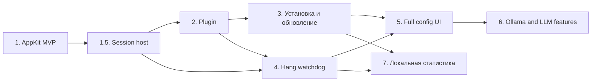

# План реализации Agent Watch

Здесь этапы развития, состояние каждого, критерии готовности и решения, которые ещё не приняты.
Чего здесь нет: что осталось до первого стабильного релиза — это [план релиза](release-plan.md);
как устроено то, что уже сделано, — остальные документы в `docs/`; что и когда сделано — история
git.

**Статус:** этап 1 — функциональная alpha и dogfooding; ближайшая цель — первый стабильный релиз.
**Дата актуализации:** 2026-10-07

## Цель

Создать лёгкое самодостаточное macOS-приложение, которое показывает состояния параллельных Claude
Code и Codex-сессий, а затем постепенно получает диагностику зависаний, удобную настройку и
локальные LLM-возможности.

План намеренно разбит на вертикальные стадии. Каждая должна дать проверяемый пользовательский
результат и новую обратную связь, а не только подготовить инфраструктуру для следующей.

## Зафиксированные решения

- Первый релиз — только Apple Silicon (ARM64), macOS 14+. Intel и universal-сборка не планируются.
- Runtime и единственный источник состояния находятся в `AgentWatch.app`.
- Отдельный daemon не создаётся.
- Приложение строится AppKit-first и продолжает работать после закрытия окна настроек.
- Claude и Codex передают события напрямую приложению через hooks.
- Общей упаковки на две экосистемы нет: у Claude Code это каталог-плагин, который приложение
  создаёт целиком, у Codex — слияние в его собственный файл хуков. Почему одного механизма не
  получилось — [agent-integration.md](agent-install.md#отклонено-плагин-с-хуками-у-codex).
- Установку, обновление и проверку интеграций выполняет само приложение; отдельного инструмента
  установки нет.
- Файлы состояния — внутренняя деталь приложения; внешние клиенты, когда появятся, пойдут через
  версионированный локальный API.
- Базовые состояния вычисляются детерминированно. LLM не участвует в определении фактов.
- Watchdog сообщает о потенциальном зависании и объясняет причины, но не выдаёт эвристику за
  доказанный факт.
- Данные и аналитика локальны по умолчанию.

## Последовательность и зависимости

```mermaid
flowchart LR
    S1[1. AppKit MVP] --> S15[1.5. Session host]
    S15 --> S2[2. Plugin]
    S2 --> S3[3. Установка и обновление]
    S15 --> S4[4. Hang watchdog]
    S2 --> S4
    S3 --> S5[5. Full config UI]
    S4 --> S5
    S5 --> S6[6. Ollama and LLM features]
    S3 --> S7[7. Локальная статистика]
    S4 --> S7
```

Этапы 4 и 7 могут частично идти параллельно после стабилизации event model и локального API. Этап 6
начинается только после отдельного выбора LLM-сценариев.

### Состояние этапов

| Этап | Статус | Что осталось |
|---|---|---|
| 1. AppKit MVP | **active dogfooding** | замеры простоя и обратная связь для этапов 4 и 5 |
| 1.5. Session host | **сделан, с известными границами** | ничего; границы — в критериях этапа |
| 2. Встраивание в агентов | **сделан** | проверка в релизной матрице — [план релиза](release-plan.md), раздел 4 |
| 3. Установка и обновление | **частично** | подпись Developer ID, чистая установка, новый агент после первой настройки — [план релиза](release-plan.md), разделы 2–3 |
| 4. Hang watchdog | planned | всё |
| 5. Full config UI | **частично** | окно настроек есть ([ADR-0016](adr/0016-every-setting-lives-in-one-window.md)); запуск при входе и настройки будущих этапов |
| 6. Ollama и LLM | planned, product gate required | всё |
| 7. Локальная статистика | planned | всё |

## Этап 1. AppKit MVP и dogfooding

**Цель:** получить полезный виджет с достоверными состояниями сессий без диагностики зависаний.

### Dogfooding

- использовать приложение самим в реальных параллельных задачах;
- вести короткий список неверных и непонятных состояний;
- записывать ситуации, когда всё равно пришлось вручную открывать сессию;
- затем дать debug-сборку нескольким коллегам;
- собирать только осознанно отправленный feedback, без фоновой отправки transcript или команд.

### Критерии готовности

- [x] одновременно отображаются Claude и Codex-сессии;
- [x] режим планирования визуально отличается от исполнения;
- [x] основной агент, ожидающий дочернюю работу, не выглядит как безымянное состояние «работает»;
- [x] строка показывает виды текущей работы счётчиками
  ([ADR-0011](adr/0011-the-row-is-a-template-with-one-gap.md));
- [x] клик по строке как минимум активирует правильное host application;
- [x] точный переход используется только тогда, когда окно и вкладку можно назвать достоверно;
- [x] карточка говорит, когда клик сделает не то, что обычно; неверная вкладка не выбирается
  эвристически;
- [x] переходы фаз и жизненный цикл параллельных активностей покрыты тестами;
- [x] закрытие окна не останавливает мониторинг;
- [x] отключённый Agent Watch не замедляет и не ломает агента;
- [x] перезапуск возвращает сессии, за которые ещё есть кому поручиться, и не возвращает остальные;
- [ ] idle CPU, память и wakeups измерены против бюджетов — бюджетов пока нет (открытые решения);
- [ ] feedback достаточен для уточнения этапов 4 и 5.

## Этап 1.5. Session host: закрытие терминала и фокус

**Цель:** связать сессию с фактическим процессом агента без launcher'а и использовать эту связь для
двух действий: достоверно показать завершение сессии и поднять окно host-приложения кликом по
строке.

### Критерии готовности

- [x] завершение процесса агента переводит сессию в `session closed` не позднее чем через 10 секунд;
- [x] клик по строке активирует корректное host application или карточка честно говорит, что
  поднимать нечего;
- [x] завершение процесса не интерпретируется как нормальный `Stop` turn;
- [x] нет launcher'а и PTY proxy; обход процессов идёт, только пока есть живые строки;
- [x] process mapping и exit transitions покрыты детерминированными тестами.

Границы, принятые сознательно:

- закрытая вкладка терминала JetBrains оставляет агента живым, и события у этого нет: строка
  получает фазу `terminal closed` на ближайшем обходе, пробуждении, открытии меню или клике, а не за
  10 секунд ([ADR-0013](adr/0013-a-click-ends-an-agent-its-closed-terminal-left-behind.md));
- у Codex Desktop нет наблюдения за процессом каждой сессии: его runtime общий для нескольких
  задач, поэтому закрывает все его сессии только выход самого приложения.

## Этап 2. Штатная установка хуков из приложения

**Цель:** заменить временную debug-конфигурацию hooks на штатную и обратимую установку. Как она
устроена у каждого агента — [agent-integration.md](agent-integration.md).

### Критерии готовности

- [x] установка не требует ручной правки settings-файлов;
- [x] тестовое событие появляется в Agent Watch;
- [x] выключенное приложение не влияет на работу агента;
- [x] обновление не создаёт дублирующиеся hooks;
- [x] удаление полностью прекращает доставку событий и не трогает чужие записи.

## Этап 3. Установка, обновление и первый запуск

**Цель:** довести путь от скачанного пакета до работающего мониторинга без ручной сборки
компонентов. Как устроены релиз и самообновление — [distribution.md](distribution.md).

### Критерии готовности

- [ ] новая машина проходит путь от скачанного пакета до работающего HUD без ручного редактирования
  settings-файлов и без `xattr`;
- [x] повторная установка интеграции идемпотентна (повторный запуск ничего не меняет);
- [ ] обновление сохраняет настройки и историю — проверить в релизной матрице;
- [x] отказ от обновления не мешает работе текущей версии;
- [ ] новый агентский инструмент, появившийся после первой установки, обнаруживается и предлагается
  к подключению;
- [ ] несовместимые версии диагностируются понятным сообщением;
- [ ] удаление не затрагивает пользовательские данные без отдельного выбора;
- [ ] когда запись в файл агента не удалась (нет прав, каталог только для чтения, шаг доверия у
  Codex), приложение показывает, что вставить руками, а не только «не получилось».

## Этап 4. Проверка потенциальных зависаний

**Цель:** отличать просто долгую работу от операций, которые с высокой вероятностью перестали
продвигаться.

### Сначала — проектирование на реальных данных

- собрать из dogfooding типовые длительные и реально зависшие операции;
- определить доступность PID/process-tree для Claude и Codex;
- проверить стоимость CPU, I/O и FSEvents sampling;
- определить объяснимые сигналы и мягкие пороги;
- разделить foreground tool calls и фоновые процессы;
- определить поведение после sleep/wake.

### Реализация

- возраст незакрытой shell-операции;
- адаптивный sampling только активных операций;
- process existence и CPU-time delta;
- файловая активность через FSEvents;
- несколько измерений перед предупреждением;
- объяснимый `stuck score`;
- действия `snooze` и «ожидаемо долгая команда»;
- локальные baseline по типам команд после накопления истории.

Не входят в первую версию: чтение всего stdout, универсальный PTY proxy, автоматическое завершение
процесса, точный контроль любого процесса, запущенного через `&`, LLM как единственный детектор.

### Критерии готовности

- предупреждение всегда содержит наблюдаемые причины;
- обычные долгие сборки не создают постоянный шум;
- ожидаемое предупреждение можно быстро подавить;
- sleep не увеличивает ошибочно длительность работы;
- overhead watchdog измерен отдельно от idle-режима;
- эвристики покрыты воспроизводимыми сценариями и тестами.

## Этап 5. Полноценный config и management UI

**Цель:** сделать настройку понятной без редактирования файлов и знания внутренней архитектуры.

Окно настроек уже есть: все настройки живут в одном окне
([ADR-0016](adr/0016-every-setting-lives-in-one-window.md)). Осталось:

- запуск при входе;
- настройки этапов, которых ещё нет: предупреждения и snooze watchdog, модели и лимит памяти,
  срок хранения статистики.

Принципы: ясность уровня Handy, а не его внешний вид; показывать состояние интеграции и следующее
действие; технические параметры — в стороне от основных; последствия удаления данных или модели
видны до подтверждения; работоспособные умолчания без обязательной настройки.

### Критерии готовности

- [x] базовая настройка выполняется полностью через UI;
- [x] состояние интеграции диагностируется без чтения логов;
- [ ] экран интеграций показывает доступный уровень навигации для Codex Desktop, а не только для IDE;
- [ ] HUD остаётся компактным;
- [ ] окно не держит локальную модель в памяти после закрытия.

## Этап 6. Ollama и согласованные LLM-функции

**Цель:** добавить локальную интеллектуальную обработку только для сценариев, доказавших полезность.

### Обязательный product gate

Перед реализацией отдельно выбрать функции из кандидатов:

- объяснение подозрительного зависания;
- summary сессии;
- автоматическое короткое имя сессии;
- классификация shell-команд;
- группировка повторяющихся проблем;
- приоритизация сессий, требующих внимания.

Для каждой функции нужны примеры входа, ожидаемый результат, latency budget и способ понять, что она
действительно помогает.

### Технический scope после согласования

- provider interface для local inference, Ollama как первый provider;
- каталог рекомендованных моделей и экраны Downloaded/Available в стиле Handy;
- профили «минимум ресурсов», «сбалансированный», «лучший анализ»;
- lazy loading и выгрузка после idle timeout;
- ограничение контекста и редактирование секретов;
- fallback на полностью детерминированное поведение.

### Критерии готовности

- приложение полезно и без модели;
- модель никогда не определяет фактическое lifecycle-состояние;
- idle-приложение не держит модель загруженной;
- до скачивания видны размер, потребление памяти и назначение;
- ошибка Ollama или inference не ломает мониторинг;
- функции проверены на заранее подготовленных примерах.

## Этап 7. Локальная статистика

**Цель:** дать локальную аналитику по накопленному журналу сессий. Журнала пока нет: приложение
помнит сессии только для восстановления после перезапуска.

### Работы

- журнал сессий и версионированный read API приложения;
- агрегация по источнику, проекту и периоду;
- отдельно считать `attention wait` (агент явно ждёт разрешения или ввода) и `review delay` (ход
  закончен, а человек к результату ещё не вернулся);
- показывать ошибки и suspected-stuck incidents;
- определить retention и экспорт.

### Критерии готовности

- метрики имеют однозначные определения;
- агрегаты можно проверить на небольшом журнале вручную;
- внешние читатели идут через версионированный API, а не через файлы приложения;
- данные остаются локальными, пока обратное не выбрано отдельно.

## Сквозные требования

- **Производительность.** Budgets для idle CPU, resident memory без модели, wakeups, времени hook
  sender, задержки HUD и overhead watchdog получить замером на целевом Mac, а не угадать.
- **Приватность.** Не хранить prompts, ответы и stdout по умолчанию; редактировать чувствительные
  аргументы до записи; не добавлять централизованную телеметрию без отдельного решения.
- **Совместимость.** Версия события есть в каждом запросе; приложение принимает предыдущую
  совместимую версию отправителя; local API, когда появится, версионируется.
- **Качество.** State machine проверяется табличными unit-тестами, адаптеры — на обезличенных
  payload fixtures; каждая найденная ошибка перехода получает regression fixture.

## Десктопные клиенты — аудит 2026-10-07; пункты 1, 2, 3 и 6 сделаны

Человек перешёл с терминалов на Claude.app и ChatGPT.app, и клик по строке поднимает приложение
целиком. Замеры — [«Десктопные приложения»](agent-processes.md#десктопные-приложения) и
[«Десктопные клиенты»](session-focus.md#десктопные-клиенты). Что из них следует:

1. **Сделано: десктопная сессия Claude — `desktop`, а не `cli`.** Признак —
   `entrypoint: "claude-desktop"` в записи реестра, проверенной по времени запуска; предка из
   `/Applications/Claude.app/` в дереве процессов не хватает, под ним работает и встроенный
   терминал. `AgentSource.claude.desktopBundleIdentifier` остаётся `nil`: живость сессии Claude
   проверяется по процессу, потому что Claude.app останавливает процессы сессий, сам продолжая
   работать.
2. **Сделано: переход к сессии ссылкой клиента.** `DesktopSessionLink` в `AgentWatchCore`,
   `TabRoute.desktopClient` в `SessionHostRegistry`; устройство — [«Десктопные клиенты»](session-focus.md#десктопные-клиенты), проба
   против настоящих приложений — `DesktopFocusProbe`. Строка, найденная по процессам до первого
   хука, ссылки не получает — её метка не совпадает с идентификатором сессии, — и клик поднимает
   приложение целиком, как раньше.
3. **Сделано: Codex не теряет начало первого хода.** Служебный сеанс — тот, что даёт имя новому
   треду, и транскрипта у него нет. Тред, которого ещё нет в индексе, отправитель пропускает по
   первой записи транскрипта; устройство — [«Приём сеансов Codex, и открытый вопрос про `/clear`»](agent-events.md#приём-сеансов-codex-и-открытый-вопрос-про-clear).
   Открыто: запуски `codex exec` строк не получают ни до, ни после этого — пропускать ли их, решает
   человек.
4. **Решено человеком 2026-10-07: оставить как есть.** Строка сессии, процесс которой Claude.app
   остановил за бездействием, закрывается, хотя сессия видна в приложении и продолжится по первому
   сообщению. Сама остановка на этой машине ни разу не наблюдалась.
5. **Статус-строки у десктопной сессии нет** — подтвердил человек. Процента контекста у неё не будет.
6. **Сделано: значок вопроса MCP-сервера.** `Elicitation` и `ElicitationResult` просим у Claude
   (теперь 15 событий); вопрос — диалог основного потока, лампа говорит `input needed`, а значок
   `questionmark.bubble` стоит первым в блоке счётчиков и выключается в настройках вместе с ними.
   Замеры и правила — [«Вопрос MCP-сервера: `Elicitation`»](agent-events.md#вопрос-mcp-сервера-elicitation); проверено с человеком на
   настоящей установке 2026-10-07. Открыто: каталог событий Claude (33 в 2.1.289) не закреплён
   тестом, как у Codex.

## Технический долг

**Правила агента по слоям.** Принцип — тип правил на агента в каждом слое
([agent-integration.md](agent-integration.md#где-это-живёт-в-коде)). Переведён слой
`AgentWatchLookup`. Остальные переводятся, когда их трогают:

- чтение транскрипта и имени сессии — `TranscriptLocator`, `TranscriptReader`,
  `SessionDescriptionResolver` и его ветка Codex в отправителе;
- запись реестра Claude: ядро состояний принимает `ClaudeSessionStatus` и проверяет
  `source == .claude` (`SessionStateEngine.apply`), а должно принимать общий факт «на диалог
  ответили»;
- установка хуков и значок.

## Открытые решения

Каждое — с тем, что его решит.

- **Окончательный bundle identifier** (сейчас `com.glockbender.agentwatch` и у приложения, и у
  плагина). Блокирует первую загрузку плагина: после публикации идентификатор плагина не меняется
  ([план релиза](release-plan.md), раздел 1).
- **Численные performance budgets.** Решит замер на целевом Mac.
- **Пороги и профили команд watchdog.** Решат данные dogfooding (этап 4).
- **Набор LLM-функций.** Решит product gate этапа 6.
- **Нужен ли централизованный сбор агрегированной статистики.** Решит отдельное продуктовое решение;
  по умолчанию — нет.
