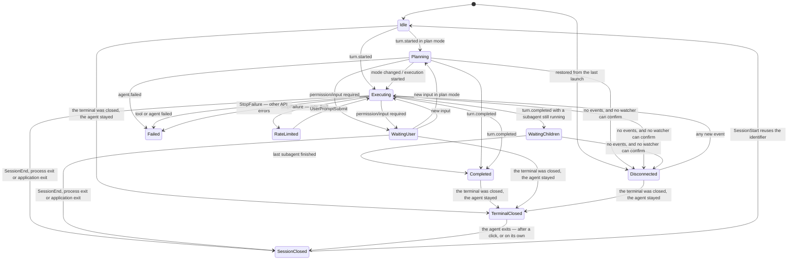

# Модель сессии

Здесь — что приложение знает о сессии и как это знание меняется: события на приёме, фазы и
переходы между ними, граф активностей. Чего здесь нет: как фаза выглядит в виджете —
[widget.md](widget.md); как события получают от агентов — [agent-integration.md](agent-integration.md).

## Единая модель событий

Claude и Codex передают похожие, но не идентичные payload. Отправитель передаёт приложению исходное
имя хука и отфильтрованный payload (`HookIngressRequest`: `declaredEvent` и `payload`), а
нормализует приложение. Через сокет проходят только поля из
разрешённого списка ([ADR-0001](adr/0001-nothing-leading-to-a-file-crosses-the-socket.md)): в
запросе нет prompt, stdout, пути к проекту и текста shell-команды. Идентификатора хода тоже нет —
поле без читателя на границе процесса только добавляет поверхность.

Что во что превращается (`EventKind`). Какие из этих хуков у кого запрашиваются — в
[agent-integration.md](agent-integration.md); нормализатор понимает больше, чем запрашивается,
потому что событие может прийти от установки, сделанной руками или старой версией.

| Хук | Событие | Оговорки |
|---|---|---|
| `SessionStart` | `sessionStarted` | сброс, который он делает, и есть реакция на `/clear`; `source: fork` помечает копию |
| `SessionEnd` | `sessionEnded` | одинаково для обоих агентов |
| `UserPromptSubmit` | `turnStarted` | |
| `Stop` | `turnCompleted` | несёт список работы, оставшейся после хода |
| `StopFailure` | `turnFailed`; у Claude с `error: rate_limit` — `turnRateLimited` | ход кончился ошибкой API, а не ответом |
| `Interrupt` | `turnInterrupted` | только Codex; сессия садится в `idle`, а не в `completed` |
| `PreToolUse` | `activityStarted`; для `AskUserQuestion` — `userInputRequired` (выбор) | фоновый `Bash` — фоновая работа |
| `PostToolUse` | `activityCompleted` | понимается, но не запрашивается |
| `PostToolUseFailure`, `PermissionDenied` | `activityFailed` | |
| `PreCompact` / `PostCompact` | `activityStarted` / `activityCompleted` | одна активность на сессию: сессия сжимает один контекст за раз |
| `SubagentStart` / `SubagentStop` | `activityStarted` / `activityCompleted` | сабагент переживает ход |
| `PermissionRequest` | `userInputRequired` (разрешение) | |
| `StatusLine` | `statusUpdated` | только Claude; у Codex отклоняется |
| `status` в `~/.claude/sessions/<pid>.json` | конец ожидания человека | не хук; только гасит ожидание, только у Claude — [ADR-0010](adr/0010-the-answer-to-a-dialog-comes-from-the-session-record.md) |

Режим планирования берётся из `permission_mode: plan` и только при явном значении: отсутствующее
поле не угадывается.

### У вызова инструмента четыре конца, и хуком приходят не все

Это проверено по документации Claude Code и стоило реальной ошибки в редьюсере.

| Чем закончился вызов | Что приходит |
|---|---|
| успешно | ничего: `PostToolUse` не запрашивается намеренно, см. [agent-integration.md](agent-integration.md) |
| упал | `PostToolUseFailure` |
| отклонён автоматическим режимом | `PermissionDenied` |
| отклонён человеком в диалоге | не подтверждено; предполагаем, что ничего |
| прерван человеком | ничего |

Документация Claude Code описывает `PermissionDenied` как событие автоматического режима («when auto
mode denies a tool call») и про отказ человека в диалоге не говорит. Поэтому успешный конец и две
последние строки таблицы объединяет одно и то же следствие: такую активность закрывает либо чтение
транскрипта, либо правило ниже.

**Согласие человека не сообщает вообще ничто, и это отдельная беда.** Конец вызова закрывает
активность, но ожидание человека кончается раньше — в момент ответа, — а этот момент не приходит ни
хуком (в каталоге 2.1.272 тридцать три события, и ни одного про разрешённый вызов), ни записью в
транскрипте (между `tool_use` и `tool_result` одобренного `git push` за 89 с нет ни строки).
Отвечает на это третий источник — собственная запись Claude Code о процессе,
`~/.claude/sessions/<pid>.json`, и только на этот один вопрос: ожидание кончилось.
[ADR-0010](adr/0010-the-answer-to-a-dialog-comes-from-the-session-record.md),
[«Почему живой агент находится только у Claude»](agent-integration.md#почему-живой-агент-находится-только-у-claude).

Успешный конец вызова тоже не всегда конец работы, и это замерено:

| Вызов | От вызова до ответа | Что происходит дальше |
|---|---|---|
| `Bash` с `run_in_background` | ~5 с | команда работает сколько угодно, и её конец сам открывает следующий ход |
| `Agent` | медиана 2.1 с, 151 из 152 быстрее 10 с | сабагент работает дальше, его конец — `SubagentStop` |
| обычный вызов | сколько работал | работа закончена |

Поэтому у активности два независимых признака, и оба нужны:

- `outlivesItsCall` — успешный ответ вызова её не закрывает. Стоит у фонового шелла;
- `outlivesTurn` — `Stop` её не закрывает. Стоит у сабагента, пришедшего из `SubagentStart`, и у
  фонового шелла. Закрывает их разное: сабагента — его собственный `SubagentStop`, фоновый шелл —
  начало следующего хода.

Границу фонового шелла даёт **начало следующего хода**, а не конец текущего, и это измерено. Claude
Code сообщает о завершении фоновой команды записью `task-notification` в транскрипте — с
идентификатором того самого вызова, — и эта запись сама открывает новый ход. В журнале событий
проекта три фоновые задачи закончились в 23:56:06, 00:03:40 и 00:12:17, и в каждом случае
`UserPromptSubmit` пришёл в ту же секунду.

Раньше границей считался `Stop`, и это было прямой ошибкой показа: в замеренном случае задача
стартовала в 00:08:52, `Stop` пришёл в 00:09:21, а скрипт работал до 00:12:16 — почти три минуты
сессия значилась завершённой, пока шла работа.

Граница по началу хода не доказательство: человек, написавший сообщение во время работы фоновой
задачи, тоже начинает ход и убирает строку раньше времени. Но ошибка при этом идёт в сторону
«показали меньше, чем есть», а не в сторону счётчика, который только растёт. Сам идентификатор из
`task-notification` на провод не идёт: это потребовало бы пустить содержимое транскрипта через
границу процесса — отдельное решение о приватности, см. [«Приватность и безопасность»](architecture.md#приватность-и-безопасность).

Сжатие контекста (`PreCompact` → `PostCompact`) — тоже активность, хотя вызовом инструмента не
является. Это единственное объяснение того, почему строка вдруг замолчала, ничего при этом не
ожидая, и без него молчание читалось как зависание. Пара делит один идентификатор на сессию: сессия
сжимает один контекст за раз. Признака «переживает ход» у неё нет намеренно — сжатие может не
завершиться, и тогда её уберёт конец хода, тем же правилом, что и любой другой вызов без сообщённого
конца.

Вызов `Agent` остаётся короткой активностью, а не долгой: долгую даёт `SubagentStart`, и если бы оба
жили до конца хода, один сабагент считался бы дважды.

Очистка контекста (`/clear`) своего события не требует. Идентификатор сессии при ней
переиспользуется — на это движок уже опирается, чтобы вернуть закрытую сессию к жизни, — а
`SessionStart`, пришедший в работающую сессию, и есть всё сообщение: сброс, который начало
сессии выполняет всегда, гасит активности и ставит фазу `idle`. Поле `source` со значениями
`startup`/`resume`/`clear`/`compact` читать для этого не нужно; оно пригодилось бы, только если
бы на очистку понадобилось ответить иначе, чем на обычный старт. Открытый вопрос по доставке
этого события у Codex — в [agent-integration.md](agent-integration.md).

Прерывание хода нормализуется в `turnInterrupted`, и сессия садится в `idle`, а не в
`completed`: зелёная лампа «завершено» на ходе, который человек остановил, утверждала бы
противоположное тому, что произошло. Событие присылает только Codex; для Claude тот же факт
приходится доставать из транскрипта — почему так, в [agent-integration.md](agent-integration.md).

**Сабагент не заводит своей сессии.** Проверено на живом сабагенте 2026-09-04: `SubagentStart`,
`SubagentStop` и собственные `PreToolUse`/`PostToolUse` сабагента — все четыре события несут
`session_id` **родителя**, а сам сабагент различается полем `agent_id`. Документация об этом не
говорит, поэтому факт добыт наблюдением.

Из этого следует три вещи:

- лишних строк в списке сабагенты не создают: приложение не заведёт для них отдельную сессию;
- признак «переживает ход» у активности из `SubagentStart` работает — она попадает в строку
  родителя;
- **вызовы инструментов внутри сабагента доезжают до строки родителя**.

### Как вызовы сабагента то отбрасывались, то нет

Сначала они считались работой родителя. Замер 2026-09-04 показал, чего в этом не хватало: закрыть
такую активность нечем. За пять минут, в которые сама сессия не выполнила ни одной команды, на её
строке открылось 48 вызовов оболочки — и ни один не закрылся. `PostToolUse` для них не приходил, а
результат сабагент писал в свой файл `…/subagents/agent-….jsonl`, который приложение читать не имеет
права ([ADR-0001](adr/0001-nothing-leading-to-a-file-crosses-the-socket.md)). Строка набирала по сотне «работающих» команд за длинный ход, и вычищал их только конец
хода.

Тогда появился фильтр в отправителе — `SubagentToolCall`. Он отбрасывал `PreToolUse`, `PostToolUse`,
`PostToolUseFailure` и `PermissionDenied`, если `transcript_path` в payload похож на файл сабагента.

**На 2.1.272 обе половины этого рассуждения перестали быть верными**, и фильтр удалён. Замерено:

- у хука из сабагента `transcript_path` — путь *родительской* сессии, точно такой же, как у хуков
  основного потока. Собственный файл сабагента приходит отдельным полем `agent_transcript_path` и
  только у `SubagentStop`. Значит проверка по пути не узнавала уже никого: фильтр стоял и не
  срабатывал ни разу;
- вызовы сабагента **закрываются**: `PostToolUse` от него приходит, с тем же `agent_id`, что и его
  `PreToolUse`. Незакрываемых активностей, ради которых всё и затевалось, больше нет.

Фильтр убран, а не починен, и это выбор, а не недосмотр. Вызов, о котором спрашивают разрешение,
нужен приложению: без него у диалога не на что указать, и снять ожидание можно будет только концом
всего сабагента. Отправитель же отбрасывает событие насовсем — передумать потом нельзя.

Поэтому вопрос «считать ли вызовы сабагента работой строки» переехал туда, где на него можно
ответить обратимо: приложение теперь знает у каждого вызова его `agent_id` и может принять вызов, но
не показывать его в счётчике. Открытым этот вопрос и остаётся — один сабагент на пять команд даёт
сейчас шесть активностей, себя и свои вызовы.

Чего тут опасаться на будущее: у удалённого фильтра были зелёные тесты, и они кормили его выдуманным
путём вида `/tmp/whatever/agent-abc.jsonl`. Поэтому смена формата в Claude Code не сломала ни одного
теста: мёртвый код выглядел живым и работающим, и заметить это можно было только замером на живом
агенте. Когда именно формат сменился, не установлено — известно лишь, что 4 сентября фильтр ещё
узнавал сабагента, а 15-го уже нет. Проверка на этом месте теперь идёт через настоящий
отправитель, с payload той формы, какую агент действительно присылает
(`UnixSocketIngressTests.testExecutableDeliversASubagentsCallAndNamesTheSubagent`).

Поле `SessionActivity.parentID` несёт `agent_id` — того сабагента, внутри которого вызов сделан, и
пусто у основного потока. Не ради вложенности счётчиков, а ради одного вопроса: чей диалог висит.
Кто вправе его закрыть, разобрано в [«У диалога есть хозяин»](agent-integration.md#у-диалога-есть-хозяин).

Поэтому вызов инструмента `Agent` больше не считается сабагентом: это обычный вызов инструмента,
который действительно выполняется те две секунды, что уходят на выдачу дескриптора. Сабагента
описывает ровно один источник — пара `SubagentStart`/`SubagentStop`. Пока оба назывались сабагентом,
один сабагент считался за два на протяжении этих двух секунд.

Выбор именно такой, а не «не заводить активность на вызов `Agent`»: подавлять событие значило бы
скрывать вызов, который в самом деле идёт, и делать сабагентов невидимыми там, где `SubagentStart`
не зарегистрирован. Так же и честнее, и устойчивее.

Отсюда правило: **`Stop` решает судьбу своего хода.** Ход закончен — значит всё, что он запустил,
закончено. Единственное исключение — сабагент: он может продолжать работать после конца хода
родителя и сообщает о своём конце отдельным `SubagentStop`. Поэтому активность несёт признак «может
пережить ход» (`SessionActivity.outlivesTurn`), выставляемый только при `SubagentStart`, и `Stop`
убирает все остальные. Признак объявляется в момент создания активности, а не выводится из её вида:
отклонённый вызов инструмента `Agent` — тоже сабагент по виду, но переживать ему нечего.

Прерванный вызов не сообщает о себе вообще ничего, поэтому только это правило его и убирает.

**И то же правило на `UserPromptSubmit`, потому что `Stop` приходит не всегда.** Замерено по
собственному журналу событий приложения: за 39 минут 8 начатых ходов против 4 завершённых, причём
одна сессия начала четыре хода подряд без единого `Stop` между ними — так выглядит прерывание. Хуки
к тому же fail-open по устройству, поэтому пропуск `Stop` — штатное событие, а не аномалия.

Пока подметал только `Stop`, вызов без сообщённого конца жил в счётчиках через все следующие ходы,
до какого-то более позднего `Stop`. Новый промпт означает, что предыдущий ход закончен, чем бы он ни
закончился, — поэтому `turnStarted` применяет ровно тот же предикат с тем же исключением: `removeAll
{ !$0.outlivesTurn }`. Именно с исключением, а не `removeAll()`: родитель, получивший новый промпт,
ничего не говорит о сабагенте, который всё ещё работает.

Размен назван честно. Раздел [«События пришли повторно или не по порядку»](session-recovery.md#события-пришли-повторно-или-не-по-порядку) обещает пережить события не по порядку, а `UserPromptSubmit`, пришедший
позже вызова, который он предваряет, уберёт живой вызов. Но такая потеря самовосстанавливается —
следующий `PreToolUse` снова откроет активность, — а прежний перерасчёт не восстанавливался ничем и
держался ходами.

Каждое событие должно иметь ключ дедупликации. Для сабагентов и инструментов желательно сохранять
`parent_activity_id`: он позволяет построить небольшое дерево текущей работы. Если источник не даёт
надёжной связи, приложение показывает плоский список активностей и не выдумывает иерархию.

State engine обязан корректно переживать повторную доставку, события, пришедшие не по порядку, и
несколько одновременно открытых активностей.

### Одна дверь в состояние

> [ADR-0004](adr/0004-one-door-into-session-state.md).

Событие попадает в состояние ровно одним способом: `SessionStateEngine.receive(_:)`. Внутри него
пять шагов в жёстком порядке — получит ли событие строку вообще; строка, построенная по живому
процессу, переходит к сессии, которая на нём работает; закрытая строка, чей процесс теперь занят
другой сессией, уходит; собственная строка копии складывается в строку, которую та продолжает; и
только потом применяется само событие. Три приватных поля переносят решения ранних шагов в
последний, так что порядок несущий.

`receive` отвечает одним значением `RowChange`: строка, на которую событие легло (или причина,
по которой строки нет), строки, ушедшие вместе с этим событием, и что движок решил про копии.
Всё, что остаётся вызывающему, — то, чего движок знать не может: наблюдатель за процессом каждой
ушедшей строки и выбор, о чём сказать вслух.

## Фаза сессии и граф активностей

> Решения из этого раздела, на которые ссылается код: [ADR-0002](adr/0002-a-closed-session-is-terminal.md)
> (закрытая сессия — конечное состояние), [ADR-0003](adr/0003-colour-is-never-the-only-carrier.md)
> (цвет никогда не единственный носитель) и
> [ADR-0008](adr/0008-background-work-does-not-claim-the-turn.md) (фоновая работа не претендует на
> ход).

Одного статуса для сессии недостаточно. Например, основной агент может ждать сразу двух сабагентов,
один из которых исследует код, а второй запускает тесты. Если показать только «работает», наиболее
полезная часть контекста потеряется.

Поэтому UI получает составной snapshot:

```text
SessionSnapshot
├── phase            planning | executing | waiting_user | waiting_children | completed | rate_limited | failed
├── mode             plan | default | unknown
├── fault            none | transcript unreadable | unexplained silence
├── activities
│   ├── shell
│   ├── subagent
│   ├── background task
│   └── other tool
└── background work  shell | subagent | monitor | workflow | other
```

`phase` описывает положение основной сессии, а `activities` — конкретную работу, которая сейчас
выполняется внутри неё. Активности могут образовывать дерево, но интерфейс обязан нормально работать
и с неполными связями.

`background work` — четвёртая ось, и она отвечает на свой вопрос: что осталось работать, когда ход
уже кончился. Это не активность: активность — вызов, которого ход ждёт, а здесь работа, от которой
ход ушёл. Список приходит целиком с каждым `Stop` ([«Какие события мы просим»](agent-integration.md#какие-события-мы-просим)), фазу не двигает
([ADR-0008](adr/0008-background-work-does-not-claim-the-turn.md)) и показывается счётчиком в строке
и отдельной строкой в карточке.

Третья ось — `fault` — отвечает не «что делает сессия», а «насколько это ещё известно», и это разные
вопросы: сессия может честно работать, а приложение — потерять её из виду. Здесь раньше стояло поле
`attention` со значениями `none | required | suspected_stuck | error`. Оно оказалось третьим именем
для того, что уже сказано фазой: `required` встречалось ровно там, где фаза `waiting_user`, `error`
— там, где `failed`, а `suspected_stuck` не порождался ничем и никогда. Модель приведена к тому, что
есть на деле: догадка о «подозрительно застрявшей» сессии заменена наблюдаемым признаком сбоя
мониторинга.

Основная фаза вычисляется конечным автоматом:



`TerminalClosed` агент не сообщает: эту фазу находит приложение. Терминал, в котором шла сессия,
закрыли, а агент не завершился. Путей к этому два, и находятся они по-разному.

- **Ядро забрало терминал.** Замерено на Claude Code 2.1.280 во вкладке PyCharm и 2.1.270 во
  вкладке GoLand: агент висит в `tcsetattr`, ожидая, что терминал примет его последний вывод, а
  PyCharm держит открытыми обе стороны терминала. Находит это сканирование или клик, спрашивая ядро
  о процессе. Воспроизводится так: держать терминал открытым, ничего из него не читать и послать
  оболочке `SIGHUP`, — и тогда ни `SIGTERM`, ни `SIGKILL` агента не завершают. Завершает его сброс
  непрочитанного вывода.
- **Ghostty закрыл вкладку, а терминал оставил.** Замерено на Ghostty 1.3.1: ядро видит терминал
  целым, Ghostty его читает, но не показывает нигде. Агент не висит, а работает дальше. Найти это
  можно только у Ghostty и только при клике ([«Ghostty»](session-focus.md#ghostty)). Завершает агента и оболочку вкладки `SIGHUP` — то,
  что должно было прийти при закрытии.

Подробности обоих — в `agent-integration.md`, «Терминал закрыли, а агент остался».

Признак — у процесса стоит флаг «был управляющий терминал» (`P_CONTROLT`), а самого терминала
больше нет (`e_tdev` пуст); у живой сессии в терминале есть оба, у приложения нет ни одного.
Проверяется только у сессий `cli`: фоновая живёт в pty самого агента, а desktop-сессия — в
приложении. Отдельного события у этого нет — агент не выходит, и наблюдатель за выходом молчит, —
поэтому приложение спрашивает там, где и так смотрит: при запуске, после сна, при открытии меню, на
обходе раз в 15 секунд, пока хоть одна сессия работает, и при клике по строке. Клик по такой строке
агента завершает ([ADR-0013](adr/0013-a-click-ends-an-agent-its-closed-terminal-left-behind.md)).

Из `SessionClosed` есть ровно один выход — `SessionStart`. Идентификатор сессии действительно
переиспользуется, когда сессию очистили и начали заново, и это первое событие новой сессии, а не
запоздавшее событие старой. Любое другое событие, пришедшее после закрытия, теряет своё
lifecycle-значение: то, что оно рассказывает о сессии (имя, ветка, размер контекста), по-прежнему
сливается, а фаза не меняется, и время последнего события не уходит назад.

В `WaitingChildren` есть ровно один вход — конец хода, у которого остался работающий сабагент, — и
ровно один выход: этот сабагент завершился. Ход при этом уже закончен, поэтому выход ведёт в
`Completed`, а не назад в работу.

Выход `WaitingUser --> Executing` уточнён. Ожидание — это **список незакрытых диалогов**
(`awaitedDialogs`), по одному на спрошенного агента; у каждого есть хозяин (`agentID`, пустой у
основного потока), вызов, о котором спрашивают (`activityID`), и вид вопроса. Один диалог снимает
завершение или ошибка именно его вызова, начало нового вызова тем же агентом, конец самого этого
агента (`SubagentStop`), а для диалога основного потока — ещё и конец хода. Строка выходит из
ожидания, только когда список опустел: два сабагента могут быть спрошены одновременно (замерено,
[«У диалога есть хозяин»](agent-integration.md#у-диалога-есть-хозяин)), и ответ на один не отвечает за другой. Поздно прочитанное начало
advisor из транскрипта ожидание не снимает. Завершение параллельного вызова — не снимает. Если
идентификатора ожидаемого вызова нет, принимается только окончание не старше последнего
наблюдения; старая запись прошлого хода не может ответить на новый диалог.

Причина в двух словах: спрошенный агент остановлен, поэтому ничего нового он до ответа не
запускает, — а вот уже запущенные им вызовы продолжают завершаться. *Спрошенный агент*, а не
сессия: её сабагенты работают дальше, и их события к чужому диалогу отношения не имеют
([«У диалога есть хозяин»](agent-integration.md#у-диалога-есть-хозяин)).

## Проверка потенциальных зависаний

В текущей alpha уже есть лёгкий **индикатор свежести**, но это не watchdog: после 15 секунд без
hook-сигнала активная сессия получает `quiet`, после 60 — `no recent activity`. Показан он цветом
таймера строки, а не словами. Этот сигнал не меняет фазу lifecycle, не объявляет задачу зависшей и
не должен скрывать возможную долгую корректную работу. Он нужен ровно для того, чтобы пользователь
видел отсутствие наблюдаемых событий.

Отдельно от него существует **потеря связи**. Сессия переходит в `Disconnected` после 30 минут
молчания, но только если её смерть не может подтвердить никто другой: ни один наблюдатель не может
за неё поручиться: нет живого отслеживания выхода процесса и приложение-хозяин не запущено. Наличие
PID само по себе поручительством не считается — отслеживание создаётся только там, где приложение
действительно его завело. Для остальных сессий работают точные сигналы — системное уведомление о
завершении процесса и уведомление о завершении приложения, — и догадка по времени им не нужна.
Переход обратим: любое новое событие возвращает сессию в обычное состояние, а `lastObservedAt` при
переходе не обновляется, потому что таймаут ничего не наблюдал. Порог намного больше индикатора
свежести, но это не обещание. Одна длинная сборка не порождает hook-событий, поэтому рано или поздно
пересечёт любой порог; фаза сообщает ровно то, что известно — событий нет, — и одно новое событие
сразу возвращает сессию обратно.

Есть и третье, самое слабое правило — **необъяснённое молчание**: сессия заявляет о работе, ни одной
открытой активности у неё нет, и ни один из двух источников не сказал ничего три минуты. «Сказал»
здесь шире, чем «сообщил факт»: любой прирост транскрипта считается за услышанное, даже если ни
одной строки из него читатель не взял. Ход, который думает или печатает длинный ответ, не
вызывает инструментов и не порождает hook-событий, а файл при этом растёт всё время. Оно тоже не
меняет фазу и живёт в [transcript-reader.md](transcript-reader.md) вместе с чтением транскрипта, потому что появилось вместе с ним. Три
правила отсчитывают от одного и того же `lastObservedAt` и отличаются только порогом и условием,
поэтому подкручивать один порог, не посмотрев на остальные два, нельзя.

Порог был две минуты и поднят до трёх по замеру, который ломает как раз оговорку «а файл при этом
растёт всё время». Вызов `advisor` молчит в обоих источниках сразу: хука для него нет ([transcript-reader.md](transcript-reader.md)), а запись
о нём появляется в файле только когда вызов вернулся. Замерено 236 секунд между меткой времени
записи `server_tool_use` и моментом, когда читатель её увидел, — всё это время здоровая сессия
выглядела ровно как потерянная, и получала жёлтый треугольник. Три минуты замеренный вызов всё равно
не покрывают: предупреждение отодвинуто, а не отменено — порог, накрывающий любую честную паузу, не
сообщил бы и о настоящей потере.

Hooks дают надёжную отправную точку: если пришёл `tool.started`, но долго не приходит завершающее
событие, операция остаётся открытой. Однако одного timeout недостаточно — тесты, сборки и загрузки
могут законно работать долго.

Предупреждение показывается только после нескольких последовательных измерений и всегда содержит
причины.

## Отвергнутое событие тоже новость

Событие, которого приложение не поняло, раньше исчезало молча: ни строки в журнале, ни
счётчика, ни следа. Для приложения, вся работа которого — замечать, это единственный
недопустимый класс отказа. Он же делал неотвечаемым практический вопрос: пришло ли начало
вызова и было отвергнуто, или не приходило вовсе.

Теперь каждый отказ произносится вслух с причиной, и причины различимы: имя хука не в
списке (первый рубеж — редактор, до всякого разбора), payload не объект, событие без
сессии, инструментальное событие без вызова, чужая версия протокола. Строка отказа
собирается в `AgentWatchCore` рядом с очисткой строк, а не в месте записи: единственная
интересная часть — объявленное имя события — приходит по socket, куда может писать любой
процесс того же пользователя. Без очистки туда попал бы перевод строки в файл, вся
структура которого «одна запись — одна строка», или двунаправленное переопределение,
после которого весь остаток читается задом наперёд.

## Порядок событий на приёме

Через socket идут переходы состояния, поэтому их порядок — это и есть их смысл: вызов,
закончившийся раньше, чем начался, оставляет строку, утверждающую работу, которой никто не
делает. Порядок обеспечивается в двух местах, и оба обязательны.

Соединения читаются **последовательной** очередью. Читая их параллельно, приёмник отдавал их
в том порядке, в каком завершались чтения, а не в том, в каком они пришли: сообщение,
задержанное на один недописанный байт, обгонялось следующим — воспроизводимо, тестом.
Пропускной способности при этом не теряется: сообщение это одна короткая строка, у чтения свой
срок в 200 мс, а запуск хука стоит три четверти секунды — отыгрывать параллельностью тут
нечего.

Переход на главный поток делается через `DispatchQueue.main.async`, а не через
`Task { @MainActor }`. У отдельно созданных задач порядка между собой нет, поэтому переход
отдавал обратно ту самую гарантию, которую приёмник только что установил. Очередь главного
потока — FIFO. Это записано в самом интерфейсе приёмника, а не только здесь: обязанность
сохранить порядок лежит на том, кто принимает события.
